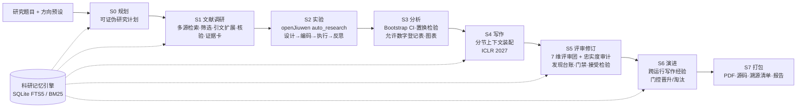

# Tyche：基于 JiuwenSwarm 的证据约束型 Agent 科研短论文自动生成系统

> CCF BDCI 2026 · 【华为 openJiuwen】基于 JiuwenSwarm 的 Agent 科研论文自动生成
>
> English summary: [below](#english-summary)

Tyche 在 [openJiuwen JiuwenSwarm](https://github.com/openJiuwen-ai/jiuwenswarm) 源码基础上构建。给定一个 Agent 方向的研究题目，它自动完成
**选题拆解 → 文献调研 → 方法设计 → 实验 → 结果分析 → 论文撰写 → 模拟评审与修订**，输出一篇可编译的 **ICLR 2027 模板短论文**
（主文默认 ≤ 5 页），可直接上传到 [Stanford Agentic Reviewer](https://paperreview.ai) 评测。

核心原则是**模型负责提议，代码负责核验**：

- 参考文献只来自 arXiv / Semantic Scholar / OpenAlex / Crossref 的真实检索结果，经核验后才进入 `refs.bib`；模型不能凭记忆生成文献。
- 论文中的每个结果数字都必须能追溯到实验日志经确定性统计脚本计算出的值（数字门禁）；伪造或估算的数字无法通过打包。
- 编译、页数、结构、占位符、引用解析等全部由确定性门禁检查；任何门禁阻断项未解决时拒绝打包（除非显式标记为 UNVERIFIED）。
- ICLR 2027 要求的 *AI use statement* 由代码根据运行记录生成，而不是由模型撰写，保证披露与事实一致。

## 系统架构



| 阶段 | 做什么 | 由谁负责 |
|---|---|---|
| S0 规划 | 把题目拆成 1–3 个研究问题、可证伪假设、方法机制、基线、指标与贡献 | 模型（结构化 JSON，校验后入库） |
| S1 文献 | 查询规划 → 三源检索 → 去重 → BM25 预排序 → 摘要级相关性筛选 → 一跳引文图扩展 → 元数据核验 → 证据卡（引文必须逐字出自摘要）→ 主题归纳 | 检索/核验：代码；筛选/归纳：模型 |
| S2 实验 | 复用 openJiuwen `auto_research` 的 ManagerRuntime（仅开启 设计/编码/执行/反思，关闭其网页检索与 NeurIPS 报告模块）；也可导入团队自有实验结果 | openJiuwen 智能体 + 真实执行 |
| S3 分析 | 逐条目 bootstrap 置信区间、配对 sign-flip 置换检验、方向感知的最优标注；生成表格、图和“允许数字登记表” | 代码（固定随机种子） |
| S4 写作 | 按依赖顺序（方法→实验→分析→相关工作→引言→结论→摘要）逐节写作；每次调用的上下文由记忆引擎在 token 预算内装配并留存清单 | 模型 + 确定性清洗 |
| S5 评审 | 三位视角评审（严谨性/新颖与定位/清晰与影响）按 Agentic Reviewer 的 7 个维度打分 + 忠实度审计；发现写入台账，定向修订，重新编译与门禁，分数不降才接受 | 模型评审 + 代码裁决 |
| S6 演进 | 从台账提炼写作经验；跨 ≥2 次运行复现且修复被接受并提分才晋升为生效经验；无效则淘汰；导出为 JiuwenSwarm 技能 `evolutions.json` | 模型提炼 + 代码门控 |
| S7 打包 | 论文 PDF、LaTeX 源码、全部产物的 SHA-256 溯源清单、评审台账、门禁报告、运行报告（含各阶段 token 用量） | 代码 |

更详细的设计见 [docs/tyche/DESIGN.md](docs/tyche/DESIGN.md)。

## 与赛题三个建议方向的对应

Tyche 既能就三个方向**生成论文**（`--direction context_engineering | memory_engine | self_evolution`，每个方向带有种子查询、经典工作名、可执行的实验族与指标），其自身也是这三项技术的一个实现：

- **Agent 记忆引擎**：`tyche/memory/store.py` —— 带来源类型（retrieved / observed / inferred）、作用域（run / project / global）、更正链（supersession）与使用记录的科研记忆，SQLite FTS5 + BM25 检索。
- **Agent 上下文工程**：`tyche/memory/context_pack.py` —— 必选块 + 按优先级/相关度装入的可选块，在硬 token 预算内装配，超长块截断而非静默丢弃；每次模型调用都保存装配清单，可审计、可研究。
- **Agent 自演进**：`tyche/evolution/playbook.py` —— 评审发现 → 经验候选 → 需“多次复现 + 修复被接受且分数不降”才晋升 → 失效自动淘汰，并与 JiuwenSwarm 的技能演进机制互通。

## 相对上游的改动

本仓库是 JiuwenSwarm 在提交 `b7a7c32` 处的完整 fork（Apache-2.0）。导入提交与上游逐字一致（仅去掉 6 个无法推送的 Git LFS 演示视频，链接改指上游）。本项目新增：

| 路径 | 内容 |
|---|---|
| `tyche/` | 全部自研代码：配置、LLM 封装、工作区与溯源、记忆引擎、文献、实验桥接、统计分析、论文写作与编译、门禁、评审、演进、流水线、CLI、离线自检 |
| `tests/tyche/` | 61 个离线单元/端到端测试（含真实 LaTeX 编译的完整自检） |
| `jiuwenswarm/resources/agent/workspace/skills/tyche-iclr-paper/` | SwarmFlow 蜂群技能：按阶段编排，可在 TUI `/swarmflows` 监控，支持人工审批研究计划 |
| `jiuwenswarm/resources/agent/workspace/skills/tyche-paper/` | Agent 模式技能：在对话中驱动 `tyche` |
| `scripts/tyche/install_dev.sh` | 开发环境安装；gitcode 不可达时自动改用 GitHub 镜像的**同一提交** |
| `pyproject.toml` | 注册 `tyche` 包、数据文件与 `tyche` 命令 |

openJiuwen 本身未作修改：实验环节通过公开接口调用 `openjiuwen.rsi.artifact_rsi.paper_opt.auto_research`，技能演进导出复用 `openjiuwen.agent_evolving` 的数据结构。

## 快速开始

环境要求：Python 3.11–3.13、[uv](https://docs.astral.sh/uv/)、TeX Live（`latexmk`、`pdflatex`、`bibtex`）与 poppler（`pdftotext`、`pdfinfo`）。

```bash
# 1. 安装（Ubuntu 示例）
sudo apt-get install -y latexmk texlive-latex-recommended texlive-latex-extra texlive-fonts-recommended poppler-utils
scripts/tyche/install_dev.sh          # 创建 .venv 并安装锁定依赖、JiuwenSwarm 与 Tyche
source .venv/bin/activate

# 2. 配置模型（默认 DeepSeek，OpenAI 兼容接口）；密钥只放在被忽略的 .env 中
cp .env.example .env && chmod 600 .env   # 填写 API_KEY

# 3. 自检：离线跑通全部阶段并真实编译一篇（合成数据的）ICLR 论文，无需网络与密钥
tyche selftest --keep out/

# 4. 检查工具链、密钥与网络
tyche doctor --ping-model

# 5. 生成论文（可分阶段：--stop-after plan 后检查/修改，再 --resume）
tyche run --topic "带更正链的 Agent 记忆能否减少过期事实回答" --direction memory_engine --stop-after plan
tyche run --resume --run-id <run-id>
```

产物位于 `workspace/runs/<run-id>/package/`：`paper.pdf`、`paper_source/`、`provenance.json`、`review_ledger.json`、`gates.json`、`run_report.md`。

常用选项：

- `--engine imported --results-dir <dir>`：使用团队自己跑出的 `<variant>.metrics.json`（可含逐条目结果 `per_question`），跳过自动实验。
- `--set review.max_rounds=4`、`--set paper.max_main_pages=6`：覆盖任意配置项（默认值见 `tyche/configs/tyche.default.yaml`）。
- `TYCHE_REVIEW_MODEL_NAME=...`：评审使用不同于写作的模型，降低自我认同偏差。
- `tyche review paper.pdf`：用本地 7 维评审团评审任意论文 PDF。
- `tyche lessons`：查看跨运行写作经验及其状态。

### 在 JiuwenSwarm 中使用

- **Cluster 模式 + SwarmFlow**：在配置中开启 `enable_swarmflow` 后，让 Leader 运行技能 `tyche-iclr-paper`（参数 `topic`、`direction`、可选 `review_plan: true` 进行人工审批），在 TUI 中用 `/swarmflows` 查看阶段进度。每个阶段智能体只执行对应的 `tyche` 命令并汇报状态，核验逻辑始终留在确定性代码里。
- **Agent 模式**：直接说“用 tyche-paper 技能写一篇关于 Agent 上下文压缩的 ICLR 短论文”。
- 运行时加 `--export-skill-dir ~/.jiuwenswarm/agent/workspace/skills/tyche-paper`，生效的写作经验会出现在 `/evolve_list` 中，可用 JiuwenSwarm 自带的 `/evolve_rollback` 等命令管理。

## 用 Stanford Agentic Reviewer 评测

1. 取 `package/paper.pdf`，在 <https://paperreview.ai> 上传，目标会议选择 **ICLR**（只有选 ICLR 时才显示分数）。
2. 对照 `run_report.md` 中各轮的 7 维分数，定位薄弱维度，可用 `--notes` 调整研究计划或增加评审轮数后重跑。

`run_report.md` 里的 *composite* 是 Tyche 自己对 7 个维度的等权平均，只用于比较同一篇论文的不同草稿，**不是** paperreview.ai 分数的预测。

## 诚信与复现

- 实验失败时流水线停止并报告原因，不会在没有结果的情况下写论文；门禁阻断项未解决时拒绝打包。
- `provenance.json` 记录每个产物的阶段、输入、父版本与 SHA-256，打包时重新校验，确保论文对应的就是这些数据。
- 统计分析使用固定随机种子；所有模型调用的上下文装配清单都保存在 `write/context_manifests/`。
- 自检使用的文献与实验数据全部是**虚构的合成夹具**（arXiv 编号以 `0000.` 开头，作者名为 Fixture/Testcase），输出会明确标注，不构成任何研究结论。
- 提交前请团队人工检查计划、实验代码、结果与论文；ICLR AI use statement 中的人工审阅声明在 `paper.human_review_statement` 配置，请如实填写。

## 测试

```bash
source .venv/bin/activate
ruff check tyche tests/tyche
pytest tests/tyche                       # 61 项，含真实 LaTeX 编译的端到端自检
tyche selftest
python jiuwenswarm/resources/agent/workspace/skills/swarmskill-creator/scripts/validate_swarmskill.py \
    jiuwenswarm/resources/agent/workspace/skills/tyche-iclr-paper
```

上游 JiuwenSwarm 的测试与使用说明见 [README_JIUWENSWARM_CN.md](README_JIUWENSWARM_CN.md)、[README_JIUWENSWARM.md](README_JIUWENSWARM.md) 与 `docs/`。

## 许可与致谢

- 代码以 Apache-2.0 发布（见 [LICENSE](LICENSE)），第三方声明见 [NOTICE.md](NOTICE.md) 与 [OPEN_SOURCE_SOFTWARE_NOTICE.md](OPEN_SOURCE_SOFTWARE_NOTICE.md)。
- 基于 openJiuwen 社区的 [JiuwenSwarm](https://github.com/openJiuwen-ai/jiuwenswarm) 与 [agent-core](https://github.com/openJiuwen-ai/agent-core)。
- ICLR 2027 样式文件来自官方 [ICLR/Master-Template](https://github.com/ICLR/Master-Template)，未作修改（见 `tyche/paper/template/SOURCE.md`）。

## English summary

Tyche is a fork of openJiuwen **JiuwenSwarm** that turns a research topic about LLM agents into a compiled
**ICLR 2027 short paper**. Its stages are plan, survey, experiments, analysis, write, review, evolve, and package.
Language models propose plans, prose, and critiques. Deterministic code handles the rest:

- retrieval and verification of references from arXiv, Semantic Scholar, OpenAlex, and Crossref;
- statistics: bootstrap confidence intervals and paired permutation tests;
- LaTeX compilation;
- gates that reject citations to unverified keys, numbers that do not trace to computed results, broken references,
  and papers over the page limit.

Experiments reuse openJiuwen's `auto_research` runtime; alternatively, the team can import its own metrics.

A three-lens review panel scores the Stanford Agentic Reviewer's seven dimensions, and a fidelity auditor checks
claims against the evidence. Their findings drive targeted, acceptance-tested revisions.

Lessons distilled from reviews evolve across runs through a promotion/retirement gate. They are exported in
JiuwenSwarm's skill `evolutions.json` format.

To get started, run `tyche selftest`, which is fully offline and still compiles a real PDF, then `tyche doctor`,
then `tyche run --topic ... --direction ...`.
