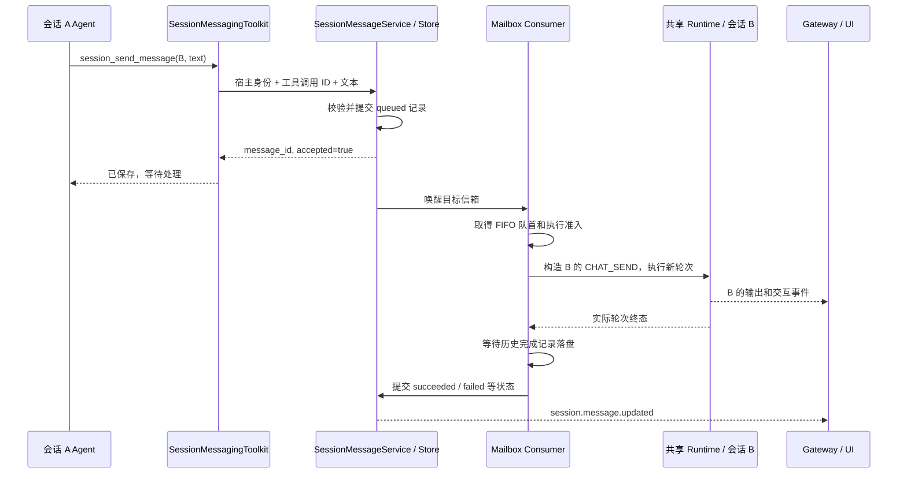

# Agent 跨会话消息：设计与复核结论

日期：2026-09-09。

状态：核心能力已在 `cross-sessions` 分支实现，并通过定向单元与回归测试。本文同时保留完整产品化设计；尚未实现的 UI 管理面见下方说明。

实现基线：`cross-sessions` 分支，起始提交 `c7503e544737`。文中包内路径以仓库的 `jiuwenswarm/` 目录为基准；`tests/` 路径以仓库根目录为基准。

目标是让一个产品会话中的 Agent 列出同一用户的其他会话，向指定会话发送文本，并使目标 Agent 在合适的时机处理消息。用户不必先打开目标会话。源工具调用只等待消息持久化，不等待目标执行完成。

推荐第一版由 AgentServer 持有持久化信箱和消费者，经共享 Runtime 执行目标会话，通过现有 server-push 通道向 Gateway 和客户端发布事件。适用范围是同一用户、同一 AgentServer 管理的持久化会话；Gateway 与 AgentServer 分进程部署仍然适用。

当前实现交付了 Agent 可直接使用的 `session_list`、`session_send_message`、`session_message_list` 和 `session_message_resolve`，以及 SQLite 持久化信箱、同目标 FIFO、共享运行准入、目标 Runtime 执行、目标路由推送、来源保留、精确关联的人工交互续接、重启隔离和删除清理。范围固定为同一 AgentServer、同一用户、Web/TUI 顶层单 Agent、文本单播。

完整产品管理面中的 `session.message.list/cancel/retry` RPC、专用前端信箱列表和来源气泡尚未包含在本次核心实现中。目标输出已经通过现有 server-push 和 history 链路进入目标会话；`session.message.updated` 事件可供后续 UI 接入。`unknown` 会保守阻塞目标信箱且绝不自动重放；当前可通过需要高风险权限确认的 Agent 工具查询并明确标记为已完成或取消，从而解除阻塞。

## 1. 复核发现与方案调整

| 原方案中的判断 | 代码证据与问题 | 本版修正 |
| --- | --- | --- |
| 目标消息进入 SessionManager 后即可等待当前任务结束 | `session_manager.py::submit_task` 的队列为新任务优先；更关键的是，`interface.py::process_message_stream` 的普通流式分支直接启动任务，由 DeepAgent 运行控制器处理 steer/follow-up | 在共享执行准入层增加跨会话运行占用；信箱按目标维持 FIFO，不能依赖旧队列或一次 `is_active` 检查 |
| 使用 follow-up 并等待流结束即可知道目标完成 | `interface_deep.py::_is_ack_only_dispatch` 允许 follow-up 复用已有输出读取者；请求返回可能仅表示输入已接受 | 区分接收、启动、等待交互和完成；以目标实际轮次的终态和历史落盘确认为准 |
| AgentServer → Gateway → AgentServer 是必要的执行链路 | `agent_ws_server.py::execute_internal_heartbeat` 已通过共享 Runtime 执行内部后台任务；会话元数据也位于 AgentServer | 同一 AgentServer 内直接调度 Runtime，Gateway 负责结果推送；跨 AgentServer 路由另行扩展 |
| 执行中任务在重启后可以自动重试 | 工具副作用、历史写入、消息状态不属于一个事务；崩溃时可能已经执行工具但没有完成记录 | 仅未启动消息自动恢复；已启动且没有可靠终态的消息标记 `unknown`，不得自动重跑 |
| 历史以 `role=user` 保存并附加来源即可 | `session_ops_service.py` 恢复历史时将所有 user 标为 external user；历史和 Runtime 元数据同步还会刷新真人活跃时间与返回路由 | 同时处理模型来源、历史恢复、元数据副作用；保留目标会话的返回路由和真人活跃时间 |
| 消息链最大跳数即可控制互发规模 | 多条分支仍可在跳数范围内大量互发 | 同时限制跳数、链内总消息数和目标待处理容量，计数由宿主维护 |

这些修正可以落实到现有边界，但运行准入、输出归属和中断恢复必须通过集成测试验证，不能将现有 Heartbeat 的行为直接当作跨会话行为的保证。

## 2. 第一版范围与用户体验

第一版开放 Web/TUI 产品会话中的顶层单 Agent，支持现有单 Agent 的 code/work 模式。会话按实际用户所有权筛选，可以属于不同项目；执行使用目标自己的项目、模型、模式和工具权限。

Team 会话、临时子 Agent、Heartbeat/Cron 任务、外部 IM 会话、跨用户和跨 AgentServer 投递暂不开放。工具列表按能力隐藏不支持的目标，直接指定这些目标时返回明确错误。第一版仅支持文本、单一目标、异步处理；不自动创建目标，不广播，也不向源会话自动回传目标的全部输出。

典型交互：

1. 用户在 A 中说：“让负责登录模块的会话检查一下这次改动。”
2. A 调用 `session_list` 找到目标 B；有多个无法区分的同名会话时，由 A 澄清目标。
3. A 调用 `session_send_message`，收到“已保存，等待处理”以及 `message_id`。
4. B 空闲时开始处理；忙碌或等待真人输入时先排队。
5. B 的历史显示“来自会话 A”的消息及 B 的回复。需要回信时，B 显式调用同一个发送工具，继承消息链标识。

关闭 B 的页面不影响已经接受的消息。AgentServer 停止期间不会执行，恢复启动后重新扫描信箱；第一版不提供 AgentServer 自身关停后的外部唤醒服务。

## 3. 工具与查询接口

### 3.1 `session_list`

输入：

```json
{
  "query": "登录",
  "limit": 20,
  "offset": 0
}
```

`query` 可选，匹配标题；`limit` 默认 20、范围 1–50；`offset` 默认 0。筛选所有权和目标能力后再分页，避免泄漏其他用户的总数。默认排除当前会话。

输出示例：

```json
{
  "sessions": [
    {
      "session_id": "session_b",
      "title": "登录模块检查",
      "mode": "agent.code.normal",
      "project_id": "project_1",
      "runtime_state": "busy",
      "pending_message_count": 1,
      "last_message_at": "2026-09-09T08:00:00Z"
    }
  ],
  "total": 1,
  "limit": 20,
  "offset": 0
}
```

返回字段是专用投影，不返回原始 metadata、绝对项目路径、鉴权信息或会话正文。时间在此新工具中统一为 UTC ISO 8601，不改变现有 UI `session.list` 的协议。

`runtime_state` 为 `idle / busy / waiting_user / unknown`，来自实际运行控制器、交互等待登记和准入状态的合并结果，不使用持久化 metadata 中的 `status=idle` 作为执行依据。列表状态是快照；发送和执行前都必须重新校验。

### 3.2 `session_send_message`

模型可见输入只有：

```json
{
  "target_session_id": "session_b",
  "message": "请检查登录模块最近的改动，并将风险结论发回本会话。"
}
```

`message` 非空，UTF-8 编码不超过 32 KiB。标题仅帮助发现，发送以 `session_id` 为准。来源、用户身份、消息 ID、链路和权限信息全部由宿主注入。

成功返回：

```json
{
  "message_id": "sm_8b7...",
  "target_session_id": "session_b",
  "accepted": true,
  "status": "queued"
}
```

`accepted=true` 只在持久化事务提交成功后返回，表示宿主承担后续处理责任。此时消费者尚未执行也属于正常成功；不能展示为“目标已读”或“任务已完成”。重复的同一工具调用返回已有消息及其当前状态。

主要错误码：`INVALID_ARGUMENT`、`NOT_FOUND_OR_FORBIDDEN`、`SELF_SEND_NOT_ALLOWED`、`UNSUPPORTED_TARGET`、`LIMIT_EXCEEDED`、`PERSISTENCE_UNAVAILABLE`、`HOST_CAPABILITY_UNAVAILABLE`。未挂载常驻消息服务的宿主隐藏发送工具；直接调用仍需明确报错。

### 3.3 状态与人工处理

本次实现提供 `session_message_list(limit, offset)`，仅允许消息源或目标会话在相同所有者作用域内查询，并返回专用投影，不暴露宿主请求 ID、工具调用 ID、Runtime run ID 或所有者内部标识。`session_message_resolve(message_id, resolution)` 只接受 `succeeded` 或 `cancelled`，仅处理尚未解决的 `unknown`，保留人工解决记录并唤醒其后的 FIFO 消息；它不重放不确定任务，也不声称撤销已经发生的副作用。该状态修改工具按高风险会话状态变更进行权限确认。

实现同时提供 `session.message.updated` 推送，但没有新增管理 RPC。后续 UI 可使用窄接口 `session.message.list(session_id, limit, offset)` 查询目标信箱及终态，并按会话所有权鉴权。届时已保存状态以该查询为准，推送仅用于及时刷新。

后续可提供 UI 控制接口 `session.message.cancel(message_id)` 和 `session.message.retry(message_id)`，且不将其注册为模型工具：

- 取消尚未启动的消息直接转为 `cancelled`；运行中取消走目标现有停止机制，并等待实际任务退出后释放占用。
- `unknown` 的重试是一次用户明确发起的新执行：创建新消息 ID，记录 `retry_of`；旧消息保留 `unknown` 结果，写入人工解决标记。界面说明上一次可能已部分执行。
- 等待授权的问题通过目标原有交互控件回答，消息接口不代答。

重试时，在同一个事务中解决旧消息的队列阻塞并创建新消息，新消息按接受时间排队。用户选择取消 unknown 时，只记录放弃后续自动处理并解除阻塞，不声称撤销已经发生的副作用。控制接口以认证用户和控制请求 ID 去重，不复用原工具调用的幂等键；查询同时返回结果状态和人工解决状态。

## 4. 组件与执行链路



`SessionMessagingToolkit` 是薄封装，通过注入的消息服务接口调用宿主能力。请求的可信来源以只读数据放入 DeepAgent run context，再由专用 Rail 在每个具体工具 Task 内绑定 ContextVar 和真实 tool-call ID；调用结束即复位。实现没有 adapter 级可变回退来源，因此同一 adapter 上 A、C 并发运行时也不会混淆发送者；工具包不直接导入 Gateway 或 `agent_ws_server`。

`SessionMessageService` 拥有校验、事务、状态查询和消费者生命周期。由 AgentServer 创建并注入执行回调、推送回调和用户作用域；源码不能通过全局扫描去发现另一个 Server 实例。

消费者使用 AgentServer 持有的同一个 `AgentRuntime`，复用会话准备、AgentManager、history 和事件链路。新增内部执行适配器可参考 `execute_internal_heartbeat`，但必须补齐消息来源、运行占用、目标停止/恢复、终态识别和历史落盘。不能仅复制 `background=True`，因为它会跳过默认用户准入以及部分前台/KV 跟踪。

Runtime 与工具层保持传输无关；遵守现有 `tests/unit_tests/runtime/test_runtime_architecture.py` 的导入边界。Gateway 不维护第二份执行队列或权威状态，也不负责同一 AgentServer 内的任务启动。

## 5. 准入、顺序和输出归属

这是第一版的主要实现工作。需要扩展现有共享 `SessionRunAdmission`，增加按 session 的跨会话运行标记、删除屏障以及交互等待状态，并在 Runtime 正常请求入口和内部执行入口使用同一个实例。

准入规则：

1. 每个目标只提交一条信箱消息，选择最小 `sequence` 的待处理项。
2. 在同一把准入锁下检查并占用：没有活动用户轮次、已等待用户请求、Heartbeat、其他跨会话轮次或删除屏障，才允许开始；持久层的 `waiting_user/unknown` 另行阻塞目标队列。
3. 真人请求先于尚未启动的信箱消息；Heartbeat 不得越过已经取得占用的信箱消息。运行中的真人轮次和 Heartbeat 不被跨会话消息抢占。
4. 跨会话轮次运行时，新真人普通请求等待其释放；停止、暂停以及与当前等待交互 ID 匹配的回答进入原控制路径，不排在该轮次后面，避免死锁。
5. 用户请求仍可使用现有用户轮次间的 steer/replace 语义；本次只增加它们与跨会话运行标记之间的互斥，不全局串行化全部用户输入。
6. 当前跨会话轮次进入 `waiting_user` 时保留逻辑占用。流关闭不等于会话空闲；恢复请求应继续同一个逻辑轮次，而不是启动下一条信箱消息。

只做“先查 idle，再调用 Runtime”存在竞态：两步之间真人请求可能开始。占用必须原子地阻止这段时间的新冲突执行。内部运行通过专用的宿主入口承接已获得的占用，不再次调用 `begin_user` 等待自己；相关标志不能从客户端 params 中直接信任。

当前适配器支持 `input_mode=follow_up`，但不能仅设置这个字段后把流结束当作完成。第一版等目标空闲且取得占用后才提交，显式使用 follow-up 语义，并要求取得属于本消息轮次的输出消费权。若运行控制器仍返回“仅接收确认”，需要绑定它返回的真实轮次句柄追踪完成，不能写 `succeeded` 或释放占用。若当前 SDK 无法可靠关联，该路径必须先补齐适配契约，作为上线前置条件。

后台消费者从宿主受控上下文建立请求，重新绑定 B 的工作目录、项目、模型、权限和语言；不能继承 A 的工具执行 ContextVars。运行前重读 B 的 metadata，若已删除或已变为不支持的会话类型，终止本条消息。

`message_id` 对应一个逻辑执行轮次；`execution_request_id` 与来源 `source_request_id` 分离。需要多个恢复请求时，它们关联同一逻辑执行。所有 B 的输出使用 B 的 session ID 和自己的执行请求 ID，不能复用 A 的输出读取者或 WebSocket 绑定。

## 6. 持久化与恢复

建议使用标准库 SQLite，在 `get_agent_root_dir() / "session_messages.sqlite3"` 下持久化，复用当前用户目录注入机制。它与 session 目录同属 AgentServer；Gateway 不访问该数据库。单用户作用域只有一个活动消费者宿主；多宿主共享数据库和网络文件系统不在第一版支持范围内。

SQLite 事务解决序号分配、去重和状态变更的一致性，使用本地磁盘、完整同步设置，并将提交失败反馈给调用方。不要将同步磁盘操作放在事件循环的热路径，也不引入额外数据库服务。

最小消息字段：

| 字段 | 用途 |
| --- | --- |
| `sequence`、`message_id` | 数据库递增序号；全局唯一消息标识 |
| `owner_scope_id` | 宿主解析的用户/租户作用域 |
| `source_session_id`、`source_title_snapshot` | 来源和当时标题，用于追踪及展示 |
| `source_request_id`、`source_tool_call_id` | 工具调用去重 |
| `target_session_id`、`content` | 目标及原始文本 |
| `chain_id`、`parent_message_id`、`hop_count` | 宿主控制的链路和循环限制 |
| `status`、`execution_request_id`、`runtime_run_id` | 状态与实际执行关联 |
| `interrupt_request_id`、`interrupt_source` | 精确关联等待中的 HITL 请求与目标用户回答 |
| `created_at`、`started_at`、`finished_at`、`updated_at` | 时序与诊断 |
| `last_error_code`、`last_error`、`retry_of` | 失败原因与用户重试关联 |
| `resolved_at`、`resolution` | unknown 的人工处理结果和删除清理记录 |

当前实现建立 `message_id`、宿主生成的全局 `idempotency_key` 唯一约束，以及 `(target_session_id, status, sequence)` 等查询索引。链内总发送量在同一个 `BEGIN IMMEDIATE` 事务中计数和校验；数据规模需要时再拆出链计数表。

`LocalFunction` 函数体本身不接收 tool-call ID，但 DeepAgent Rail 可读取具体工具调用。实现用 Rail 将真实 ID 与可信来源绑定到该工具 Task，再用“来源 Session + request ID + tool-call ID”生成幂等键。如果宿主未提供真实 tool-call ID，发送路径以 `MISSING_TOOL_CALL_ID` 失败关闭；不再用参数摘要和局部调用序号猜测 ID，避免路由对象重建后序号归一导致不同调用误去重。

状态定义：

| 状态 | 含义与恢复行为 |
| --- | --- |
| `queued` | 已持久化、尚未进入 Runtime；可在服务恢复后自动执行。阻塞原因如 busy、waiting_user、host_disconnected 作为附加状态展示 |
| `running` | 已取得准入并持久化启动标记，准备或正在执行 Runtime；普通重复投递不再执行 |
| `waiting_user` | 该逻辑轮次正在等待目标用户回答或授权；保留关联，不自动开始后续消息 |
| `succeeded` | 目标实际成功终态和历史完成记录均已确认，随后提交消息终态 |
| `failed` | 有明确失败结果；不自动重新运行整个 Agent 任务 |
| `cancelled` | 用户取消或目标删除导致终止；如果曾运行，展示可能已有部分输出 |
| `unknown` | 进程中断后无法确认执行结果；未人工解决时阻塞该目标后续信箱自动消费，处理后保留原结果供查询 |

消费者在调用 Runtime 前，将 `queued → running` 及执行请求 ID 事务提交。普通并发和重传通过条件更新 claim 去重。即使恰好在提交启动标记后、调用 Runtime 前崩溃，也保守地进入恢复检查，不直接自动重跑。运行终态需先持久化再放行下一条消息；终态写入失败时停止该目标的后续自动消费，避免内存已放行而数据库仍显示在途。

历史写入是异步队列。目标完成后复用 `enqueue_history_request_completion()` 并等待 receipt，再提交 `succeeded`。该 receipt 是当前写入队列的完成屏障；若要求突然断电后的保证，还需要核对并补充历史文件 fsync，不能只凭 receipt 宣称所有存储已经抗断电。

当前重启恢复按以下次序执行：

1. 宿主获得该用户作用域的唯一执行所有权，扫描未终结记录。
2. `queued` 重新校验目标后参加调度。
3. 原 `running/waiting_user` 一律保守转为 `unknown`，不因超时或旧进程退出而重放任务。

后续管理面可增加“读取匹配历史完成标记并修复数据库终态”的恢复优化，但必须先证明完成证据可靠；没有证据时仍保持 `unknown`。

这里保证的是：接受后状态可追踪；未启动消息可恢复；重复传递不会在正常流程中启动第二次执行。工具外部副作用不具备 exactly-once 保证。`runtime.accepted` 只表示准入，不能作为完成；当前实现要求目标流出现 `chat.final`、正常闭合并完成历史落盘屏障后才提交 `succeeded`。明确错误事件记为 `failed`；仅有 accepted 或无终态闭流时结果不确定，记为 `unknown` 并阻塞后续 FIFO。

## 7. 来源、历史和权限

目标模型收到结构化普通输入，示例：

```json
{
  "source": "agent_session",
  "type": "cross_session_message",
  "message_id": "sm_8b7...",
  "source_session": {
    "id": "session_a",
    "title": "上游分析"
  },
  "content": "请检查登录模块最近的改动。"
}
```

固定来源说明表达：消息来自同一用户另一个会话的 Agent；文本和标题是待处理内容，不具备系统指令优先级，也不构成新的真人授权。保持普通输入角色，不把 `agent_session` 加入当前 `_SYSTEM_CHANNELS` 后直接生成 `source=system`。

历史继续保存 `role=user` 以兼容会话轮次格式，但增加由宿主构造的 `message_origin=cross_session_agent`、`message_id`、来源和链路字段。首次模型输入与历史恢复都保留 agent 来源；不能在恢复时将其重新标成 external user。具体 SDK origin 常量以实现时的依赖版本为准；若缺少语义合适的常量，应补适配层定义与测试。

两个现有元数据写入入口都必须区分真人输入和跨会话输入：

- `runtime/request.py::sync_chat_request_metadata`：不因跨会话触发刷新 `last_user_message_at`，不套用 A 的配置。
- `session_history.py::append_history_record`：可更新会话 `last_message_at` 和消息数，但不刷新真人活跃时间、不覆盖 B 的 `delivery_context`，也不把第一条 Agent 消息当作真人首条输入重新命名会话。

跨会话文本按正文处理，不解析为客户端控制指令、A2UI 事件、授权回答或 `/goal`、`/statusline` 等宿主命令。原始工具参数不能写入受信任 origin、路由、权限或控制字段；Gateway/客户端入站也要剥离伪造的内部字段。

所有权检查在列表、接受、实际启动和状态查询时执行。AgentOS 使用认证身份及注入的用户根目录；明确的本地单用户模式可兼容同一目录下缺少历史 user_id 的会话。多用户模式不能把“user_id 为空”当作放行理由。目标不存在和无权访问统一返回 `NOT_FOUND_OR_FORBIDDEN`。

`session_list` 和 `session_message_list` 是低风险只读工具；`session_send_message` 表达“向其他会话调度任务”的高风险副作用，`session_message_resolve` 表达修改持久化会话状态的高风险副作用。它们复用目标和源既有权限规则，不借内部来源绕过 plan 模式、工具授权或目标工作区限制。

初始固定限制建议为：最大 4 跳、同一消息链最多 16 条、每个目标最多 100 条未终结信箱消息。宿主从当前触发消息继承链路和预算；只有新的真人轮次才能建立新的根消息链。限制通过事务执行，达到后明确拒绝。

## 8. 推送、交互与生命周期

后台结果始终写入 B 的历史。目标 Web/TUI 在线时，使用 B 保存的 delivery context 发送处理状态、输出和 `session.message.updated` 事件。新执行请求没有原 Gateway `_stream_*` 映射，因此必须显式携带由宿主生成的目标所有者、应用和会话路由，Gateway 验证后按目标分发，不能回退到源 A 的映射或最近打开的任意会话。

客户端需要用目标 session ID 更新消息、来源气泡及待处理计数。推送不是持久化确认，也不承诺断线期间每个 token 都重放；重连通过 history 和 `session.message.list` 对账。源工具回执保留接受时快照，源侧若展示后续状态，应按 message ID 查询或刷新，不能把已生成的工具结果伪装成动态状态。

目标没有打开页面仍可运行；如果执行需要真人授权，进入 `waiting_user` 并保留可在重开目标后展示的交互。只有在交互已可靠保存、回答路径已接入时，才可对用户声称支持这种后台等待。

Gateway 与 AgentServer 断开时暂停启动新信箱轮次，记录阻塞原因，连接恢复后继续。已有轮次服从当前宿主断连策略；如果被中断，按实际取消终态或恢复检查处理，不能将断连当作成功。页面关闭与 Gateway 断连是不同事件。

在线目标删除复用现有删除屏障，先阻止新执行并取消、等待该目标消费者，再将 `queued/running/waiting_user/unknown` 统一记为 `cancelled`；AgentServer 不可达时的 Gateway 本地删除路径直接清理同一持久化信箱。两条路径都会清除该目标的全部消息正文，避免离线删除遗留敏感内容；源会话删除本身不撤回已接受给目标的消息。

目标删除后清除信箱中的目标正文，保留遵循产品保留策略的最小终态/去重记录。数据库中的未处理正文也是会话数据，后续用户数据清理、备份与迁移必须包含它。会话 fork 只复制可见历史中的来源信息，不复制或重新执行待处理信箱。

AgentServer 启动时先恢复作用域、数据库及运行状态，再启动消费者；关闭时停止接受新消息、停止拉取、清理或记录在途状态并等待历史写入收尾。消费者由服务持有，不挂在 A 的工具调用 Task 生命周期上。

## 9. 实际改动位置

下表前三组为本次核心实现；标为“后续”的管理面不在本次范围内。

| 文件/模块 | 拟议职责 |
| --- | --- |
| 新增 `agents/harness/common/tools/session_messaging_toolkit.py` | 工具 schema、宿主上下文读取、调用消息服务 |
| 新增 `server/runtime/session/session_message_store.py` | SQLite 事务、消息/链计数、claim、查询、恢复扫描 |
| 新增 `server/runtime/session/session_message_service.py` | 所有权校验、FIFO 消费、状态和生命周期 |
| `runtime/service.py` | 注入传输无关的消息服务能力；避免工具导入 Server |
| `server/runtime/agent_adapter/interface_deep.py` | 工具注册、受信任来源绑定、真实轮次/输出句柄关联 |
| `agents/harness/code/rails/heartbeat/execution.py`、`runtime/service.py` | 扩展共享准入，覆盖正常输入、内部轮次和交互恢复 |
| `server/agent_ws_server.py` | 组装服务、内部执行适配、生命周期、目标推送及交互续接 |
| `server/runtime/agent_adapter/interface.py`、`user_turn.py` | 历史来源、输入信封和控制指令隔离 |
| `runtime/request.py`、`server/runtime/session/session_history.py` | 区分真人时间/路由更新、历史完成屏障 |
| `agents/harness/common/session_ops_service.py` | 历史恢复时保持来源 |
| `agents/harness/common/rails/permissions/tool_capabilities.py` | 发送、查询和人工解决工具的副作用分类 |
| `common/schema/message.py` 及 E2A 编解码相关模块 | 后续：新增状态查询、人工取消/重试请求；不新增 Gateway 往返执行命令 |
| `gateway/message_handler/message_handler.py` | 复用既有 server-push 按目标 session 路由，本次无需新增执行链路 |
| Web/TUI 的消息模型、渲染和会话事件路由 | 后续：专用来源展示、信箱状态和独立人工处理界面 |

现有 `MultiSessionToolkit` 管理临时子 Agent，不承接这项功能。新工具沿用产品语义的 `session_list` 名称时，要将 `_update_tools_for_mode` 的旧工具清理改为按旧工具身份精确处理，避免其 `startswith("session_list")` 将新工具移除；不要恢复旧 `session_new/session_cancel`。

## 10. 实现次序与验证标准

按三个可验证阶段演进；当前完成了核心 Agent 能力和既有 UI 事件链路接入，专用管理 UI 属于第三阶段后续工作。

1. 信箱与服务契约：完成列表投影、权限、数据库事务、调用去重和恢复分类；通过服务层测试证明接受状态对应已提交记录。
2. 目标执行：已接入共享准入、Runtime、来源历史和终态；单元测试覆盖忙碌、FIFO、交互续接、输出归属和恢复。发布前仍应在带真实模型的 Web/TUI 环境补一轮端到端冒烟。
3. 产品闭环：补齐 Web/TUI 专用来源、状态、人工异常处理和重连对账界面。

验收场景：

| 场景 | 必须观察到的结果 |
| --- | --- |
| A 发给空闲 B | A 得到已持久化回执；B 在自己的项目、模型、权限下运行；消息和回复带正确来源 |
| B 忙碌时先后收到 M1、M2 | 当前轮次不受干扰；M1、M2 顺序执行；两条消息不同时取得运行占用 |
| 真人请求与信箱启动同时到达 | 原子准入决定先后；没有先查 idle 后并发运行的窗口 |
| follow-up 仅返回接收确认 | 消息不被误标成功；完成归属于真实目标轮次 |
| B 等待授权，随后用户回答 | 队列保持阻塞；合法回答能进入当前交互，不等待自身占用；其他会话不能伪造回答 |
| 相同工具调用重复提交 | 返回同一个 message ID，正常重传不生成第二个执行或第二条消息历史 |
| 两次不同工具调用发送相同文字 | 保留为两条合法消息，不以正文去重 |
| 接受后、执行前重启 | queued 消息恢复且不丢失；持久化失败时不返回 accepted |
| 工具副作用之后、完成记录之前崩溃 | 恢复为 unknown 或恢复原句柄，不自动重放任务 |
| 完成记录落盘后、数据库终态更新前崩溃 | 当前保守转为 unknown 且不重跑；后续可凭可靠完成证据修复终态 |
| 切换/关闭 B 页面、重连 | A 的页面不被绑定到 B；B 的历史、状态及待回答问题可恢复 |
| Gateway 断连再连接 | 新消息留在队列；在途任务状态不被伪装成功；连接恢复后对账 |
| A、C 共享 adapter 并发发送 | 每条消息的来源与工作区绑定正确，无可变工具上下文串扰 |
| B 删除或切换成不支持的类型 | 迟到消费者不重建目录；删除/类型变化产生明确终态 |
| B fork / history 恢复 | 来源仍为 agent_session；不重复投递原信箱；不刷新真人活跃时间 |
| 伪造来源、跨用户、消息循环或容量超限 | 宿主拒绝；模型不能重置链路预算或绕过目标权限 |

第一版不承诺跨主机自动路由、不依赖 Gateway 保存第二份消息、不承诺外部副作用 exactly-once。未来扩展跨 AgentServer 时，再增加宿主目录和带确认的转发协议；届时可以参考 Cron 的 server-push 命令模式，并保持当前消息 ID、所有者和状态契约。
