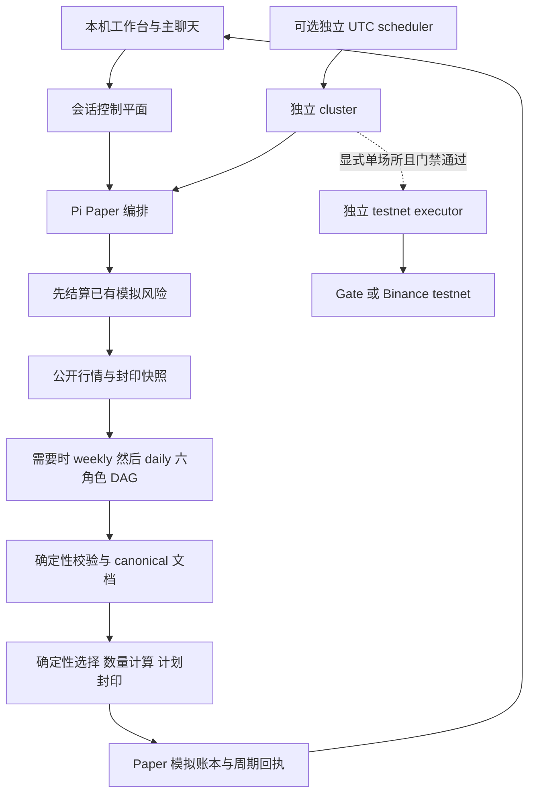
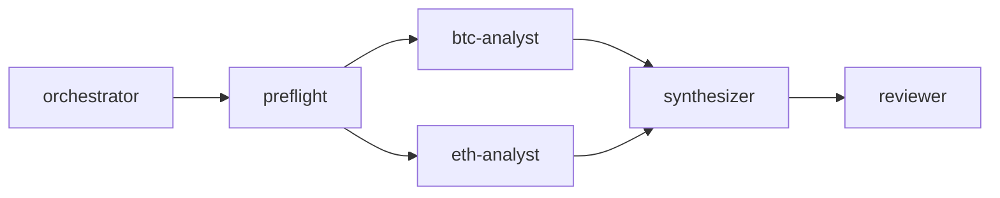

# Tyche 项目规划与验收路线

更新日期：2026-09-05。历史 Astra 验收基线：`285deb5`；本轮对话配置及模型池/自动手动分配是在 `68dd5ee` 上的未提交工作区增量，尚未发布。本文件是接续开发与验收计划；“已实现”描述代码存在，“已验证”必须注明验证环境，后续阶段不表示已经完成或已经启用。

## 1. 产品目标与范围

Tyche 的当前目标是：用户在本机通过主聊天讨论 BTC/ETH 策略，通过请求或委托让主 Agent 配置策略、角色模型和模拟起点，然后启动一次可追溯的公开行情分析与确定性 Paper 周期，理解结果、阻断原因和模拟账户变化。语义模型负责分析；数量、杠杆约束、资金限额、计划封印、模拟成交与执行权限由确定性代码负责。

现有 UI 简化和主聊天策略与模型/effort 操作已完成离线验收，保留为后续回归基线。接续工作首先验证真实模型网关，再验证完整 Paper 联合路径；用户明确选择后才验收已有独立调度及测试网能力。只有后续验证发现具体缺陷，才安排对应 UI 修复。优先跑通可复核的 Paper 闭环，不以产生交易或盈利作为成功标准。证据不足时的 `NO_TRADE` 或明确阻断也是正确结果。

固定范围：

- 资产仅 BTC、ETH。公开跨交易所数据是分析上下文，Gate 数据是 Paper 合约规则和执行证据的来源。
- 当前默认页面每次点击只运行一个 Paper 周期；不表示已开启无人值守调度或交易所执行。
- Spot 仅 dry-run；可选生产 Spot 账户读取仅服务 dry-run sizing，不具备 Spot 下单能力。
- USDT-M 交易所写操作仅存在于独立 Gate/Binance testnet 路径。生产交易始终不支持。
- 不默认安排多币种、多租户、云部署、新依赖、新调度框架、生产实盘或收益优化工作。

基础边界见 [CLAUDE.md](../CLAUDE.md)、[SECURITY.md](../SECURITY.md) 和 [确定性执行设计](GATE_TRADING.md)。本计划仅验收已有可选调度，不新增调度或部署；当前可选启动方式见 [README](../README.md)。

## 2. 当前交付状态与证据

| 能力 | 当前实现 | 验证范围与限制 |
|---|---|---|
| 本地分析工作台 | 固定 Agent 列表、主聊天、API 两字段、只读配置摘要与运行详情 | 本地页面及 fixture 路径已有验收；仍需结合真实网关完成用户最短路径验收 |
| 六角色 weekly/daily DAG | 固定拓扑、结构化输出、超时和有界分析重试、失败关闭 | 离线测试及 SDK fixture 已验证；不等于真实模型输出已稳定 |
| Astra 与角色 effort | 默认池仅 Astra；用户声明模型池，支持主 Agent 自动分配与手动六角色选择 | 实际 SDK 请求序列化已用 fixture 验证；真实 API key 与网关兼容性尚未验证 |
| 策略和主聊天 | 讨论无工具；解释不修改，配置请求按明确范围自动应用并反馈服务端状态 | 会话隔离、busy 互斥、冻结映射、身份校验和回执复用已有离线覆盖 |
| 首次 Paper 设置 | 对话收集十一项模拟参数，委托时明确模拟假设；固定文件与冲突校验 | 对话应用与失败回滚使用隔离 fixture 验证；不代表真实资金或真实偏好 |
| 公开行情与 Paper | CCXT 公共数据、Gate 权威证据、先结算、确定性计划、模拟账本、周期回执 | 已实现且有离线端到端覆盖；本基线未证明真实网关加当期公开行情的完整联合运行 |
| 独立 UTC scheduler | 固定 UTC 时槽、状态与依赖控制，cluster 默认 shadow | 实现和离线测试存在；不宣称已部署常驻进程或完成持续运行验收 |
| 独立 testnet executor | 单场所、独立进程/凭据、arm 与计划身份门禁、对账和保护单 | 实现和 fixture 测试存在；未据此宣称实际账户、真实提交、成交或保护成功 |

基线交付记录：`285deb5` 已完成 `npm test` **344/344**、`npm run check`、`npm run selftest`、`npm run test:e2e` **1/1**、`npm run web:build` 和 `git diff --check`，当时的独立安全与一致性审查无阻断。主 Agent 的本地 UI 验收使用实际 SDK 加 fixture 服务，确认 weekly/daily 共 12 个角色请求使用 Astra 和应用后的 effort；主聊天确认 `high → 显式应用 medium → 下一请求 medium`。

以上是既有代码基线的验收记录，不是本次文档修改重新执行全部测试的声明，也不证明真实网关、真实测试网账户或真实成交。可复跑入口在[第 8 节](#8-测试与验证矩阵)，交付时应附本次实际命令结果。不要把 GitHub 无法访问的临时目录日志作为唯一证据。

## 3. 用户最短操作路径

开发者先按 [README 的安装与本地启动步骤](../README.md#local-pi-cluster-and-analysis-cockpit) 安装、构建页面并运行 `scripts/tyche-control-plane.mjs`。服务仅绑定本机 loopback；默认使用随机一次性 bootstrap token，也可用权限为 `0600` 的 ignored `config/control-plane.token` 显式配置固定可复用登录。完整入口每次启动读取项目自身的固定路径；退出、会话过期和重启后可用同一固定 token 登录，每次仍生成随机 session/CSRF，重登录会撤销同一浏览器的旧会话和模型凭据。独立 `@tyche/control-plane` 包 CLI 是投影壳，保留随机一次性登录，不能替代完整脚本入口。

1. 登录后进入“运行设置”，手动选择 OpenAI Responses（默认）、OpenAI Chat Completions 或 Anthropic Messages，再输入对应的 API 基础地址与 API key。可填裸域名、基础地址或当前协议完整操作地址，前后端统一自动补全并显示实际基础地址；OpenAI 根地址补 `/v1`，Anthropic 去标准尾 `/v1`，显式网关前缀保留。协议、地址与 Key 整组保存，换协议或地址必须重新填写 Key，失败保留原配置。原连接校验检查 URL、本机 DNS 和 SDK/模型元数据；新目录检测会带会话 Key 请求固定 models GET，但不调用推理或 Paper；已知失败返回固定可操作提示。刷新或新标签页只读恢复当前会话；不同本机端口使用独立 cookie。会话变化后先恢复或重新登录，核对当前配置与保留的协议/域名/Key、聊天草稿，再自行发送；不会自动重试写操作。
2. 若网关仅支持自定义模型，先在“模型分配”保存可用 ID/effort 池及首次分配主模型，再填写连接；普通 Astra 网关无需新增步骤。在主聊天描述希望验证的 BTC/ETH 想法。主 Agent 主动问一两个必要问题，并在会话草稿中记住已知偏好与参数，不会因为最近八条消息窗口截断就清空答案。
   已有模型连接时，完整候选池及所有声明 effort 必须兼容当前协议；不兼容的候选在任何保存前整组拒绝。若要准备另一协议的模型池，可先清除模型连接；未连接时仍可预存池，原有 auto pending/manual blocked 的旧角色引用语义保留。
3. 用户不确定时可说“由你安排模拟起点”。主 Agent 将推断值标为虚拟资金和模拟假设，补齐十一项参数；它不推断真实余额，不保证最优或盈利。无需手填技术问卷。
4. 请求配置时，响应明确本次应用范围，服务器整组校验后自动应用策略、模型/effort、主题或首次 Paper 设置，并显示真实应用/待补充/失败状态。纯解释不改设置；独立主题或模型调整不顺带提交旧 Paper 草稿。已有账户与风控不会覆盖、重置或归档。
5. 选择“运行 workflow”。未就绪时引导主 Agent 补问；就绪后按当日 UTC 日期和 ISO 周冻结策略及完整角色配置，执行一次分析、确定性计划和 Paper 周期。
6. 查看周期结果、明确阻断原因及运行详情的 DAG/事件。实际角色 model/effort 可在本机回执 provenance 核查；同周期仍复用已有回执，不因聊天调整产生重复模拟成交。测试网在页面仅展示状态，独立执行门禁不变。

首次参数对应关系：

| 参数 | 含义 | 存放位置 |
|---|---|---|
| `configured_leverage` | 模拟杠杆，整数 1–3 | ignored 本地配置 |
| `risk_per_trade_bps` | 单笔风险预算 | ignored 本地配置 |
| `max_order_notional_usdt` | 单笔名义金额上限 | ignored 本地配置 |
| `daily_new_notional_cap_usdt` | 当日新增名义金额上限 | ignored 本地配置 |
| `max_managed_notional_usdt` | 总受管名义金额上限 | ignored 本地配置 |
| `initial_usdt` | 初始模拟资金 | 固定 Paper 账本 policy |
| `daily_loss_bps` | 当日亏损熔断 | 固定 Paper 账本 policy |
| `max_drawdown_bps` | 最大回撤熔断 | 固定 Paper 账本 policy |
| `max_spread_bps` | 允许价差上限 | 固定 Paper 账本 policy |
| `max_entry_distance_bps` | 入场距离约束 | 固定 Paper 账本 policy |
| `trigger_slippage_bps` | 触发滑点参数 | 固定 Paper 账本 policy |

`1 bps = 0.01%`，保留十进制精度。参数校验、账户摘要或既有配置不一致时应给出可操作错误，不覆盖账户或偷偷更改风险限额。实现见 [Paper 设置适配器](../scripts/control-paper-setup.mjs) 与 [页面工作流入口](../apps/web/src/workflow-entry.js)。

## 4. 实际架构与职责

默认 UI 手动周期不能触发 scheduled execute。图中的 testnet 分支是可选独立路径，绝不是 Paper 的自动升级步骤。执行器拥有场所凭据；分析、行情、Paper 与 cluster 服务不拥有测试网交易凭据。

### 固定六角色 DAG

| 角色 | 默认模型 | effort | 职责与边界 |
|---|---|---|---|
| `orchestrator` | Astra | `high` | 基于证据进行语义协调；主聊天复用此角色的有效模型与 effort |
| `preflight` | Astra | `medium` | 输出状态、证据引用和阻断项；不替代代码的新鲜度及风险检查 |
| `btc-analyst` | Astra | `high` | 分析 BTC 的公开证据 |
| `eth-analyst` | Astra | `high` | 与 BTC 并行，分析 ETH 的公开证据 |
| `synthesizer` | Astra | `high` | 合成符合 weekly/daily 结构的结果 |
| `reviewer` | Astra | `xhigh` | 审核合成结果；代码继续校验最终文档 |

weekly 和 daily 使用同一固定拓扑。主聊天不是第七个 DAG 角色；它没有工具或账户访问。DAG worker 仅使用 `submit_analysis` 结构化提交工具，不加载 shell、文件写入、coding-agent、扩展或任意上下文发现。控制器而非模型决定拓扑、超时、重试与失败关闭。

模型只能输出语义候选，不能指定数量、名义金额、合约张数、杠杆、客户端订单身份、`reduce_only`、HTTP 路径或成交状态。weekly 的 `execution_candidates` 必须为空；daily 新开风险需要有效且同周的 canonical weekly anchor。过期 anchor 不能授权新仓，但不能阻止符合确定性条件的受管减仓/退出。

关键调用链：[UI](../apps/web/src/App.jsx) → [控制平面](../apps/control-plane/src/control-plane.mjs) → [完整服务适配](../scripts/tyche-control-plane.mjs) → [Pi 自动化](../scripts/pi-automation.mjs) → [DAG 控制器](../packages/pi-agents/src/cluster.mjs)、[协议](../packages/pi-agents/src/protocol.mjs) → [canonical 校验](../scripts/agent-write.mjs) → [Paper 编排](../scripts/crypto-automation.mjs) 与 [Paper 引擎](../scripts/paper-trade.mjs)。

### 既有 Claude Code 入口

仓库仍保留 `/weekly-crypto`、`/daily-crypto`、`/auto-crypto` 等技能和工作流，使用显式日期与 ISO 周、只读分析及确定性写入边界，详情见 [README 的 Analysis](../README.md#analysis)。它们是既有独立入口；本计划的 Astra 默认配置描述针对当前 UI/Pi 路径，不表示这些 Claude 工作流也自动切换了模型。

### 模型与 effort 的兼容性

默认会话池仅包含 Astra；已知目录保留 Luna、Sol、Terra、5.5、5.4 Mini 供用户添加，也可声明自定义 ID 与可用 effort。已知模型 ID 见 [会话 provider 定义](../packages/pi-agents/src/session-provider.mjs)。只开放 `medium`、`high`、`xhigh`，不代表每个旧模型支持所有组合；必须按实际元数据拒绝不支持的组合，禁止 SDK 静默降档。

Pi `0.84.4` 自带目录没有 Astra，因此 [会话 provider](../packages/pi-agents/src/session-provider.mjs) 使用显式 custom 模型定义，默认走 Responses，也可明确选择 Chat Completions。`272000` context 与 text/image 输入来自已核实的本机目录；`16384` 是应用单次输出预算，不是模型能力上限。价格未知，SDK 必需的零占位不能展示为免费或费用估算。旧模型保留固定 SDK 元数据。Responses/Chat 的自定义模型只扩展固定协议请求的 model 值，不增加 provider/工具/执行权限；未知 context 在 SDK 使用零哨兵、对用户展示未知，价格不作估算。Anthropic Messages 仅接受模型面板列出的固定 SDK 原生 adaptive Claude 及可原样传输的 effort；GPT、未知别名、仅支持 budget 的模型和不支持的档位明确拒绝，不伪装模型或降档。不支持 OAuth，移除 SDK fallback 模型能力，失败不自动换协议。协议不能由聊天更改；自动目录发现可用已列出且本机支持的模型建立首次聊天候选池，手动配置保持原样。

## 5. 策略、配置与数据生命周期

| 对象 | 生命周期 | 生效规则与保护 |
|---|---|---|
| 模型协议/endpoint/API key | 服务端会话内存 | 协议随 job/result/provenance 记录；endpoint/Key 不写项目文件、提示词、结果或日志；退出、过期或服务重启后重新输入 |
| 讨论历史、策略草稿与已应用策略 | 会话内存 | 解释不应用；配置请求作用域决定所消费的草稿，策略仅影响后续未开始的分析 |
| 模型池、模式与六角色 model/effort | 会话内存 | 自动池变化标记 pending，主 Agent 完整分配与依据后就绪；手动模式拒绝聊天角色覆盖；主聊天未分配时使用明确 bootstrap |
| 周期输入快照 | 启动时冻结 | 第一个异步前置检查前冻结完整有效配置；运行中不改变角色身份 |
| Paper 风险配置 | `config/tyche.local.json`，Git ignored | 默认从 locked 模板建立；不修改提交模板，不静默覆盖冲突 |
| 自定义启动配置 | 用户选定的本地文件 | 始终保持选定，不由页面重写；缺失限额由用户在原配置补齐 |
| Paper 账户 | `data/paper/active.json`，Git ignored | 校验配置摘要、哈希链与既有状态，不因新会话或参数更改重置 |
| 行情、canonical 文档、计划、回执与 provenance | ignored runtime data/outputs | 由确定性代码校验和保存；不提交真实运行数据 |

模型池最多十二项，每项为有界 ID 和 medium/high/xhigh 的非空子集。已知元数据与声明冲突整组拒绝；池变化清理失效角色草稿，保留无关 Paper/策略草稿。手动模式支持逐角色保存；自动模式只有主模型返回完整分配及依据才可解除新池 pending，不在每个周期额外调用模型。

模型目录发现新增固定 `/api/provider/discover`，完成输入后 blur 或首次发送前自动读取，保留重新检测及失败后手动路径。单次标准 GET 限 10 秒、256 KiB、200 条，不扩展 query/重定向通道；Anthropic `has_more` 明确标为当前页不完整。目录只保留有界 ID 和固定能力来源，原始 name/description/URL 不入提示；目录列出、本机/SDK effort、用户明确声明、未知能力分别展示。目录五分钟失效，仅会话内存，绑定实际协议、归一化 endpoint 和凭据身份；旧异步响应不能覆盖新输入或重建失效会话。

自动候选池最多十二项，先保留当前可用声明（已声明窄 effort 不扩张），再按本机能力固定顺序补充，并展示规则与未选数量。无 Astra 但含已知可用模型可直接开始聊天，候选池及 bootstrap 只为启动对话，六角色仍须主 Agent 完整选择并提供依据。未知 custom effort 可保留为聊天草稿，但必须在模型面板明确保存才能成为能力声明；保存后匹配目录立即更新，检测事实/失效时间/连接绑定保持不变。无可启动候选时只展示目录，原可用连接及配置不变。显式能力声明独立于当前选用模型池保存；主 Agent 切换池或 effort 不缩减已确认能力。面板在开始编辑时捕获声明目标，服务端核对有界确认 ID 后绑定实际协议、地址和凭据身份；过期或被替换目标的旧草稿须重新确认，目录过期不清除同连接声明，换 Key/地址/协议不继承。目录成功换池复用失效角色草稿清理，保留独立 Paper/策略草稿；手动池、bootstrap 和角色均不被检测或聊天覆盖。

连接变更、讨论、应用与周期启动遵守现有 busy/session/CSRF 检查。模型输出不能获取或修改凭据，连接信息不能进入分析内容。周期冻结模型池、模式及完整角色选择；job、result、provenance 与分析重试身份包含实际角色 model、effort 和池摘要；不能仅记录默认值而掩盖实际请求。

同周期复用是低成本和不重复模拟成交的正确性要求。v2 回执封印 weekly、daily、market、policy、计划、Paper receipt 与账本前后状态摘要；在规定身份及 active ledger 匹配封印后状态时复用。变更提示词、模型或 effort 不能作为绕过回执、重复填单或强制新周期的理由。若回执与当前证据/账本不一致，依现有代码阻断或处理，不能删除回执“重试”。

## 6. 行情、Paper 与 testnet 的边界

公开行情通过唯一获准 CCXT 公共适配入口读取固定方法；“全部交易所”指当前安装 registry 中具备相关能力的来源，不承诺每个来源都可访问。`PARTIAL` 必须保留成功来源、失败类别及摘要；跨场所价格不能替代 Gate 的 Paper 执行证据。见 [跨交易所数据](MULTI_EXCHANGE_DATA.md) 与 [适配器](../scripts/multi-exchange-market.mjs)。

Paper 必须先结算已有仓位，再收集行情和启动分析。缺失或不连续的结算证据不能被模型补全。确定性代码根据账户、止损距离、限额和当前场所规则选择及量化候选；退出和减仓优先，不接受模型排序作为资金分配依据。账本只产生 `SIMULATED_*` 状态，venue `submitted` / `filled` 保持零，模拟成交单列。

Paper 使用显示盘口的保守限价成交模型、历史资金费与 mark bars 结算；同分钟冲突按清算、止损、止盈优先级处理。手续费与清算估计必须保留估计标识，不能当作真实交易所引擎或实盘成交证明。kill switch、损失与回撤熔断阻断新开风险，但继续结算和受管减仓/退出。详见 [执行与 Paper 设计](GATE_TRADING.md)。

现有可选 UTC scheduler 的 weekly 时槽为周一 `00:05 UTC`，daily 为每日 `00:10/04:10/08:10/12:10/16:10/20:10 UTC`，窗口 15 分钟，只处理当前窗口，不做历史回放。其时槽身份与手动 Paper 同周期回执不可混为一谈。实现见 [UTC scheduler](../scripts/utc-scheduler.mjs) 与 [cluster](../scripts/tyche-cluster.mjs)。

testnet 必须显式选择一个场所、独立进程及其本地配置/凭据。Gate 原手动路径保留精确 TTY 确认；自动测试网路径要求 `automatic_testnet` 与现有动态门禁，cluster 还要求 executor 已 arm。必须验证精确计划 ID/hash、当前账户/规则/价格、仓位模式、隔离保证金和用户指定杠杆。提交前原子预留；不确定提交不盲重试，sticky red 未解决不得继续；只有真实可识别成交才能创建对应数量的 reduce-only 保护。具体步骤以 [testnet 文档](AUTOMATIC_TESTNET.md)、[executor](../scripts/testnet-executor.mjs) 和 [交易模块](../scripts/testnet-trade.mjs) 为准。

## 7. 后续阶段：依赖、验收与停止条件

阶段采用完成条件，不承诺日期或模型费用。发现当前实现已满足时只补验收证据，不重复重构。

### P0：历史 Astra 基线与本轮对话配置验收

历史状态：`285deb5` 完成的是 Astra/effort、手填 Paper 参数及分别确认策略/模型的旧页面离线验收。其 344 项测试与页面证据不能证明本轮 API 两字段、主动追问和自动配置行为。当前工作区增量须单独验证下面清单；自动回归使用仓库内测试与隔离 fixture，最终页面验收由主 Agent 完成。尚未提交或发布新功能。

基线依赖：当前工作台、会话 provider、策略讨论与 Paper 设置接口，使用 fixture，无需真实交易凭据。

本轮工作区增量的验收与后续回归清单：

- 从首次登录到首次 Paper 周期无不必要步骤，仅 API 域名/Key 手填，十一项参数通过对话收集；错误指出具体缺项或冲突。
- 主聊天主动补问，用户委托时说明模拟假设并自动配置；模型池与逐角色选择是可手动填写的明确例外；作用域保证独立主题/模型修改不提交旧 Paper 草稿，界面显示服务端真实状态。
- 主聊天复用 orchestrator 的有效配置；六角色、三档 effort 及不兼容组合拒绝与实际 SDK 请求一致。
- 忙碌期间不能造成配置穿透；退出/过期后的内存状态消失，Paper 账户保持完整。
- 同周期复用在页面可理解，不暗示重复成交或静默重置账户。

后续回归停止条件：发现凭据泄漏、账户覆盖、角色权限扩张、冻结快照不一致或重复模拟成交，先修复并回归，暂停受影响的真实验证。修复交付只包含已证明缺陷所需修改、相应回归与说明。

### P1：真实模型网关联通与结构化输出验收

依赖 P0 和用户提供可用 endpoint/API key、该网关授权的模型集合，以及一次受控验证的调用预算/范围。凭据仅进入会话内存；不得请求用户把 key 发进文档或提交仓库。

先验证受限连接与主聊天，再用受控公开证据跑 weekly/daily 角色请求。逐项确认请求中的模型与 effort、结构化输出、超时/失败错误及 provenance；一次成功不能推断其他模型/effort 组合也可用。

验收标准：记录实际网关支持的 Astra 请求与本次角色 effort；周/日结果通过 canonical 校验，主聊天请求配置并由服务端确认应用后，下一请求采用新值；失败信息不暴露连接秘密；不存在静默降档。Astra 价格仍未知时不计算费用收益比。

停止条件：无有效 key、网关不支持模型或 exact effort、结构化结果不合格、预算范围不明确、网络或传输限制阻断。报告可复核的脱敏错误，不更换未知网关、扩大模型目录或降级配置来伪造通过。

### P2：真实公开行情加模型的完整 Paper 验收

依赖 P1、当期公开行情可用、用户给定全部 Paper 参数，以及一致且可校验的本地 Paper 配置/账户。

按实际 UTC 日期运行一次完整周期，核对先结算、行情封印、必要 weekly 刷新、daily、确定性计划、Paper 回执与页面结果。随后验证符合条件的同周期复用。熔断、坏账本、过期 anchor、证据中断等破坏性场景在隔离 fixture 中验收，不篡改用户活跃账户。

验收标准：阶段链与输入摘要完整；有效无交易结果也可完成；如产生模拟成交，数量、保护、费用/资金费和账本变化均可由确定性证据解释；真实 venue 提交/成交仍为零；重复运行不重复模拟填单；账户与风险参数未被重写。

停止条件：公开数据无法支持结算、配置摘要漂移、账本损坏、canonical 结果不合格、回执身份冲突或任何模拟/真实状态混淆。保留原状态和脱敏诊断，不清空账本以换取“成功”。

### P3：可选验收已有调度与 testnet 能力

本阶段不自动启用。P2 完成后，用户明确选择需要验证的现有路径及单一场所；调度 shadow 验收可先独立进行，testnet 执行另须账户、风险参数、独立凭据注入和现有授权/arm 条件。

调度验收先验证 UTC 时槽、重复 tick、周依赖、失败和时钟异常、进程重启后的状态，再观察用户选定的实际运行窗口。默认 shadow 不执行 testnet，手动 UI 周期也不能越过 scheduled execute 边界。

testnet 验收从独立 executor 状态与只规划开始；只有用户选择的测试网流程满足全部门禁，才验收实际提交、精确成交、保护与对账。传输歧义与保护失败主要通过 fixture 验证，不为制造测试结果故意扰乱真实账户。

验收标准：单一场所、隔离凭据、精确计划身份和 arm 条件可证明；unarmed、shadow、RED、歧义或 weekly 依赖失败均停止执行；不存在盲重试或场所故障转移；真实证据与 Paper 状态分离。

停止条件：用户未选择该阶段、独立进程或 testnet 账户条件缺失、风险参数不全、非单向/非隔离/杠杆不匹配、保护或对账无法证明。不得改为生产交易，也不新增常驻部署框架。本阶段完成仍不代表生产安全或盈利能力。

## 8. 测试与验证矩阵

| 层次 | 必须证明 | 主要入口 | 证据含义 |
|---|---|---|---|
| 配置与静态边界 | locked 模板、支持范围、无越权接口 | `npm run check`；[安全测试](../test/repository-safety.test.mjs) | 离线静态与配置检查 |
| 模型协议与 SDK | 三协议原生路径/认证头/SSE、固定角色、effort 原样序列化、协议身份/重试、兼容性拒绝 | [协议测试](../packages/pi-agents/test/session-protocol.test.mjs)、[Astra 测试](../packages/pi-agents/test/astra-effort.test.mjs)、[provider 测试](../packages/pi-agents/test/session-provider.test.mjs) | fixture 使用实际 SDK；不证明网关或 Key 可用 |
| 会话/UI | CSRF、busy、对话作用域、冻结、首次设置同步提交与错误 | [控制平面测试](../apps/control-plane/test/control-plane.test.mjs)、[Paper 设置测试](../test/control-paper-setup.test.mjs)、[UI 入口测试](../apps/web/test/workflow-entry.test.mjs) | 自动回归，另需实际页面验收 |
| Paper 与周期 | 先结算、计划、风险熔断、事件真值和复用 | [Paper 测试](../test/paper-trade.test.mjs)、[Pi 自动化测试](../test/pi-automation.test.mjs)、`npm run test:e2e` | 离线完整路径，不是实际网关/账户证据 |
| 调度/测试网 | 时槽身份、依赖、arm、歧义、保护和对账 | [scheduler 测试](../test/utc-scheduler.test.mjs)、[executor 测试](../test/testnet-executor.test.mjs)、[testnet 测试](../test/testnet-trade.test.mjs) | fixture 安全门禁，不是实际提交证明 |
| 全套离线回归 | 既有行为未破坏 | `npm test`、`npm run selftest` | 报告真实通过数与退出结果 |
| 页面构建与交互 | 构建成功、最短路径与应用后请求一致 | `npm run web:build` 与本地 UI 验收 | 构建不能替代交互验收 |
| 真实网关/Paper | 实际可用性、结构化响应、当期行情闭环 | P1/P2 的受控运行 | 未完成前明确标注未验证 |
| 实际调度/testnet | 选定运行窗口、真实测试网状态与执行证明 | P3 的单独验收 | 仅涵盖本次场所与实际证明的状态 |
| 文档交付 | 链接存在、事实与规划分离、无秘密或运行数据 | `node --test test/repository-safety.test.mjs`（扫描 Markdown）、相对链接检查、人工审阅、`git diff --check` | 文档检查不冒充业务回归 |

任何代码变更在描述仓库“ready”前都应按 [CLAUDE.md](../CLAUDE.md) 执行 `npm run check`、`npm test`、`npm run selftest`、`git diff --check` 并附真实输出摘要。涉及 UI 时补构建与交互验证，涉及周期时补 e2e。纯文档改动运行已有 `repository-safety` 扫描（Markdown 也受扫描），检查文档、链接和 diff，不添加与文档内容同构的测试。

每次验收记录代码 commit、日期、入口、fixture/真实环境、脱敏输入范围、通过数/失败原因及未覆盖项。失败是证据，不删除后只保留成功结果；不把已通过的历史输出标为本次新跑。

## 9. 风险与待用户提供的信息

| 未知项或风险 | 当前处理 | 推进所需 |
|---|---|---|
| 真实模型网关能力 | 本地 metadata 与 fixture 无法代替服务端验证 | 有效 endpoint/key、实际支持模型及受控调用范围 |
| 模型调用成本 | Astra 未知价格不做估算 | 用户可接受的验证预算或调用边界；不要求先知道单价才能做离线工作 |
| Paper 资金与风险偏好 | 不提供臆造默认值 | 十一项明确输入；已有账户时先校验，不覆盖 |
| 公开数据地区限制或缺口 | 显式 `PARTIAL` / 阻断，禁止补造 | 运行时可访问数据和完整结算证据 |
| 模型无效输出、延迟 | schema 校验、有界分析重试和失败关闭 | 真实请求验证及具体失败案例；不增加交易提交重试 |
| 会话内存丢失 | 退出/过期/重启后重新输入连接与策略 | 用户理解会话范围；不默认增加持久化功能 |
| 已有文件冲突或损坏 | 保留原状态，阻断初始化/运行 | 用户决定恢复正确配置；归档需满足现有无仓位/无活跃订单条件 |
| 调度与 testnet 尚无实际验收 | 默认不开启，离线能力与实际部署分开记录 | 用户选择阶段/场所/窗口及必要 testnet 条件 |
| 文档与代码随开发漂移 | 在同一功能交付中更新相关说明与证据 | 每阶段仅核对受影响调用链，不全仓重写 |

这些未知项阻断相应真实验证阶段，不阻断已授权的文档、离线审查或必要修复。不得要求用户在聊天中公开 API key、私密账户响应或交易历史。

## 10. 协作与 GitHub 交付规则

本项目开发协作与产品六角色 DAG 是两回事。主 Agent 仅负责规划、派发、审查与集成，不编写业务代码。GPT 开发子代理统一使用 Astra，并通过实际调用参数设置推理强度；不能只在任务文字中声称采用某档强度。

| 实际推理参数 | 使用条件 |
|---|---|
| `medium` | 默认：范围明确、局部且低风险的实现 |
| `high` | 跨模块或复杂逻辑 |
| `xhigh` | 架构、并发、安全或数据关键任务 |

不因文件数量、网络或权限问题升档。派发前记录任务与代理 ID、单一产物、文件范围、禁止项和验收条件；默认一个实现代理同时负责相关测试，不递归派发，不让多个代理同时修改同一文件。普通任务由主 Agent 验收；高风险任务仅增加一次独立审查。

执行规则：

- 先阅读相关契约与必要调用链，再定向实现；不全仓遍历、顺手重构、扩依赖或增加未来抽象。
- 每任务一次实现、最多两次定向修复，由原代理处理问题。更换代理或升档不重置次数；确认原任务结束后才能重试。没有新依据时停止重复尝试，报告剩余问题与阻断。
- 子任务返回文件、变更理由、实际检查结果与未知项。主 Agent 独立核对关键事实和边界，不能把子代理结论直接当作已验收。范围外问题列明证据与影响，不擅自扩工。
- 提交前检查工作区和 diff，仅纳入本任务文件，保留用户既有修改。真实凭据、ignored 配置、运行数据、日志、账本和截图不得顺手提交。
- 按用户实际 Git 授权完成目标分支交付；需要分支时默认使用 `codex/` 前缀。不得把一次上传授权泛化为未来修改的直接合并授权。
- 在可确认的基线上提交；远端推进时先检查差异，禁止强推覆盖。发现冲突或任务外变更时先隔离和解决，不能重置用户工作区。
- 上传后核对远端目标分支与 commit，返回 GitHub 可访问的文档链接、提交标识和本次检查结果。没有远端成功证据只能报告未上传及实际阻断。

本次交付范围仅为本文件及 [README](../README.md) 的文档入口；主 Agent 审查后按已获得的本次授权上传 `main`。

## 11. 接续入口

| 需要了解的内容 | 文档或代码 |
|---|---|
| 安装、启动、页面和命令 | [README](../README.md) |
| 开发契约与秘密/执行边界 | [CLAUDE.md](../CLAUDE.md)、[SECURITY.md](../SECURITY.md) |
| 语义证据要求 | [NO_HALLUCINATION](NO_HALLUCINATION.md) |
| 六角色运行机制 | [Pi README](../packages/pi-agents/README.md)、[DAG 控制器](../packages/pi-agents/src/cluster.mjs) |
| 模型连接与讨论 | [会话 provider](../packages/pi-agents/src/session-provider.mjs)、[策略讨论](../packages/pi-agents/src/strategy-discussion.mjs) |
| 本地工作台与冻结配置 | [App](../apps/web/src/App.jsx)、[控制平面](../apps/control-plane/src/control-plane.mjs) |
| Paper 计划、账本和回执 | [自动化](../scripts/crypto-automation.mjs)、[Paper](../scripts/paper-trade.mjs)、[Gate 设计](GATE_TRADING.md) |
| 公共数据及独立测试网 | [多交易所数据](MULTI_EXCHANGE_DATA.md)、[自动 testnet](AUTOMATIC_TESTNET.md) |

历史 P0 的 Astra 路径已有离线基线。本轮对话配置增量先完成独立检查、自动回归与新页面验收，再补齐 P1 网关前置条件并完成真实连接验证，随后进入 P2 真实联合 Paper 验收；P3 为等待用户明确选择的可选阶段。每阶段完成后更新事实、证据和剩余阻断，不把下一阶段计划改写为完成承诺。
