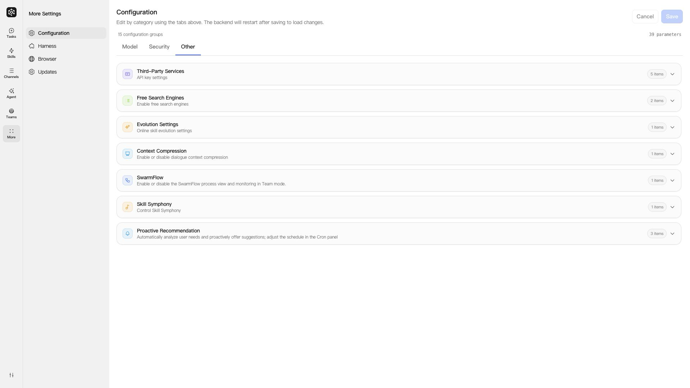
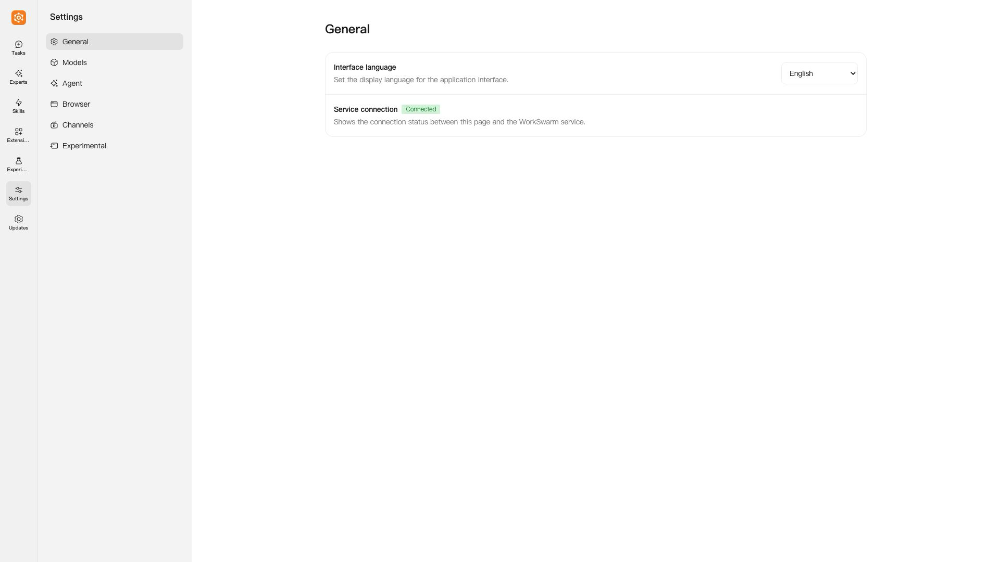
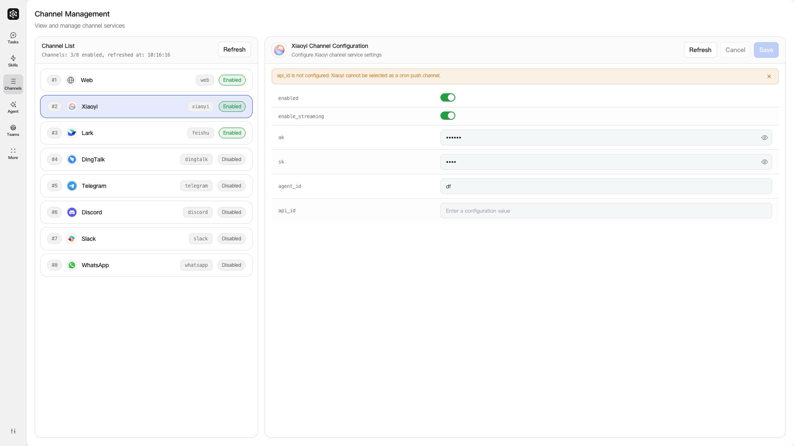
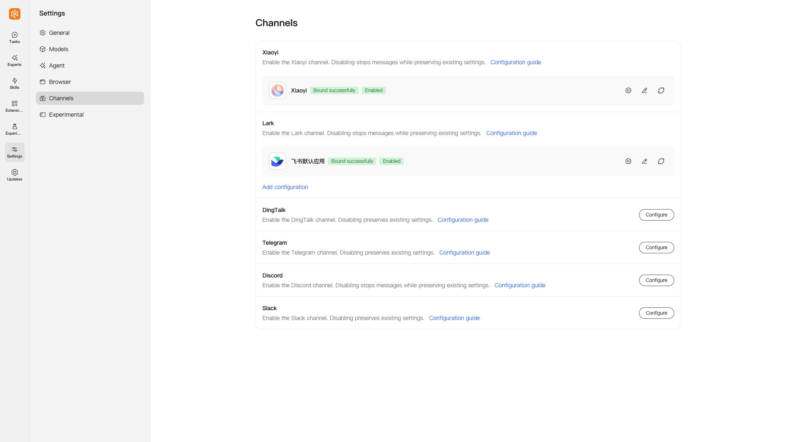
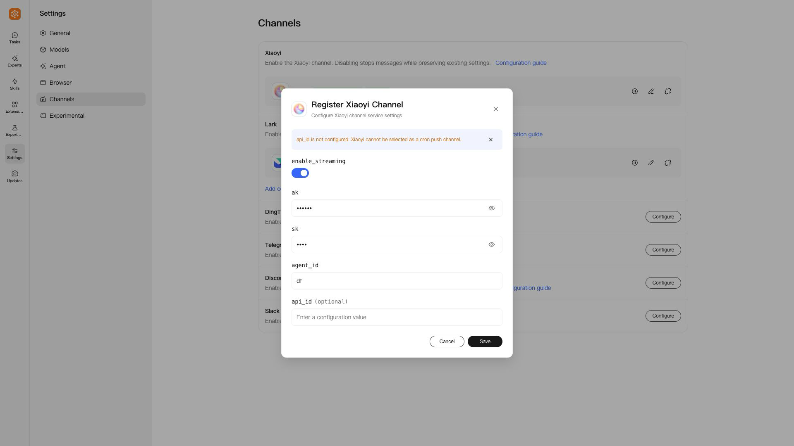
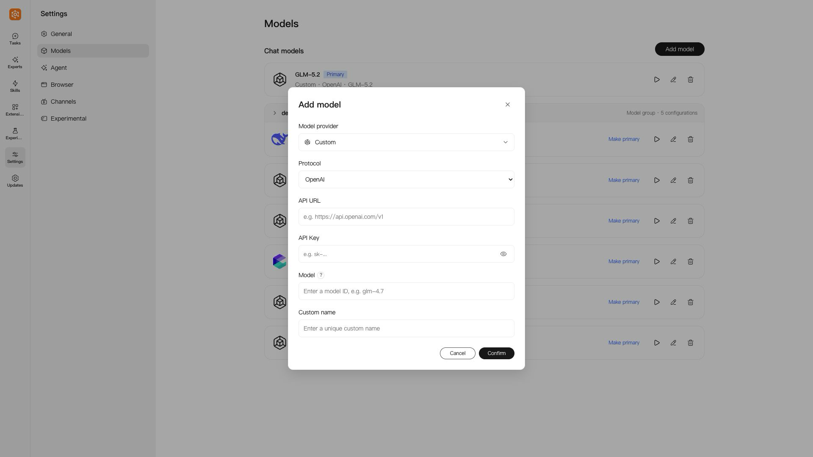
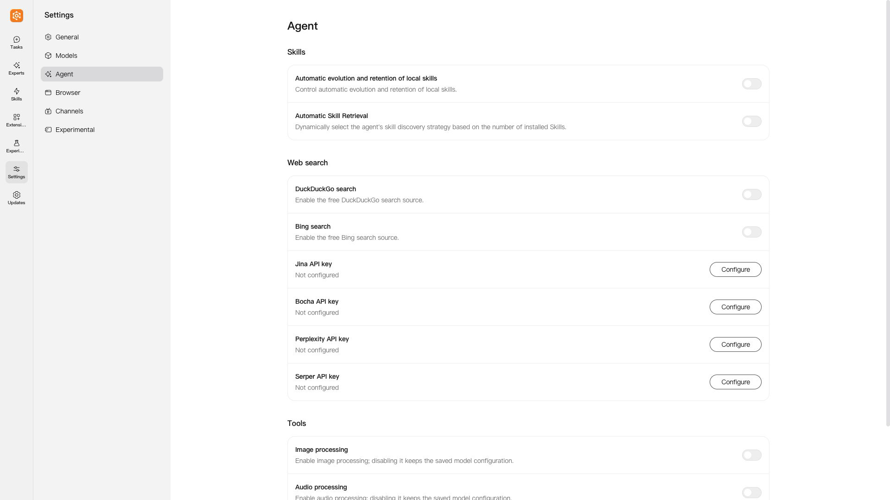
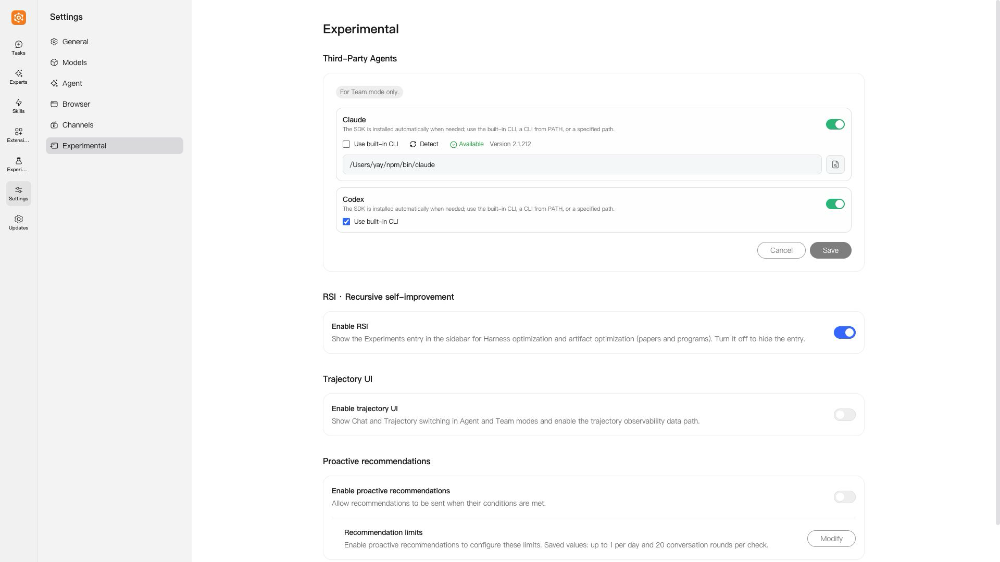
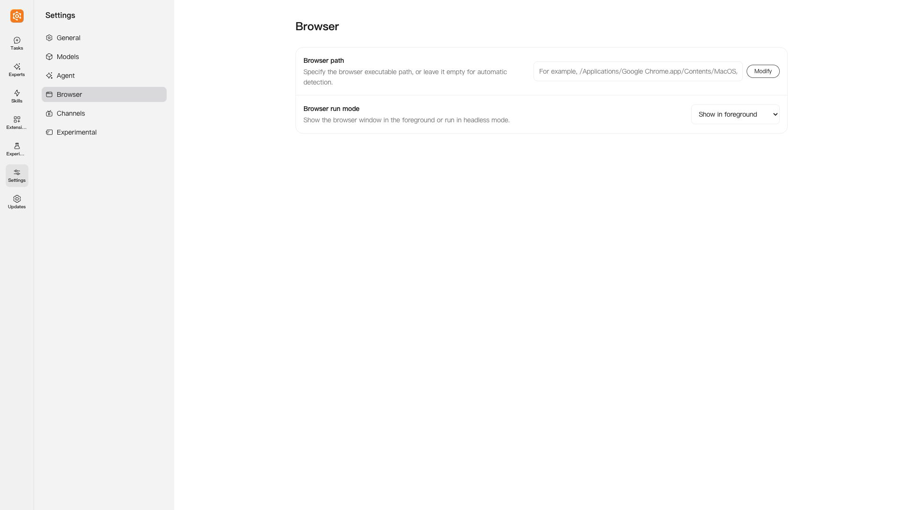
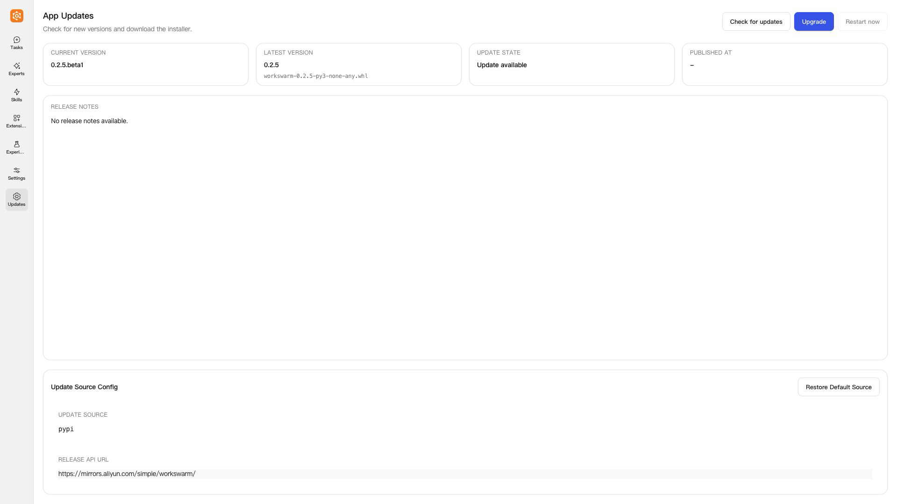

# Settings and Channels Upgrade: Configuration Migration Guide

[中文](../zh/设置与频道升级迁移指南.md)

In this guide, the **previous version** means **WorkSwarm 0.2.5**. The new interface was checked against the **0.2.6 development version**. This guide maps previous navigation entries and labels to their current equivalents. “No corresponding setting” means that the current interface does not expose that configuration option.

Screenshots show the English interface at 1920 × 1080. Saved app names and other user-entered values retain their original language.

## Navigation changes

- Previous **Channels** → **Settings → Channels**
- Previous **More → Configuration** → **Settings → Models / Agent / Experimental**
- Previous **More → Browser** → **Settings → Browser**
- Previous **More → Updates** → the separate **Updates** entry in the left sidebar

### WorkSwarm 0.2.5: More

### New interface: Settings

## Channels → Settings / Channels

**Settings → Channels** provides configuration for six channels: Xiaoyi, Lark (Feishu), DingTalk, Telegram, Discord, and Slack.

### WorkSwarm 0.2.5: Channels

### New interface: Settings → Channels

### Enable and disable controls

| Previous label | Current label |
| --- | --- |
| `enabled` | `Enabled` / `Not enabled` |
| Enable/disable switch | `Enable` / `Disable` (icon actions on the configuration card) |

### Xiaoyi

| Previous label | Current label |
| --- | --- |
| `enable_streaming` | `enable_streaming` |
| `ak` | `ak` |
| `sk` | `sk` |
| `agent_id` | `agent_id` |
| `api_id` | `api_id` |

`api_id` is optional. Without it, Xiaoyi cannot be selected as a notification channel for scheduled tasks.

### Lark (Feishu)

| Previous label | Current label |
| --- | --- |
| `name` | `App name` |
| `enable_streaming` | `enable_streaming` |
| `app_id` | `app_id` |
| `app_secret` | `app_secret` |
| `encrypt_key` | `encrypt_key` |
| `verification_token` | `verification_token` |
| `group_digital_avatar` | `group_digital_avatar` |
| Add app | `Add configuration` |
| Edit app | `Modify` |
| Delete app | `Unbind` |
| Set as default app | No separate setting |

### DingTalk

| Previous label | Current label |
| --- | --- |
| `client_id` | `client_id` |
| `client_secret` | `client_secret` |
| `allow_from` | `allow_from` |

### Telegram

| Previous label | Current label |
| --- | --- |
| `bot_token` | `bot_token` |
| `allow_from` | `allow_from` |
| `parse_mode` | `parse_mode` |
| `group_chat_mode` | `group_chat_mode` |
| `mention` | `Only respond to @mentions (mention)` |
| `reply` | `Only respond to replies (reply)` |
| `all` | `Respond to all messages (all)` |
| `off` | `Disable group chat (off)` |

### Discord

| Previous label | Current label |
| --- | --- |
| `block_dm` | `block_dm` |
| `bot_token` | `bot_token` |
| `application_id` | `application_id` |
| `guild_id` | `guild_id` |
| `channel_id` | `channel_id` |
| `allow_from` | `allow_from` |

### Slack

| Previous label | Current label |
| --- | --- |
| `reply_in_thread` | `reply_in_thread` |
| `bot_token` | `bot_token` |
| `app_token` | `app_token` |
| `default_channel_id` | `default_channel_id` |
| `allow_from` | `allow_from` |
| `allowed_channel_ids` | `allowed_channel_ids` |

## More / Configuration → Settings

Options from **More → Configuration** that still have a settings entry are now mainly organized under **Models**, **Agent**, and **Experimental**. See **Task input box** below for the current SwarmFlow entry.

### Model configuration

#### Default model and model list → Settings / Models

| Previous label | Current label |
| --- | --- |
| Free models | No corresponding setting |
| `model_name` | `Model` |
| `alias` | `Custom name` |
| `api_base` | `API URL` |
| `api_key` | `API Key` |
| `model_provider` | `Model provider` |
| `reasoning_level` | `Reasoning` (available options depend on the provider, protocol, and model) |
| Default for the main conversation | `Primary` / `Make primary` |
| Default among configurations with the same model name | `Group default` / `Make group default` |
| None | `Protocol` |

When adding a model, select **Model provider** first. Built-in providers are grouped into categories such as Token Plan, Coding Plan, and API. You can also select **Custom** or **OpenAI account**. The **API URL** input is shown only for **Custom**; other fields vary by provider. The screenshot below shows the **Custom** form.

#### Vision, audio, and video models → Settings / Agent

| Previous label | Current label |
| --- | --- |
| Vision model | `Image processing` |
| Audio model | `Audio processing` |
| Video model | `Video understanding` |
| `api_base` | `API URL` |
| `api_key` | `API key` |
| `model` | `Model name` |
| `provider` | `Model provider` |

### Other configuration

#### Skills and web search → Settings / Agent

| Previous label | Current label |
| --- | --- |
| Skill evolution | `Automatic evolution and retention of local skills` |
| Skill retrieval | `Automatic Skill Retrieval` |
| DuckDuckGo search | `DuckDuckGo search` |
| Bing search | `Bing search` |
| `jina_api_key` | `Jina API key` |
| `bocha_api_key` | `Bocha API key` |
| `perplexity_api_key` | `Perplexity API key` |
| `serper_api_key` | `Serper API key` |

#### SwarmFlow → Task input box

The previous SwarmFlow option corresponds to **SwarmFlow** in the current **Team mode**. Enable it from the **+** menu at the bottom left of the task input box, then open **SwarmFlow Configuration**. This is a per-session control; it is not under **Settings → Agent**.

#### External CLI agents and proactive recommendations → Settings / Experimental

| Previous label | Current label |
| --- | --- |
| External CLI agents | `Third-Party Agents` |
| Claude / Codex `enabled` | `Enable Claude` / `Enable Codex` |
| `use_builtin` | `Use built-in CLI` |
| `cli_path` | Uncheck **Use built-in CLI** to show the path input; use **Detect** or **Choose file** |
| A2UI / `a2ui_enabled` | No corresponding setting |
| Proactive recommendations | `Proactive recommendations` |
| `proactive_recommendation_enabled` | `Enable proactive recommendations` |
| `proactive_recommendation_max_recommend_per_day` | `Daily recommendation limit` |
| `proactive_recommendation_max_rounds_per_tick` | `Conversation rounds per check` |

Third-party agents are available only in **Team mode**. The two proactive recommendation limits are in the **Recommendation limits → Modify** dialog. Enable proactive recommendations before editing them. Both accept integers from 1 to 50.

The current Experimental page also provides **RSI · Recursive self-improvement** and **Trajectory UI**. These are outside the previous-version configuration mappings listed in this guide.

## More / Browser → Settings / Browser

| Previous label | Current label |
| --- | --- |
| Browser type and its options | No corresponding setting |
| Executable path (optional) | `Browser path` |
| Show browser: on | `Show in foreground` |
| Show browser: off | `Headless mode` |

The current page provides only **Browser path** and **Browser run mode**. Leaving the path empty enables automatic detection. There is no longer a browser type or preference-order selector.

## More / Updates → Separate Updates entry

In WorkSwarm 0.2.5, **Updates** was under **More**. The new interface provides a separate **Updates** entry in the left sidebar.

