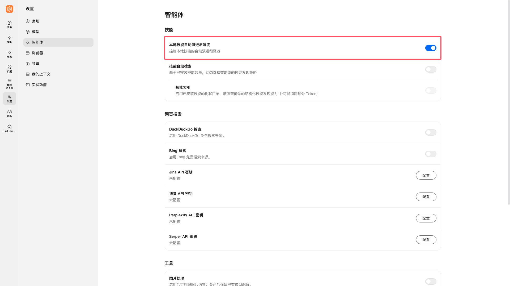
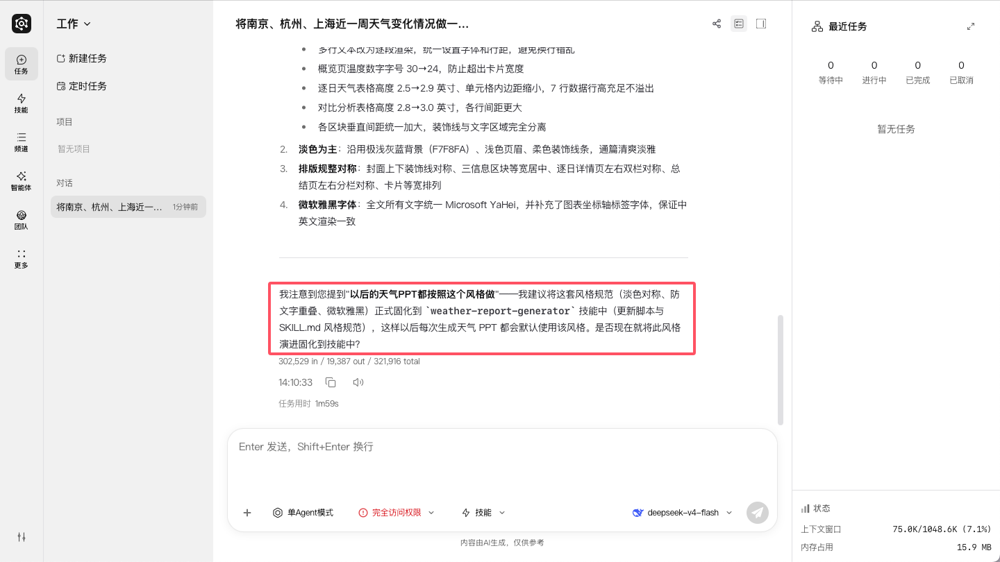
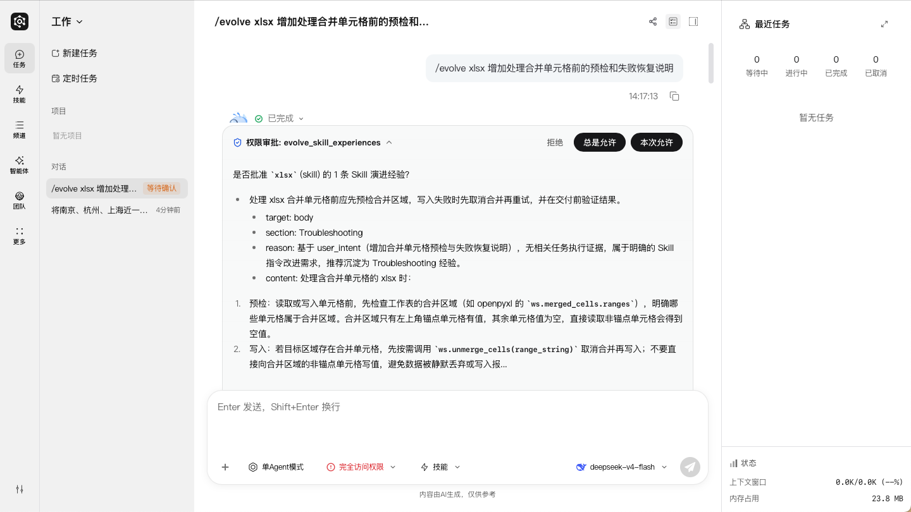
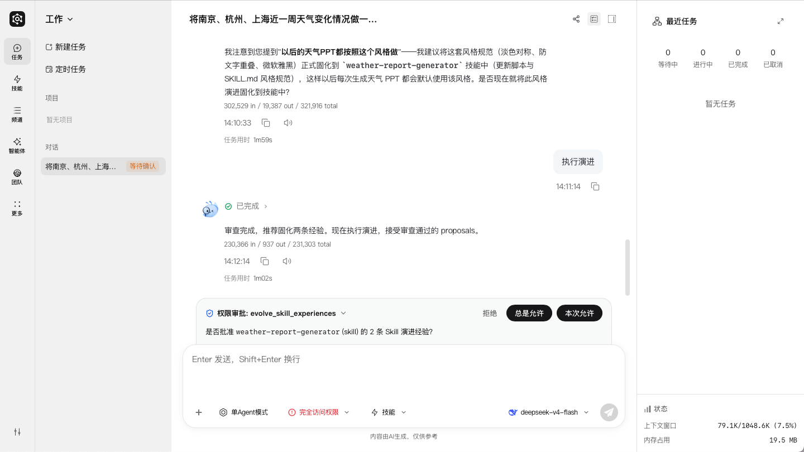
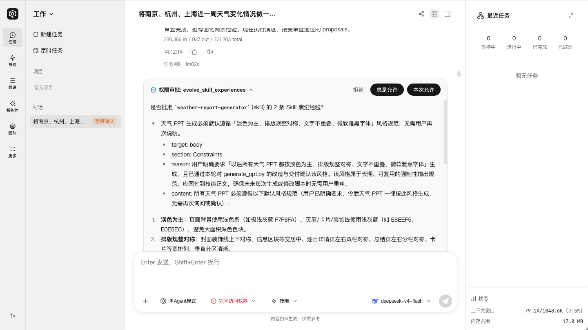
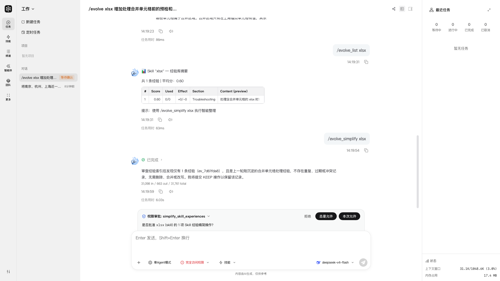
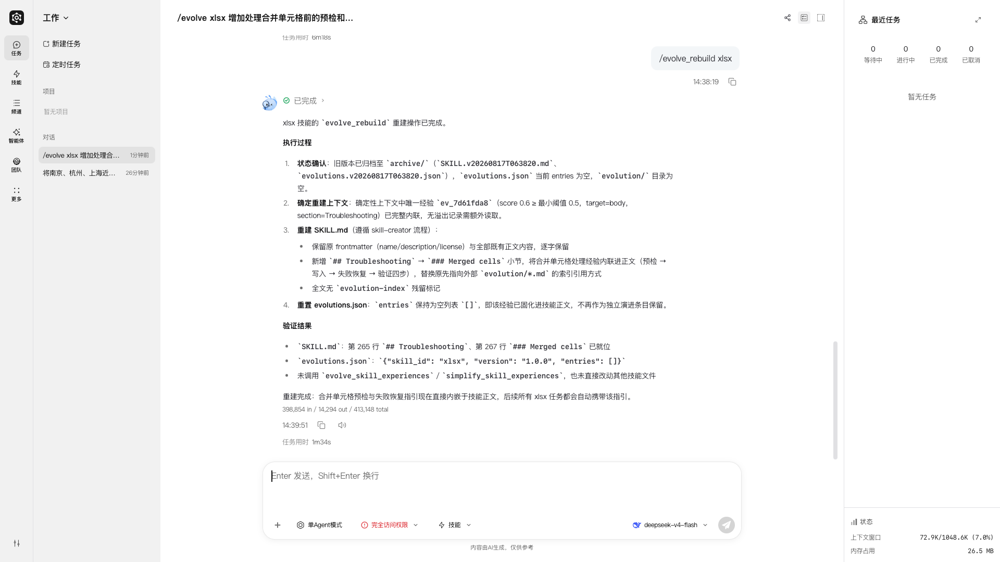
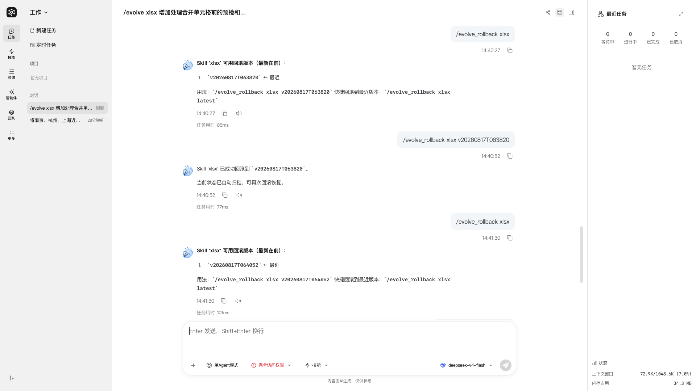

# Skill Self-Evolution

## 1. Overview

### 1.1 Introduction to Skill self-evolution

Skill self-evolution is a core JiuwenSwarm feature built on the openJiuwen evolution framework. It addresses the fixed-capability limitation of traditional Agent systems. In a traditional system, capability definitions rarely change after they are written: tool-call failures may only be logged, and feedback about a misunderstanding may not change the logic used next time. The capability ceiling is effectively fixed from the day of deployment.

JiuwenSwarm turns recurring problems and better practices discovered during real use into improvement input for a Skill. This changes a Skill from a one-time static document into a living document that can keep improving through real use. Once experience is saved, it is loaded automatically the next time an Agent uses that Skill; it does not have to be merged into `SKILL.md` immediately.

The current main path does not create experience merely because an error keyword or a single user correction appears. For a Single Agent and an Agent Team's Team Leader, the main Agent considers the evidence from the current task, decides whether the improvement is reusable, and only then decides whether to suggest Skill evolution.

### 1.2 Core value

The core value of Skill self-evolution includes:

- **Lower day-to-day intervention cost**: The Agent identifies reusable experience and saves it according to the approval policy.
- **Continuous capability improvement**: Accumulated corrections, prechecks, fallbacks, and verification methods can make a Skill more accurate and reliable over time.
- **Adaptation to changing scenarios**: Reusable adjustments and optimizations come from actual usage scenarios.
- **Reduced maintenance cost**: Less manual Skill updating is required, while accumulated experience remains manageable through inspect, simplify, rebuild, and rollback operations.

## 2. Configuration and Role Differences

### 2.1 Enable Skill self-evolution

`react.evolution.skill_evolution` is the single switch for Skill self-evolution and defaults to `false`. The Web configuration page displays it as **Automatic evolution and retention of local skills**; the TUI exposes the same setting in its Features group.

The minimum configuration is:

```yaml
react:
  evolution:
    skill_evolution: true
    auto_save: false
```

| Setting | Default | Description |
| --- | --- | --- |
| `react.evolution.skill_evolution` | `false` | Enables Skill evolution, automatic Skill-creation suggestions, and the related commands and tools |
| `react.evolution.auto_save` | `false` | YAML-only advanced setting that controls whether experience submitted by a Single Agent or Team Leader requires user approval |
| `react.evolution.review_feedback_min_confidence` | `0.7` | Minimum confidence required for a Reviewer Feedback attribution to enter team evolution |

Turning off `skill_evolution` disables the related Rails, self-check prompts, evolution tools, and `/evolve` commands. It does not prevent explicit use of the general `skill-creator` or `swarmskill-creator` capabilities.

During an upgrade, JiuwenSwarm synchronizes the configuration structure with the new template, but it does not translate values from the legacy `enabled`, `auto_scan`, `skill_create`, or related environment variables into `skill_evolution`. If those capabilities were enabled before upgrading, check the configuration after the upgrade and explicitly turn on **Skill self-evolution**.



### 2.2 Role differences

| Role | Trigger and approval behavior |
| --- | --- |
| Single Agent | Counts non-follow-up task iterations and currently runs a self-check every five eligible iterations by default; `auto_save` controls approval |
| Team Leader | Runs a self-check after each team task is confirmed complete; approval is also controlled by `auto_save`, and suggestions and approvals are presented to the user |
| Teammate | Uses a background passive-signal path with fixed automatic saving and does not present the same self-check suggestion or approval interaction |

## 3. Evolution Triggers and Management

### 3.1 Automatic suggestions from the Agent

After the feature is enabled, a Single Agent and Team Leader start self-checks at different times:

- **Single Agent** counts non-follow-up task iterations and currently checks once after every five eligible iterations by default. Background heartbeat, cron, and follow-up tasks do not count toward the threshold.
- **Team Leader** does not use the five-iteration threshold. It starts one self-check for the completed team execution whenever a team task is confirmed complete.

After a self-check starts, the main Agent judges whether the current task contains a reusable update, such as:

- A user correction that also applies to future tasks of the same kind.
- A missing precheck, parameter description, fallback, or verification step in a Skill.
- An execution failure that exposes a repeatable gap in the Skill instructions.

Temporary environment failures, one-off facts, personal preferences, and unsupported guesses should not produce an evolution suggestion. When the Agent finds a reusable update, it briefly describes the improvement at the end of its normal response and asks whether to start Skill evolution. Otherwise, it does not expose the internal self-check.



> **Prerequisites**: Turn on **Skill self-evolution** and make sure the target Skill is installed and visible. With a Single Agent, complete five eligible non-follow-up task iterations. With a Team Leader, complete one team task and have all of its task states confirmed complete.

### 3.2 Reviewer Feedback-driven team evolution

In a scheduled team, when Task review fails and Skill self-evolution is enabled, the system attributes the Reviewer Feedback:

- For a Skill issue, the system retains the observation, aggregates observations by Skill after all Tasks finish, and sends them through the Team Skill evolution flow.
- For an executor error or unattributed failure, the system records the failure without changing a Skill.
- When no Skill can be attributed but the same reusable pattern recurs across Tasks, the system starts a new Team Skill approval.

Only attributions that meet `react.evolution.review_feedback_min_confidence` enter this flow. Reviewer Feedback does not create or update member-private Skill copies, and this path does not use the Single Agent five-iteration threshold.

Updates to an existing Team Skill use the Team Leader evolution approval flow and require user approval by default when `auto_save: false`. New Team Skill creation uses a separate creation approval flow.

### 3.3 Start a review with `/evolve`

To review a Skill immediately, enter:

```text
/evolve <skill_name> [user_intent]
```

`user_intent` is an optional evolution intent that identifies the issue you want to improve. For example:

```text
/evolve xlsx add prechecks and recovery guidance before processing merged cells
```

The system reviews the conversation and execution evidence available in the current task, then returns either "no evolution needed" or structured improvement proposals. `/evolve` starts a review; it does not guarantee that experience will be generated or saved.

Automatic suggestions retain their mode-specific subject boundaries: a Single Agent targets regular Skills, while a Team Leader targets Team/Swarm Skills. An explicit `/evolve` command resolves the target's actual kind, so Team mode can manually evolve a regular Skill and normal mode can manually evolve a Team/Swarm Skill. The target must still be installed and visible to the current Agent.



> **Prerequisites**: Turn on **Skill self-evolution**, make sure the target Skill is installed and visible to the current Single Agent or Team Leader, then enter `/evolve` with the Skill name. To show an approval interaction, also set `auto_save: false`.

### 3.4 Approve and save

For both a Single Agent and Team Leader, `react.evolution.auto_save` applies the same approval rule:

- `auto_save: false`: Validated proposals require user approval before they are written to the experience store.
- `auto_save: true`: Validated proposals bypass user approval and are saved automatically.

A Teammate uses a fixed automatic-saving policy and does not present an approval interaction based on this `auto_save` value. Saved experience is loaded automatically the next time the Skill is used.

When `auto_save: false`, a Single Agent or Team Leader presents an experience approval entry to the user.



After expanding the approval content, the user can inspect the structured proposal's `target`, `section`, `reason`, and `content` before deciding whether to approve it.



### 3.5 Inspect and simplify experience

The preferred way to manage saved experience is through the Web UI. Find the target Skill in the Skill list, then select **View skill experience**.


In the experience editor, you can inspect each entry, edit its content, delete entries, and save the result.


You can also use:

```text
/evolve_list <skill_name>
/evolve_simplify <skill_name> [user_intent]
```

`/evolve_list` shows an experience summary for the named Skill. `/evolve_simplify` reviews existing entries and runs the corresponding workflow for merge, refine, or delete suggestions.



### 3.6 Rebuild and roll back

Saved experience takes effect on later calls without a rebuild. To merge experience permanently into `SKILL.md`, use:

```text
/evolve_rebuild <skill_name> [user_intent]
```

A rebuild first archives the current Skill and its experience log, then merges the experience into `SKILL.md`. Experience that has been merged is no longer retained as a separate evolution entry.



To inspect available archives or restore a version, use:

```text
/evolve_rollback <skill_name>
/evolve_rollback <skill_name> <version>
/evolve_rollback <skill_name> latest
```

Without a version, the command lists available archives. With a specific version or `latest`, it restores that archive. The current state is archived before restoration so that it can be rolled back again.



### 3.7 Advanced `evolutions.json` troubleshooting

Experience is stored in `evolutions.json` under the Skill directory. The file is created dynamically when experience is first saved and may not exist when no experience has been saved.

```text
~/.jiuwenswarm/agent/workspace/skills/<skill_name>/
├── SKILL.md
├── evolutions.json    # Created after experience is first saved
└── ...
```

Agent Team uses the same global Skill library, so its experience is stored at the same path. Skill visibility for team members is defined by the team's visibility declaration; see "Team Skills" in [Agent Team](AgentTeam.md).

The following is a **read-only example** of the current storage structure:

```json
{
  "skill_id": "file-operations",
  "version": "1.0.0",
  "updated_at": "2026-08-17T10:30:00+00:00",
  "entries": [
    {
      "id": "ev_1234abcd",
      "source": "user_intent",
      "timestamp": "2026-08-17T10:30:00+00:00",
      "context": "Relative file path failed before checking the working directory",
      "change": {
        "section": "Troubleshooting",
        "action": "append",
        "content": "Check the working directory and candidate paths before reading a relative path.",
        "target": "body"
      },
      "applied": false,
      "score": 0.6,
      "usage_stats": {
        "times_presented": 0,
        "times_used": 0,
        "times_positive": 0,
        "times_negative": 0
      },
      "summary": "Add a relative-path precheck"
    }
  ]
}
```

- `entries` contains the saved experience records.
- `change` describes where and how one experience updates the Skill, together with its concrete content.
- `target` identifies the Skill layer being improved and can be `description`, `body`, or `script`.

This example is for understanding and troubleshooting, not an interface contract for constructing records manually; the system may add optional fields in later versions. The Web experience editor and evolution commands are the preferred management interfaces. Edit `evolutions.json` directly only for troubleshooting or recovery. Back it up first and validate the JSON afterward. Do not add records manually or rewrite system-managed fields such as `id`, `source`, and `timestamp`.

## 4. Example: Add a File-Path Precheck

### 4.1 Scenario background

Suppose we have a simple `file-operations` Skill for handling file operations. It includes a `read_file` function for reading file content.

**Initial `SKILL.md` definition:**

```markdown
# file-operations Skill

## Functions

### read_file
- Function: Read the content of the specified file
- Parameters:
  - `file_path`: File path
- Return: File content

## Examples
- Read file: read_file({"file_path": "/path/to/file.txt"})
```

The initial instructions do not require the Agent to check the working directory and candidate paths before reading a relative path.

### 4.2 Accumulate evidence across the conversation

#### Round 1: Discover the problem

```text
User: Help me read test.txt from the current directory.
Assistant: Sure, I will read test.txt from the current directory.
Tool: file-operations.read_file({
  "file_path": "test.txt"
})
Tool Response: Error: File not found: test.txt
Assistant: Sorry, I cannot find test.txt. What is its full path?
```

This execution failure can be evidence for an evolution review, but the word `Error` does not necessarily create experience.

#### Round 2: The user provides a working path

```text
User: It should be ./test.txt.
Assistant: I will read ./test.txt.
Tool: file-operations.read_file({
  "file_path": "./test.txt"
})
Tool Response: This is the content of test.txt.
Assistant: Successfully read ./test.txt.
```

#### Round 3: The user adds a reusable requirement

```text
User: No, when I provide only a file name, check the current directory first. I should not have to add ./ manually.
Assistant: Thank you for the feedback. I will check the working directory and candidate paths before reading the file.
```

This correction further explains the cause of the failure and the behavior that should be reused. During a Single Agent's counted self-check or a Team Leader's team-completion self-check, the main Agent decides whether checking the working directory and candidate paths before reading a relative path applies to future tasks of the same kind; it does not create a record directly from a keyword such as "No."

### 4.3 Review and save the proposal

If the main Agent judges the behavior to be reusable, it asks whether to start evolution for `file-operations`. You can also start the review immediately:

```text
/evolve file-operations add working-directory and candidate-path prechecks before reading relative paths
```

After the review starts, `evolution_reviewer` examines the current evidence and creates structured proposals only when evolution is justified. Once approved or saved automatically, the proposal is written to the `file-operations` experience store.

### 4.4 Effect after evolution

The next time `file-operations` is used, the Agent loads the experience automatically and follows its precheck guidance:

```text
User: Help me read test.txt from the current directory.
Assistant: I will check the working directory first, then read ./test.txt.
Tool: file-operations.read_file({
  "file_path": "./test.txt"
})
Tool Response: This is the content of test.txt.
Assistant: Successfully read test.txt.
```

When the user provides only a file name, the Agent can now follow the saved experience to check the working directory and candidate paths instead of asking the user to add the `./` prefix manually.

## 5. How It Works

### 5.1 Key components

- **`SkillEvolutionRail` / `TeamSkillEvolutionRail`** register the evolution tools and review Subagent and coordinate self-check, submission, and lifecycle behavior.
- **`evolution_reviewer` Subagent** uses restricted read-only evolution tools to review current evidence, decide whether evolution is needed, and produce structured proposals.
- **`EvolutionInterruptRail`** handles user approval when human confirmation is required.
- **`EvolutionStore`** queries, saves, and rebuilds experience data.

### 5.2 Main path for a Single Agent and Team Leader

```text
Single Agent counted self-check, Team Leader completion self-check, or /evolve
        |
        v
Main Agent judges whether the update is reusable
        |
        v
User confirms starting the review (automatic self-check path)
        |
        v
evolution_reviewer reviews evidence and creates proposals
        |
        v
Proposal validation
        |
        +-- auto_save: false --> EvolutionInterruptRail approval
        +-- auto_save: true  --> automatic save
                                   |
                                   v
                            EvolutionStore
                                   |
                                   v
                            evolutions.json
```

### 5.3 Teammate compatibility path

A Teammate keeps a shorter passive path instead of the user-facing automatic self-check interaction:

```text
Passive signal detection -> SkillExperienceOptimizer -> fixed automatic saving
```

`SkillExperienceOptimizer` remains part of this passive path, but it does not drive the main judgment or proposal workflow for a Single Agent, Team Leader, or `/evolve`.

## 6. Command Reference

| Command | Purpose |
| --- | --- |
| `/evolve` | Show pending experience across all visible Skills |
| `/evolve <skill_name> [user_intent]` | Start a review for the named Skill |
| `/evolve_list <skill_name>` | Show an experience summary for the named Skill |
| `/evolve_simplify <skill_name> [user_intent]` | Simplify experience for the named Skill |
| `/evolve_rebuild <skill_name> [user_intent]` | Rebuild experience into the Skill |
| `/evolve_rollback <skill_name> [version]` | List restorable versions or restore the Skill to a specified version |

---

## Navigation

- [Back to Documentation Home](../README_EN.md)
- [Back to Project Home](../../README.md)
