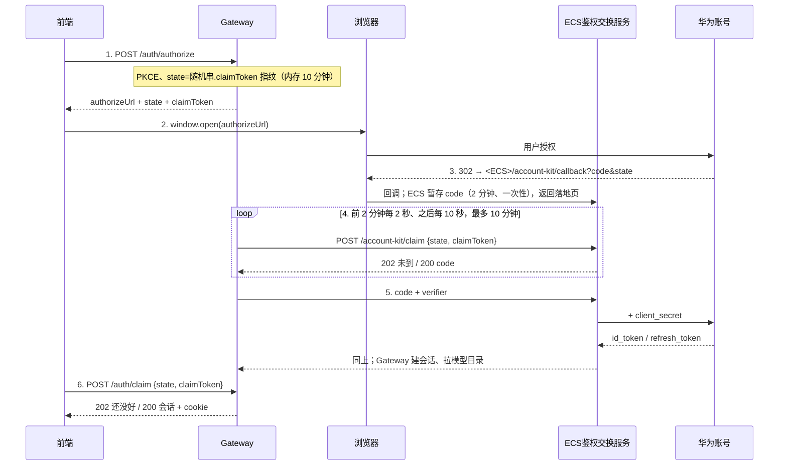

# 华为账号登录

用户点「登录」→ 浏览器打开华为账号授权页 → 授权完成回到应用，登录用户就能用平台
提供的免费模型，不用填任何 API Key。模型走 SE 的 APIG，额度按用户（openid）结算。

登录用的是**华为账号 Account Kit**（开发者联盟 AGC 注册的应用），不是华为云 IAM——
用户是华为账号，不是华为云账号。

**默认关闭**：不设开关时所有 `/api/v1/auth/*` 返回 404、界面不显示登录入口，对现有部署零影响。

---

## 一、开启

登录相关的配置**全部由官网配置接口下发**，本地只留一个引导地址。这个地址有默认值
（`remote_config.DEFAULT_CONFIG_URL` = `https://aigw.openjiuwen.com/v1/config`），
所以**默认就是开着的**，什么都不用配。联调或私有部署指到别处：

```bash
export JIUWENSWARM_CONFIG_URL=http://127.0.0.1:8800/api/v1/config
```

**关掉整块功能**：把这个变量显式设成空串或 `off`（还认 `none` / `0` / `false` /
`disabled`），一个请求都不发，登录接口一律 404、界面不显示入口。

**拉不到配置、或接口返回 `is_effective=false`，同样是功能关闭**（免费模型活动下线）。
区别是：`is_effective` 由官网控制，但客户端只在启动时拉一次配置，所以要等客户端重启才生效。

**界面区分三种关闭**（`/api/v1/auth/status` 的 `state` 字段，见 `account_kit.campaign_state`）：

| state | 什么情况 | 界面 |
| --- | --- | --- |
| `ended` | 配置拉到了，`is_effective=false` | 设置页只留一条"活动已结束"的公告，模型下拉不显示入口 |
| `unavailable` | 配置拉不到（官网接口挂了、断网、代理挡了） | 和 `ended` 显示同一条公告。**措辞不提"连不上"**：那会让人以为是我们的服务坏了。活动可能还在跑，所以从没拉到过配置时后台每 30 秒重试（退避到 10 分钟封顶），窗口重新获得焦点时前端也会重查，恢复后自动变回 `active`，入口跟着回来，不用重启 |
| `off` | `JIUWENSWARM_CONFIG_URL` 显式关掉 | 整块不渲染 |

接口返回的形状（缺字段用默认值，多字段忽略）：

```json
{
  "v1.0": {
    "is_effective": true,
    "ttl_seconds": 60,
    "huaweiaccount_login": {
      "client_id": "118998093",
      "callback_url": "https://aigw.openjiuwen.com/account-kit/callback",
      "scope": "openid profile",
      "exchange_url": "https://aigw.openjiuwen.com/account-kit/token",
      "account_center_url": "https://id1.cloud.huawei.com/AMW/portal/userCenter/index.html"
    },
    "gateway": {
      "base_url": "https://aigw.openjiuwen.com",
      "models_path": "/v1/models", "quota_path": "/v1/usage", "invoke_path": "/v1"
    },
    "models": { "whitelist": [], "blocklist": [] }
  }
}
```

外层 `"v1.0"` 是版本层，客户端自动剥掉：顶层的键全是版本号形状（`v1` / `v1.0` / `v1.2.3`）时
下钻一层，多个版本并存取版本号最大的那个；配置直接摊在顶层也认。

| `huaweiaccount_login` 字段 | 默认值 | 说明 |
| --- | --- | --- |
| `client_id` | `118944053` | AGC 里的 `oauth_client.client_id`（**不是** `client.client_id` 也不是 `app_id`），也是 id_token 的 `aud` |
| `callback_url` | `https://aigw.openjiuwen.com/account-kit/callback` | **必须和 AGC 里登记的逐字一致** |
| `scope` | `openid profile` | 必须含 `openid`，否则拿不到 id_token |
| `exchange_url` | https://aigw.openjiuwen.com/account-kit/token | ECS token 交换服务的完整地址|

登录段**按登录形式分开命名**：凡是以 `_login` 结尾的段客户端都收下，各实现取自己那一段
（本实现是 `huaweiaccount_login`，见 `account_kit.LOGIN_SECTION`）；段内的键原样交给实现。
一份配置能同时带多种登录形式，将来加一种不用动解析代码。段名要和官网接口约定一致，
上线前和平台侧确认。`gateway.base_url` 没给 = 能登录但没有免费模型。`models.whitelist`
空 = 不过滤，要屏蔽个别模型用 `blocklist`。

**一个进程只拉一次。** 启动时后台预热拉一次，之后常态下**再也不拉**——每个客户端就是
一个进程，按 TTL 定期刷新的话官网要扛「在线客户端数 ÷ 刷新周期」的常态 QPS。代价是改配置
（含活动下线 `is_effective=false`）要等客户端重启才生效，`ttl_seconds` 收下但不使用。

**拿不到配置怎么办。** 只有从来没拿到过才会重试：失败后 30 秒冷却，再有调用就再试一次，
否则一次网络抖动会让这个客户端整个生命周期都没有登录功能。已经拿到过就一直用内存里那份，
官网后来挂了也不影响已登录的人。

**谁在哪个线程上拉配置。** Gateway 事件循环上的处理（转发时挂凭据、登录路由判断功能
开没开）和 AgentServer 逐请求的模型解析都**不在调用线程上发 HTTP**：读内存里那份，还没有
就在后台线程补拉，同一时刻只拉一次。两个进程启动时各在后台预热一次。以前 AgentServer
只走非阻塞读取、从来没拉过配置，"选了免费模型却没登录"的预检因此一直没生效。


### 为什么换 token 要经过 ECS

Account Kit 的 token 端点只认 `client_secret_post`，**不支持免 secret 的公共客户端**，
所以换 token 必须带 secret。而 jiuwenswarm 是分发给用户的程序，secret 打进包里等于公开。

所以客户端里**没有任何 secret**，换 token 和续期都发给 ECS 上的交换服务。它就是一个
"会补 secret 的 token 端点"：客户端发的表单和华为 token 端点一样（`grant_type` / `code` /
`code_verifier` / `redirect_uri` 或 `refresh_token`，外加 `client_id` 供它核对），它补上
secret 转给华为，只回 `id_token` / `refresh_token` 等字段（不回 access_token）。
服务端脚本与部署说明不在本仓库。

- 没配 `EXCHANGE_URL` 时，发起登录直接返回 `503 exchange_not_configured`，不会把用户送去授权页。
- `EXCHANGE_URL` 用明文 `http://` 指向非本机地址时，网关启动会打一条警告——响应里有
  refresh_token，明文只能联调。

### 回调地址

配置里给了 `callback_url`（生产形态）就落 **ECS**，否则回落到本机 `redirect_uri`。

- **落 ECS**：AGC 登记 `https://<域名>/account-kit/callback`。和客户端端口、机器无关。
  ECS 按 state 暂存授权码，发起方凭 claimToken 来认领。
- **落本机**（老形态）：AGC 登记 `http://localhost:19000/api/v1/auth/callback`，端口就是
  `WEB_PORT`。端口被占、开第二个实例、从别的机器访问 Gateway，回调都回不到发起的那个进程。

两种形态下 `code_verifier` 都只在发起方内存里，ECS 拿不到它就换不出 token。

---

## 二、流程

回调落 ECS（生产形态）：



回调落本机时没有第 4 步：浏览器直接打到 Gateway 的 `/auth/callback`，它当场换 token 建会话，
落地页经 `BroadcastChannel` 通知同源的应用页。

续期（id_token 快过期时）：Gateway ── refresh_token ──> ECS ── + client_secret ──> 华为。

**前端不轮询。** 第 6 步只在「授权可能已经完成」的时刻发一次：落地页广播过来（同源才收得到）、
窗口重新获得焦点 / 变为可见、或用户点「我已完成登录」。还没好就返回 202，等下一个时刻。
回调落 ECS 时，Gateway 收到第 6 步会当场向 ECS 认领一次，不等第 4 步的下一轮。

**放弃登录要通知 Gateway。** 前端点「取消」、登出、关闭页面时调 `/auth/cancel`，第 4 步在下一轮认领前停止；
否则它会一直问到 10 分钟超时。ECS / APIG 返回 429 或 5xx 时第 4 步只当作暂时失败，继续问。

**为什么要 claim。** 回调不落在发起登录的那个进程里：落 ECS 时它在云上，落本机时它在打开
授权页的浏览器里（桌面端跳的是系统浏览器，cookie 还不通）。两种情况都只能由发起方主动来取。

安全上的几条：

- **PKCE（S256）**：verifier 只在 Gateway 内存里，换 token 时带上。
- **claimToken** 只下发给发起方，不出现在授权 URL 里。state 会进地址栏和浏览器历史，
  但光知道 state 取不走会话；claimToken 对不上时也**不删**待完成记录，猜 state 的人
  搅不黄合法用户的登录。回调落 ECS 时，state 里带的是 claimToken 的**指纹**
  （`account_kit.claim_fingerprint`，ECS 侧规则必须一致），ECS 据此校验认领者，
  因此不需要发起方提前登记，多台 ECS 之间也没有要同步的账本。
- **授权窗口拿不到应用页的引用**：`window.open` 之后立刻把新窗口的 `opener` 置空，落地页
  改用只在同源页面间传递的 `BroadcastChannel` 通知，不再有 `postMessage(…, "*")`。
  没直接用 `noopener` 特性：那样 `window.open` 恒返回 `null`，判断不了弹窗是否被拦截。
- **发起 / 认领 / 登出要带 `X-Jiuwen-Auth: 1`**，否则 403。Gateway 监听在本机端口，任何
  网页都能对它发不带自定义头的"简单 POST"（`/authorize` 不需要 cookie，SameSite 挡不住），
  比如不停地往内存里塞待登录记录；带自定义头的跨站请求要先过 CORS 预检，Gateway 不开 CORS。
- 会话 cookie `HttpOnly`、`SameSite=Lax`；经 HTTPS 访问时加 `Secure`（本机 http 访问时加了
  浏览器就不存）。
- **回调一次性**：同一个 state 的第二次回调（用户刷新了落地页）直接拒绝，不再去换——
  授权码已经用过，再换只会失败，还会冲掉第一次的结果。
- 落地页 `Cache-Control: no-store`（URL 里带着授权码），错误文本做 HTML 转义；
  state 无效时只给中性提示，不回显原因。

---

## 三、凭据与续期

- 存 **id_token**（RS256 JWT，1 小时）和 **refresh_token**；access_token 是不透明串，
  APIG 验不了，不存。
- 华为**不轮换** refresh_token：刷新响应里没有新的，沿用旧的。并发刷新因此不会互相
  作废，同一账号的并发续期仍会合并成一次（省请求）。
- **提前 5 分钟续期**。能等网络的调用方（`/auth/status`、`/auth/models`、`models.list`）
  同步续；不能等的（Gateway 转发热路径、逐请求的模型解析）把续期丢到后台线程，这一次
  先用还没过期的旧 token。已经过期的那一次拿不到凭据，下一次就能用上后台换好的。
- 续不了（refresh_token 被吊销）才判定登录过期。

模型层取凭据：

```python
from jiuwenswarm.common.auth import ModelAuthRequired, resolve_id_token

try:
    token = resolve_id_token(session_id)      # 调 APIG：Authorization: Bearer <token>
except ModelAuthRequired as err:
    ...  # err.reason: not_logged_in / session_expired，透给前端决定弹登录框还是提示重登
```

---

## 四、模型怎么接

APIG 配的是**自定义认证**：FunctionGraph 用 JWKS 离线验 id_token 的签名和
`iss` / `aud` / `exp`，再按 openid 拼出这个用户的 LiteLLM key 注入给后端。客户端只发一个静态头
`Authorization: Bearer <id_token>`——不签名，也不自己带身份头。

**后端是 LiteLLM。** 每个华为账号（openid）在 LiteLLM 上唯一一把 virtual key
`sk-userkeyprefix-<openid>`，额度（`max_budget` / `spend`）记在这把 key 上。这些都在服务端，客户端不感知：

- **开户**：ECS 交换服务在登录 / 续期换 token 成功后检查 key，没有就创建、快过期就续签（幂等，失败下次续期再补）；
- **调模型**：APIG 认证器拼出 key，经「前端认证参数」映射成后端 `Authorization` 头给 LiteLLM，不访问 LiteLLM；
- **额度**：APIG `/v1/usage` 的后端就是 LiteLLM 的 `/key/info`（不带 key 参数，用户自己的 key 查自己）。
  客户端把 `info.max_budget` / `info.spend` **1:1 当作积分**（不做币种换算），展示总量、已用和剩余；
  已用达到总量 90% 时提示积分所剩不多。
- **刷新时间**：key 上设了 `budget_duration`（如 `7d`）时 LiteLLM 到点清零花费。额度策略归 LiteLLM 管：ECS 只在
  开户时写默认值（`LITELLM_BUDGET_DURATION` 等）、之后只续有效期，SE 在 LiteLLM 里的调整不会被覆盖。
  额度接口带回 `reset_period` / `reset_at`，设置页说明行按本地时区显示"每周一 08:00 刷新积分"（每天 / 每月同理，
  不规律的周期显示间隔和下次时间）；用完时显示"将于 9月21日 周一 08:00 刷新"。没配周期显示"用完后需改用已配置的模型"。
  文案逻辑在前端 `features/free-models/quotaReset.ts`。

key 可由 openid 推出，LiteLLM 端口必须由安全组只放行 APIG 和 ECS。服务端代码在仓库外：
`account_kit_exchange/`（ECS）、`apig_authorizer/`（FunctionGraph），部署步骤见两边的 README。

| APIG 接口 | 谁调 | 暴露成什么 |
| --- | --- | --- |
| `GET /v1/models` | Gateway | 并进 `models.list`，出现在会话的模型下拉里；也有 `GET /api/v1/auth/models` |
| `GET /v1/usage` | Gateway | `GET /api/v1/auth/quota` |
| `/v1`（OpenAI 兼容） | AgentServer | 写进模型条目的 `api_base`，SDK 直接发推理请求 |

**凭据随请求走。** Gateway 在转发前按调用方的登录会话把
`_model_auth: {api_base, api_key, credential_ref}` 挂到请求参数上（`common/auth/passthrough.py`），
`api_key` 是 id_token，`credential_ref` 是句柄：用本机会话密钥对**账号（openid）**做的 HMAC。
**句柄必须按账号、不能按会话**——集群成员在建团队时就定了句柄，重新登录会换会话 id，
句柄跟着会话走的话在跑的团队永远等不到新 token（报 `APIG.0305`，重新登录也救不回来）。
同一账号在会话存储里只保留一个会话，所以按账号取句柄既稳定又不会串到别的登录上；
用 HMAC 而不是直接哈希，是因为 openid 不算秘密。客户端自己传的
`_model_auth` 一律先删掉。

**AgentServer 侧的模型里只有句柄。** 每个带凭据的请求到达时，id_token 按句柄登记进本进程
的凭据表；模型条目的 `api_key` 是占位值 `jiuwen-login:<句柄>`，SDK 照常拼成
`Bearer <占位值>`，由挂在 SDK httpx 客户端上的请求钩子在发出前换成登记表里最新的 token
（`common/auth/login_credentials.py`，`app_agentserver` 启动时安装）。钩子只对登记时的接入点
生效，句柄查不到或地址对不上时删掉 Authorization 头再发，占位值和 token 都不外泄。

这么绕一下是为了**集群模式**：团队运行时跨请求常驻，追问直接投递给在跑的团队、不重建成员，
成员的模型配置在创建时就定死了。配置里放真 token 的话一小时后成员全部 401；放句柄的话，
下一个请求带来的新 token 会登记进表，在跑的成员下一次调模型自动用上。单 agent 和集群走同一套：
集群装配时 `team_helpers` 用 `build_login_model_entry` 造条目，经 `team_manager` 传到
`config_loader`，成员默认模型和 `model_pool` 都用它（成员显式配置了模型的不受影响）。
顺带：SDK 按 `api_key` 缓存 HTTP 客户端，句柄不随 token 轮换而变，客户端不再每小时多一个。

**没有新请求时由 AgentServer 发起续期。** 集群可以在用户不发消息时自己跑超过一小时。
AgentServer 每分钟扫一遍凭据表：最近 20 分钟真的用过（钩子替换过，或有请求带来凭据）、
且 15 分钟内过期的句柄，通过 server_push（`payload.event_type = auth.credential.refresh`，
只带句柄）请 Gateway 续期。Gateway 按句柄反查该账号当前的会话、在线程里续期（提前量用 15 分钟，
不是自己的 5 分钟），再用 E2A 单次调用 `auth.credentials.update` 推回
`{credential_ref, api_key}`；会话已注销或凭据过期且续不了，推回 `{credential_ref, revoked: true}`。

- 由 AgentServer 发起：只有它知道谁还在调模型。用户走了、集群停了就不再续。
- 推送只能更新**已登记**句柄的 token，改不了接入点，也不能凭空登记。
- 同一句柄 2 分钟内只请求一次；续期失败时按这个间隔重试，旧 token 还能用就先用旧的。
- 登出时 Gateway 主动推撤销，在跑的集群立刻停用该会话的免费模型。
- 任何一环失败（Gateway 没连上、交换服务不通）都只是不续，行为和没有这个机制时一样。

Gateway 侧 `models.list`（Web 和 TUI 两处）下发的登录模型条目里 `api_key` 仍是真 token，
下发前置空。

**模型是发现出来的，不是配出来的。** 与用户自配模型并存：登录模型是运行时叠加的一层，
永远不写进 config.yaml（凭据会过期、换账号会变）；同名以用户自配的为准（按原样比较，
`GLM-5.2` 和 `glm-5.2` 算两个）。登录模型**只能排在配置的模型之后**：`models.list` 的
`origin_index` 就是列表下标，保存设置时拿它回查 `models.defaults` 的同一位置，排到前面会让
配置模型的下标错开、保存时写串。目录缓存在 `model_catalog.json`，30 分钟过期，刷新失败继续
用旧的，失败后 30 秒内不再向 APIG 重试（没登录不算失败）；登出时清掉。

**额度以积分展示。** 设置页 `/api/v1/auth/quota` 返回 `quota.{total, balance, used, low_balance, exhausted,
reset_period, reset_at}`，积分就是 LiteLLM key 上的 `max_budget` / `spend`，1:1 原样透传。

**推理失败的错误码。** SDK 抛出来的只有一句文本，AgentServer 在 `chat.error` 发往 Gateway 的
两个出口（请求流、server_push）按文本分类，打上 `code` 和 `upstream: true`，前端换成能照着做
的提示并附原文（`agent_ws_server._annotate_model_error` → `apig.classify_model_error` →
前端 `features/free-models/chatError.ts`）。**只对最近一次请求用的是免费模型的会话分类**——
用户自配模型的 429 不是"免费额度用完"，别的 APIG 返回 0305 也不该弹华为账号登录框。

| 上游 | code | 前端 |
| --- | --- | --- |
| `APIG.0305` / `0307` / `0316` / `0319`（认证器拒绝：token 缺失、过期、验签失败） | `login_required` | 提示登录失效 + 弹登录框 |
| LiteLLM `budget_exceeded`（400 "Budget has been exceeded"）、`402 insufficient_quota`、文本含"欠费 / 额度" | `quota_exhausted` | 免费积分已用完 |
| `APIG.0308`、`429`、too many requests / rate limit / max parallel request | `rate_limited` | 请求太频繁，稍后再试 |
| 其余 `APIG.xxxx`（0202 后端不可用、0203 超时、0101 API 未发布、0301 被配回 IAM 认证……）、LiteLLM 的 key 未开户 / 过期 / 模型未放开（不带 APIG 码的 401）、`502 Upstream provider error`、`model_not_found`、其他 5xx | `free_model_unavailable` | 服务暂时不可用，稍后重试或换模型 |

APIG 错误码以华为云「APIG 的 API 错误码说明」为准。注意集群 SDK 会把所有 `181001` 模型调用失败
（包括 401 / 402）重试 10 次再报错，对话里会先看到几段 `[Retry n/10]`。

---

## 五、HTTP 接口

| 接口 | 说明 |
| --- | --- |
| `POST /api/v1/auth/authorize` | `{authorizeUrl, state, claimToken, expiresIn}`；既没有交换服务也没有 secret 时 503。发起 / 认领 / 取消 / 登出都要带 `X-Jiuwen-Auth: 1`，否则 403 |
| `GET /api/v1/auth/callback` | 回调落本机时的落点（浏览器访问），返回 HTML 落地页 + cookie；落 ECS 时用不到 |
| `POST /api/v1/auth/claim` | `{state, claimToken}` → 202 还没完成 / 200 会话 / 400 失败 |
| `POST /api/v1/auth/cancel` | `{state, claimToken}` → 放弃这次登录，停止向 ECS 认领；总是 200 |

**切换账号。** 我们的登出只清本地会话，浏览器里的华为登录态还在，所以再次授权会直接放行原账号。
实测 `prompt=login` / `select_account` / `consent` 与 `max_age=0` 华为全部忽略，
发现文档里也没有 `end_session_endpoint`，两个猜测的登出地址都是 404——**服务端没有办法结束那个登录态**。
所以「切换账号」是两步：清掉本地会话并打开华为账号页面
（`huaweiaccount_login.account_center_url`，默认 `https://id1.cloud.huawei.com/AMW/portal/userCenter/index.html`），
用户在那里退出后回到应用点「继续」，再走正常授权。登录回来仍是原账号时，账号面板会提示还要先去浏览器退出。
| `GET /api/v1/auth/status` | 登录状态（不含任何 token） |
| `POST /api/v1/auth/logout` | 清会话 |
| `GET /api/v1/auth/models` | 登录后可用的模型 |
| `GET /api/v1/auth/quota` | 免费积分；未接 APIG 时 `available=false` |

会话 id 两种带法：cookie `jiuwenswarm_auth`，或 `X-Auth-Session` 请求头（`/claim` 的响应头
里回带一份）。HTTP 路由**严格**按调用方的会话取，不带会话就是没登录，不会退回「本机唯一登录用户」。

ECS 侧对外的三个接口（`/account-kit/token`、`/account-kit/callback`、`/account-kit/claim`）
和生产部署见 [免费模型生产部署.md](免费模型生产部署.md)。

---

## 六、存储

- `~/.jiuwenswarm/auth/sessions.json`：AES-256-GCM 加密，外层 `{"v": 2, "payload": …}`。
  认不出的版本按未登录处理，不迁移（重新登录一次即可）。
- 密钥是同目录的 `.install_key`，**一台机器一把**，没有环境变量可以覆盖它——会话本来就是
  一台机器一份。真要做多副本共享登录态时，存档本身也得挪到共享存储，到时一起加。
- `.install_key` **读不了就报错，绝不重建**（文件被杀毒 / 备份软件短暂占用时重建会覆盖掉好密钥，
  已保存的会话从此解不开）；内容损坏才重建，旧文件改名为 `.install_key.corrupt-<时间戳>` 并记 ERROR。
  首次生成走"临时文件 + 不覆盖地原子放置"，Gateway 和 AgentServer 同时启动也只会有一把。
- Gateway 写存档、AgentServer 读，按 mtime 感知对方的变更。
- 发给前端的一律走 `AuthSession.public_view()`，不含任何 token；日志里的 state / session id
  / openid 只留尾 8 位。

---

## 七、踩过的坑

1. **多进程。** Gateway 和 AgentServer 是两个进程。会话存储、模型目录的内存缓存都要
   按文件 mtime 失效，否则登录前启动的 AgentServer 永远认为没人登录。
2. **`is_default` 不是「我是默认模型」。** 前端按 `is_default !== false` 决定模型进不进
   聊天下拉，登录条目必须是 `True`；不会抢默认，配置的模型排在前面。
3. **AgentServer 的模型解析会静默回退到默认模型。** 按名字查不到就用默认模型、只打一条
   warning。免费模型不在进程级缓存里，所以请求前的预检（`_model_config_error`）必须先认
   请求级凭据，没凭据时明确拒绝（见第 4 条），否则就是"选了免费模型却跑了别的"。
4. **没有会话就是没登录，绝不借用「本机唯一登录用户」。** 早先取凭据时，没带会话 id
   会退回本机唯一的登录会话，结果无痕窗口不登录就能用免费模型，用的是另一个窗口那个
   账号的 id_token 和额度。现在凭据只沿请求带下来的会话 id 取：`models.list` 用 WS 握手
   时认出的会话，推理用 Gateway 挂上的 `_model_auth`；AgentServer 的进程级模型缓存里
   **不放**登录模型。选了免费模型却没带凭据时，AgentServer 返回 `code: login_required`，
   前端直接弹登录框，而不是静默换成默认模型。
5. **注销后别被迟到的续期写回来。** `update_credential` 写之前先同步磁盘。
6. **额度会重置。** 身份换过两次：IAM principalId → 华为账号 openid（llm_gw 按新用户开户），
   llm_gw → LiteLLM（按 openid 新开 key）。每次切换用户的已用额度都不会带过去。
7. **回调端口就是网关端口。** `account_kit_login.py` 这类调试脚本要自己绑 19000 收回调，
   和网关不能同时跑。

---

## 八、代码位置

```
jiuwenswarm/common/auth/
    account_kit.py      Account Kit：配置 / PKCE / 待完成登录 / 换 token / 续期
    service.py          AuthService（回调、认领、续期）+ 模型层取凭据
    session_store.py    会话存储：内存 + 加密落盘
    apig.py             APIG 客户端：模型列表 / 额度 / 推理接入点
    model_catalog.py    登录模型目录：发现、缓存、条目
    passthrough.py      Gateway → AgentServer 的请求级凭据
    login_credentials.py  AgentServer 侧凭据表 + SDK 请求钩子（模型里只放句柄）

jiuwenswarm/gateway/channel_manager/web/web_http_auth.py      /api/v1/auth/* + 回调落地页

jiuwenswarm/channels/web/frontend/src/
    services/authClient.ts              HTTP 调用
    stores/authStore.ts                 登录状态 + 认领触发（关掉弹窗不中断）
    components/LoginDialog/             登录弹窗 / 入口

tests/unit_tests/common/test_auth_*.py
tests/unit_tests/gateway/test_web_http_auth_routes.py         authorize → callback → claim 全链路
```

---
