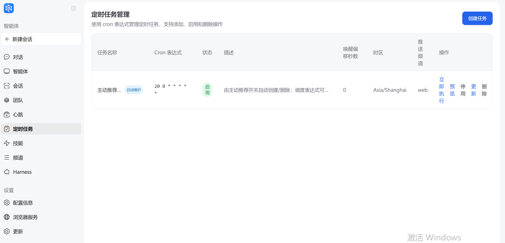
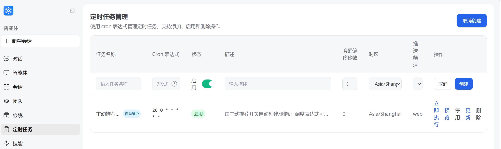
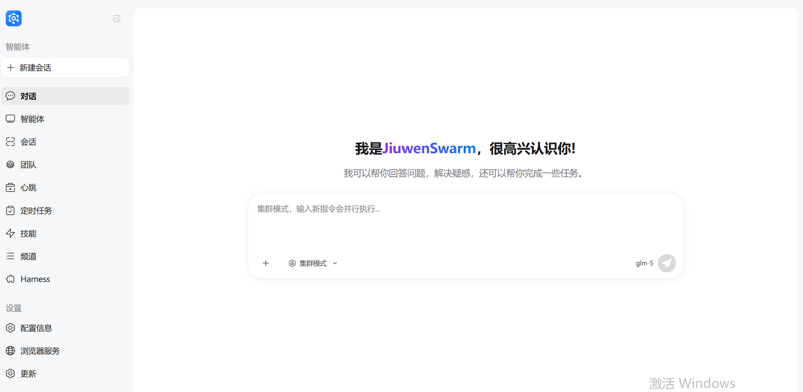

# 定时任务

定时任务（Cron）是 JiuwenSwarm 中实现自动化执行的重要机制。

---

## 概念科普

### 什么是定时任务

**定时任务（Cron Job）** 是一种按照预设时间计划自动执行任务的机制。在 JiuwenSwarm 中，定时任务可以让 Agent 在指定时间自动执行特定操作，并将结果推送到指定频道。

**核心能力：**

| 能力 | 说明 |
|------|------|
| **定时执行** | 按照 Cron 表达式定义的时间计划自动触发 |
| **自然语言描述** | 用自然语言描述任务内容，Agent 自动理解执行 |
| **频道推送** | 结果可推送指定频道，如 Web、飞书、微信等 |
| **自动唤醒** | 提前唤醒 Agent 做准备，确保准时执行 |
| **Team/SwarmFlow** | 支持多 Agent 协作，适合复杂任务（见 [Team 模式与 SwarmFlow](#team-模式与-swarmflow多智能体定时任务)） |

**典型应用场景：**

- 📅 **每日提醒**：每天固定时间发送工作提醒、健康提醒等
- 📊 **周期汇总**：定期汇总数据、生成日报/周报
- 🔄 **定时检查**：定时检查系统状态、监控任务进度
- 📢 **消息推送**：定时向指定频道推送消息或通知
- 🤝 **协作任务**：Team 模式下多 Agent 协作完成复杂分析任务

### Cron 表达式原理

Cron 表达式是定义定时任务执行时间规则的标准格式。

**基本格式：**

```
分 时 日 月 周
```

| 字段 | 取值范围 | 说明 |
|------|----------|------|
| 分 | 0-59 | 分钟 |
| 时 | 0-23 | 小时 |
| 日 | 1-31 | 日期 |
| 月 | 1-12 | 月份 |
| 周 | 0-6 | 星期（0=周日） |

**特殊字符：**

| 字符 | 说明 | 示例 |
|------|------|------|
| `*` | 任意值 | `* * * * *` = 每分钟 |
| `,` | 列举多个值 | `0,30 * * * *` = 每小时的第0和第30分钟 |
| `-` | 范围 | `0 9-17 * * *` = 9点到17点每小时 |
| `/` | 间隔 | `*/15 * * * *` = 每15分钟 |

**常用表达式示例：**

| 表达式 | 含义 |
|--------|------|
| `0 9 * * *` | 每天早上 9:00 |
| `30 18 * * *` | 每天下午 18:30 |
| `0 9 * * 1` | 每周一早上 9:00 |
| `0 9,18 * * *` | 每天 9:00 和 18:00 |
| `*/30 * * * *` | 每 30 分钟 |
| `0 0 * * *` | 每天凌晨 0:00 |

## 快速上手

### 通过 Web 界面创建

**操作步骤：**

1. 打开 JiuwenSwarm Web 界面，在左侧导航栏点击「**工作**」
2. 在工作页面左侧子面板中，点击「**定时任务**」
3. 进入定时任务管理页面，点击「**创建**」按钮
4. 填写任务配置表单：



| 配置项 | 说明 | 示例 |
|--------|------|------|
| **任务名称** | 任务名称（用户可读标识，系统会分配独立 `job_id`） | `daily_reminder` |
| **cron表达式** | Cron 表达式 | `0 9 * * *`（每天9点） |
| **时区** | 任务执行时区 | `Asia/Shanghai`（默认） |
| **状态** | 任务状态 | 启用/停用 |
| **描述** | 任务内容描述 | 生成今日工作提醒 |
| **唤醒偏移秒数** | 提前唤醒秒数，默认 0 | `0`（默认，不提前唤醒） |
| **超时秒数** | 单次执行超时（60～259200），普通模式与 Team 模式默认均为 3600（1 小时） | `3600`（默认） |
| **执行后删除** | 执行一次后自动删除，默认 false | `false`（默认） |
| **推送频道** | 结果推送频道（单个频道 ID） | `tui`、`web`、`feishu`、`wechat`、`wecom`、`whatsapp`、`xiaoyi`、`dingtalk` |
| **执行模式** | Agent 执行模式 | `agent.fast`（默认） |
| **项目目录** | 任务归属的项目工作目录（绝对路径） | `/home/user/my-project`；不填则默认取当前会话所在项目 |

> **超时说明**：`agent.fast` 等普通模式与 `team`/`team.plan`/`code.team` 等 Team 模式默认均为 3600 秒（1 小时）。如需更长的执行时间，可在创建时设置。

5. 点击 **「创建」**，任务将自动生效

**项目归属说明：**

定时任务创建后自动归属到指定 `project_dir` 对应的项目（匹配不到可见项目则归默认项目）。后续可以在项目视图下按项目维度管理定时任务及其执行会话。

**存储位置：**

定时任务配置保存在：
```
~/.jiuwenswarm/agent/home/cron_jobs.json
```

### 通过对话创建

当 Agent 具备 `cron_create_job` 工具能力时，您可以直接通过自然语言对话创建定时任务。

> **权限配置**：该能力由 `config.yaml` 的 `permissions.tools` 控制，需将相关 `cron_*` 工具（如 `cron_create_job`、`cron_update_job` 等）设为 `allow`。



**示例对话：**

```
用户：帮我创建一个定时任务，每天早上9点提醒我喝水。
```

Agent 会自动：
1. 解析时间意图 → `cron_expr: "0 9 * * *"`
2. 理解任务内容 → `description: "提醒喝水"`
3. 确定推送频道 → `targets: "web"`
4. 调用工具创建任务

> **提示**：通过对话创建任务时，Agent 会根据上下文自动推断合理的默认值，如时区、频道等。

---

## 定时任务执行

### 执行过程

到固定时间触发定时任务后，对话页面会返回一个执行中的对话。

**执行流程：**

1. **触发时刻**：到达 Cron 表达式定义的时间点
2. **Agent 唤醒**：根据 `wake_offset_seconds` 提前唤醒 Agent
3. **任务执行**：Agent 开始执行任务描述中的内容
4. **结果推送**：执行完成后，结果推送到指定频道

**执行状态：**

| 状态 | 说明 |
|------|------|
| **待执行** | 任务已创建，等待触发时间 |
| **执行中** | Agent 正在执行任务 |
| **已完成** | 任务执行完毕，结果已推送 |
| **执行失败** | 任务执行过程中出现错误 |

### 查看执行结果

定时任务执行完毕的返回结果可以在对话页面查看



上图展示了定时任务触发后的执行过程。


上图展示了定时任务执行完成后的结果展示。
---

## 定时任务管理

创建后任务可以在前端页面进行以下操作：

| 操作 | 说明 |
|------|------|
| **立即执行** | 手动触发任务立即执行一次，返回 `{accepted, run_id, session_id}`，可通过 `session_id` 跳转到执行会话 |
| **预览** | 查看任务配置详情（含 `project_id` 归属项目、`last_session_id` 最近执行会话） |
| **停用** | 暂停任务，不再自动触发 |
| **更新** | 修改任务配置（含更新 `project_dir` 变更归属项目） |
| **删除** | 删除任务 |

### 任务与执行会话的双向关联

定时任务执行后会自动创建执行会话，可通过以下字段双向跳转：

| 字段 | 位置 | 说明 |
|------|------|------|
| `project_id` | CronJob | 任务归属的项目 ID |
| `last_session_id` | CronJob | 最近一次执行产生的会话 ID（未执行过为 `null`） |
| `cron_id` | SessionInfo | 会话来源的定时任务 ID（普通会话为空串） |

- 从任务跳转会话：通过 `cron.job.get` 返回的 `last_session_id`
- 从会话反查任务：通过 `project.get_cron_sessions` 按 `cron_id` 过滤
- 项目视图聚合：`project.get_sessions`（普通会话）+ `project.get_cron_sessions`（cron 会话）互斥分工

---

## 案例实践

### 每日工作提醒

**场景描述：** 每天早上 9 点自动生成工作提醒，推送到 Web 界面。

**配置步骤：**

1. 创建定时任务，对话框输入：
```每天早上 9 点自动生成今日工作提醒，包括：1) 待办事项列表 2) 重要日程提醒 3) 天气信息```


2. 创建成功后，每天 9:00 Agent 会自动执行并推送结果

**数据获取说明：** 待办、日程等由 Agent 从 `agent/workspace/memory/` 记忆文件中读取（来自日常对话写入）；天气等通过搜索工具获取。记忆里没有的内容，提醒中通常不会出现。


**执行效果：**


```
📋 今日工作提醒（2026年5月20日 星期三）
1️⃣ 待办事项列表
当前暂无待办事项。

2️⃣ 重要日程提醒
今日暂无重要日程安排。

3️⃣ 天气信息
今日天气：

- 🌫️ 天气状况：阴天
- 🌡️ 气温：16℃ ~ 25℃
- 💨 风向风力：东风，微风
- 📍 地区：北京

未来三天预报：

- 5月21日（周四）：多云转小雨，16℃ ~ 24℃，南风微风
- 5月22日（周五）：中雨转阴，17℃ ~ 23℃，南风微风
- 5月23日（周六）：多云，19℃ ~ 28℃，西南风微风

温馨提示：

- 今日阴天，气温适中，建议穿着轻薄外套
- 明后两天有降雨，请提前准备雨具
- 周末天气转好，适合户外活动
- 祝您工作顺利！如有新的待办事项或日程安排，随时告诉我。
```

---

## 常见问题

### Q1: 定时任务没有按时执行怎么办？

**排查步骤：**

1. 检查任务是否启用（`enabled: true`）
2. 检查 Cron 表达式是否正确
3. 检查时区设置是否正确
4. 检查 JiuwenSwarm 服务是否在运行
5. 查看日志文件确认是否有错误

### Q2: 如何修改已创建的定时任务？

在 Web 界面的定时任务列表中，点击任务右侧的 **「编辑」** 按钮，修改配置后保存即可。修改后调度器会自动更新。

### Q3: 定时任务的结果会保存吗？

定时任务执行的结果会：
- 推送到指定频道（Web/飞书等）
- 作为会话历史保存在对应的会话文件中
- 可通过会话管理查看历史执行记录

### Q4: wake_offset_seconds 是什么作用？

`wake_offset_seconds` 定义了提前唤醒 Agent 的时间（默认 `0`，即不提前唤醒）。例如设置为 `300`（5分钟）时：
- 任务设定 9:00 执行
- `wake_offset_seconds: 300`（5分钟）
- Agent 会在 8:55 开始准备，确保 9:00 准时执行

### Q5: 定时任务支持哪些推送频道？

目前支持的频道：
- `tui` - TUI 终端（广播到所有已连接窗口）
- `web` - Web 界面
- `feishu` - 飞书
- `wechat` - 微信
- `wecom` - 企业微信
- `whatsapp` - WhatsApp
- `xiaoyi` - 小艺
- `dingtalk` - 钉钉

---

## 推送到 TUI 频道

当 `targets=tui` 时，定时任务的结果会推送到所有已连接的 TUI 窗口。

**推送机制**

- TUI 推送采用**广播**模式，不绑定创建任务时的 `session_id`
- Gateway 会将结果发送到所有已连接的 TUI 客户端
- 任务执行过程中的进度不会实时推送到 TUI，只有最终结果会推送

**注意事项**

- 如果任务完成时没有 TUI 客户端在线，推送可能会丢失
- 建议同时设置其他推送渠道（如 `web` 或 IM）作为备份
- 可以通过 `/cron show` 查看任务配置，或通过 Web 界面查看历史结果

---

## Team 模式与 SwarmFlow（多智能体定时任务）

除默认的单 Agent 模式外，定时任务现已支持 **Team 模式**，可在到点时启动多智能体协作，并可选走 **SwarmFlow** 工作流（详见 [TUI 使用 SwarmFlow 指南](TUI使用SwarmFlow指南.md)；Team 模式基础用法见 [Agent Team 使用指南](AgentTeam.md)）。

#### 支持的执行模式（`mode`）

| `mode` | 说明 |
|---|---|
| `agent.fast` | **默认**。单 Agent 快速执行，适合简单提醒、查询类任务 |
| `agent` / `agent.plan` / `plan` | 单 Agent 规划或推理后执行 |
| `team` | 多 Agent Team 协作；可触发 SwarmFlow |
| `team.plan` | Team + 规划类协作 |
| `code.team` | 编码向 Team 协作 |

TUI / Web 创建任务时可传 `mode=`；前端通过 `cron.job.meta` 拉取当前支持的 mode 列表与默认超时配置。

#### 创建示例

```text
# 每周一 9 点，Team 协作生成对比报告（结果推送到 TUI）
/cron add name=模型周报 cron_expr="0 9 * * 1" description="对比 GLM 与 DeepSeek 近期能力并输出 Markdown 报告" mode=team targets=tui

# 简单提醒仍用默认 agent.fast
# 5 段式：分 时 日 月 周
/cron add name=喝水提醒 cron_expr="30 8 * * *" description="提醒用户喝水" targets=tui
```

可选 **`timeout_seconds`**（60～259200 秒）覆盖单次执行超时：

| 模式 | 默认超时 |
|---|---|
| `agent.fast` 等普通模式 | 3600 秒（1 小时） |
| `team` / `team.plan` / `code.team` | 3600 秒（1 小时） |

```text
/cron add name=长报告 cron_expr="0 9 * * 1" description="..." mode=team timeout_seconds=3600 targets=tui
```

#### 执行与推送行为（与单 Agent 任务的区别）

**执行方式**

- **普通模式**：适合简单任务，快速执行后返回结果。
- **Team 模式**：适合复杂任务，支持多智能体协作。

**会话隔离**

- 定时任务使用独立的会话执行，不会绑定到创建时的界面。
- 关闭创建定时任务的界面后，任务仍会正常执行。

**执行进度**

- 普通模式：执行过程不会实时显示在创建任务的界面。
- Team 模式：执行过程也不会实时显示在创建任务的界面。
- 两种模式都会推送最终结果到指定频道。

**结果推送格式**

| 场景 | 推送内容 |
|------|----------|
| 正常完成 | Agent 返回的内容 |
| 执行失败 | 以 `[cron]` 开头的错误信息 |

**注意事项**

- 请保持 Gateway 运行，确保定时任务能正常触发。
- 可以通过 `/cron show <job_id>` 或 Web 界面查看任务配置。
- 如果执行时没有 TUI 客户端在线，TUI 推送可能会丢失，建议同时设置其他推送渠道。

---

## 相关链接

- [频道配置](频道.md) - 配置消息推送频道
- [任务规划](任务规划.md) - 了解 Agent 动态任务拆解
- [对话教程](智能体.md) - 了解对话功能

---

*文档版本：v1.0*  
*适用对象：JiuwenSwarm 用户*  
*最后更新：2026-05-05*
---

## 返回导航

- [返回文档首页](../README.md)
- [返回项目首页](../../README_CN.md)