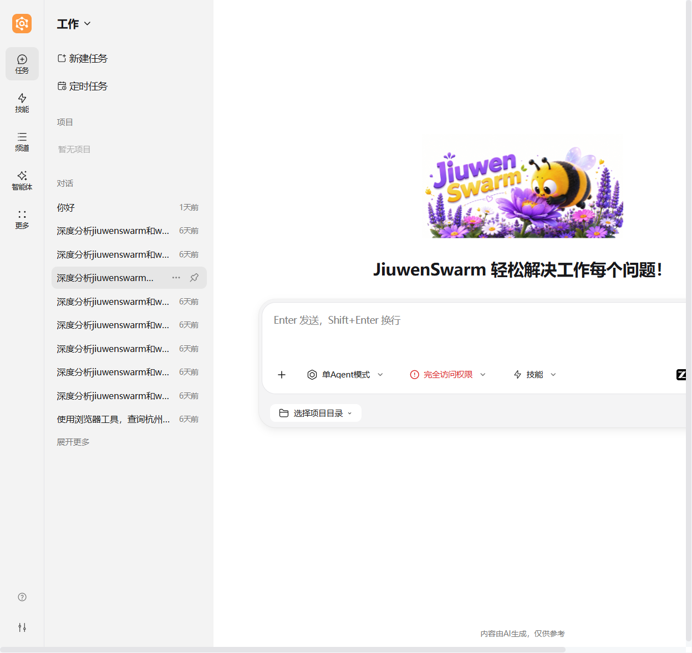
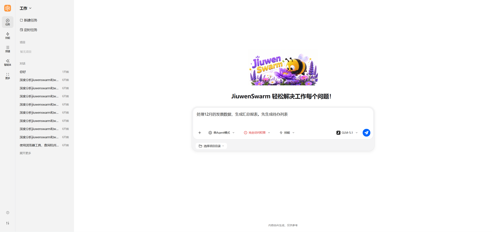
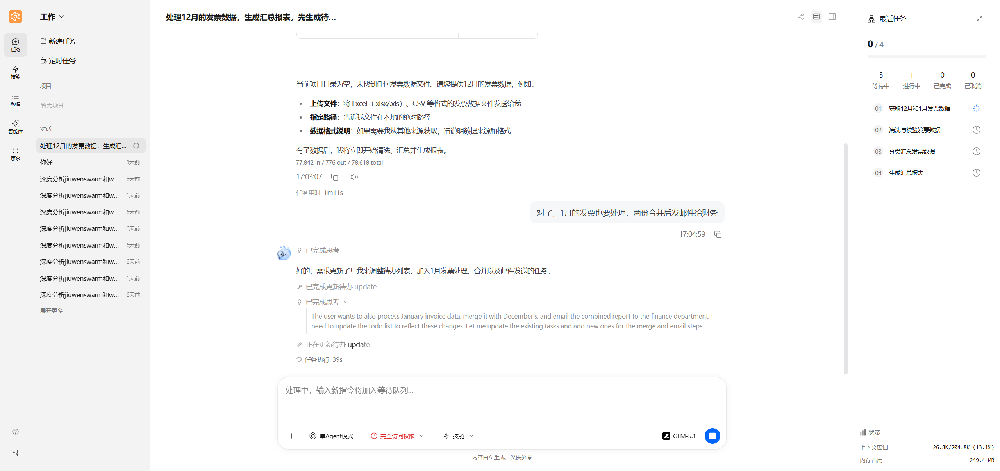
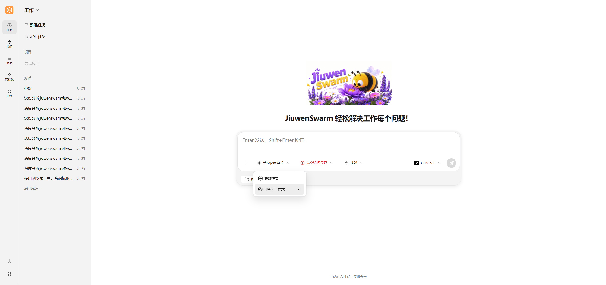

# 对话

对话是 JiuwenSwarm 最常用的使用入口，不只是聊天，而是接收任务并执行任务的主要入口。在这里，您可以提问、下达任务、补充要求、查看执行过程和结果。

---

## 1. 对话入门

### 1.1 对话简介

**对话页的定位**

对话页是 JiuwenSwarm 的核心交互界面，它不仅仅是一个聊天窗口，而是一个**任务接收与执行的工作台**。通过对话，您可以：

- **提问咨询**：获取信息、解答疑问
- **下达任务**：让智能体执行具体操作
- **补充要求**：在执行过程中动态调整
- **查看进度**：实时了解任务执行状态和结果



**核心能力**

| 能力 | 说明 |
|:---|:---|
| **自然语言理解** | 用日常语言描述需求，无需记忆复杂指令 |
| **任务规划** | 复杂任务自动拆解为可执行的子任务序列 |
| **动态调整** | 执行过程中可随时插入新需求或修改计划 |
| **工具编排** | 自动选择和组合合适的工具完成任务 |
| **结果反馈** | 清晰展示执行过程和最终结果 |

---

### 1.2 如何开始对话

**基本操作流程**

1. **输入需求**：在输入框中描述您的需求或任务
2. **发送消息**：点击发送或按 Enter 键
3. **查看回复**：智能体会理解您的需求并开始执行
4. **继续补充**：根据执行结果，可以继续补充要求或调整方向



**需求描述建议**

为了获得更好的执行效果，建议在描述需求时包含以下要素：

| 要素 | 说明 | 示例 |
|:---|:---|:---|
| **目标** | 明确要达成什么 | "生成 API 文档" |
| **范围** | 指定作用范围 | "针对 src/api 目录下的所有接口" |
| **限制条件** | 特殊要求或约束 | "使用中文，格式为 Markdown" |
| **输出形式** | 期望的结果形式 | "输出到 docs/api.md 文件" |

**提问示例对比**

| 推荐写法 ✅ | 不够清晰 ❌ |
|:---|:---|
| "帮我整理 `docs/zh` 目录下的所有 Markdown 文档，检查标题层级、修复格式问题，并生成一份修改清单" | "整理文档" |
| "分析 `src/core` 目录的代码结构，生成架构图并输出为 PNG 格式，保存到 `docs/architecture.png`" | "分析代码" |
| "将 `README.md` 翻译成英文，保持原有格式，输出到 `README_EN.md`" | "翻译 README" |

**首次使用建议**

- 从**目标明确的小任务**开始，逐步熟悉智能体的能力
- 如果第一次结果不符合预期，可以**继续补充要求**，而不是重新开始
- 善用**追问和细化**，帮助智能体更好地理解您的需求

---

### 1.3 对话中的常见操作

在对话过程中，您可以随时进行以下操作来调整任务执行：

**动态调整操作**

| 操作 | 说明 | 使用场景 |
|:---|:---|:---|
| **补充要求** | 对当前正在执行的任务追加细节或修改方向 | 发现遗漏细节、需要调整输出格式或约束条件 |
| **插入新任务** | 在任务队列中插入一个全新的独立任务 | 有更高优先级的独立需求出现 |
| **打断任务** | 中断当前正在执行的任务 | 需要停止或改变当前任务方向 |
| **调整优先级** | 改变待执行任务的顺序 | 重新安排执行顺序 |
| **结束任务** | 标记某个任务为已完成或取消 | 任务不再需要执行 |
| **查看状态** | 查看当前任务列表和执行进度 | 了解整体进展 |

> **补充要求 vs 插入新任务**：补充要求是对**已有任务**的细化或扩展（如"报表也加上图表"），插入新任务则是添加一个**全新的独立任务**（如"顺便帮我翻译另一份文档"）。

**核心特性：边聊边调整**

JiuwenSwarm 的对话系统支持**实时动态调整**。当您在智能体执行任务过程中输入新需求时，系统会：

1. **理解新需求**：解析您的补充内容
2. **评估影响**：判断对当前任务的影响
3. **重新规划**：将新需求融入任务队列
4. **继续执行**：按照新的计划推进

**案例：动态调整全流程演示**

以下案例串联了常见的动态调整操作，展示从任务规划到执行、调整、查看的完整过程：

**步骤一：下达任务**

```
用户：处理 12 月的发票数据，生成汇总报表。先生成待办列表

智能体：任务列表：
  [1]	获取12月发票数据文件	🔄 进行中
  [2]	读取并解析发票数据	⏳ 待执行
  [3]	数据清洗与校验	⏳ 待执行
  [4]	生成汇总报表	⏳ 待执行
  [5]	输出报表文件	⏳ 待执行

▶ 开始执行任务 [1]...
```


**步骤二：插入新任务**

```
用户：对了，1 月的发票也要处理，两份合并后发邮件给财务

智能体：任务列表更新：
  [1]	获取12月和1月发票数据文件	🔄 进行中
  [2]	读取并解析12月和1月发票数据	⏳ 待执行
  [3]	数据清洗与校验（12月+1月）	⏳ 待执行
  [4]	合并数据并生成汇总报表	⏳ 待执行
  [5]	导出报表文件并发邮件给财务	⏳ 待执行

▶ 继续执行...
```




---

## 2. 执行模式

### 2.1 模式概览

JiuwenSwarm 支持多种执行模式，不同模式适用于不同的场景。您可以根据任务特点选择合适的模式。



**模式对比**

| 模式 | 运行方式 | 适用场景 | 特点 |
|:---|:---|:---|:---|
| **单Agent模式** | 单个智能体独立处理任务，内置任务规划与动态调整能力 | 大多数日常任务、问答、代码生成、多步骤推理 | 过程清晰可控，支持动态调整 |
| **集群模式**（又称团队模式 Team Mode，多智能体协作） | 由 Leader 编排多个专业智能体分工协作 | 大规模任务、需要多角色协作 | 能力互补，协同处理 |

**模式切换**

您可以通过以下方式切换执行模式：

- **界面切换**：在对话页面的模式选择器（下拉选择器）中选择执行模式
- **命令切换**：在 IM 受控通道或 TUI 中使用 `/mode` 命令（详见[模式系统](模式系统.md)）

---

### 2.2 单Agent模式

#### 2.2.1 概念科普

**什么是单Agent模式？**

单Agent模式是 JiuwenSwarm 的默认执行模式。在此模式下，单个智能体独立处理您的任务，并内置**结构化的任务拆解与动态管理能力**。当您提出复杂或多步骤的请求时，智能体会自动将其解析为一系列可执行的子任务，并通过内置的待办工具进行系统性记录和追踪。

**核心价值**

| 能力 | 说明 |
|:---|:---|
| **动态拆解** | 复杂请求自动分解为可执行的子任务序列 |
| **实时追踪** | 每完成一个子任务，状态实时更新，进度清晰可控 |
| **灵活干预** | 支持用户中途追加需求、插入紧急事项，不打断整体流程 |
| **目标保持** | 有效解决长周期任务中的目标丢失与执行断层问题 |

**适用场景**

- 步骤较多、需要分阶段完成的任务
- 任务中途可能发生变化或调整
- 希望过程清晰可跟踪的任务
- 需要确认每个阶段结果的任务
- 目标明确、希望快速得到结果的任务


---

### 2.3 集群模式

#### 2.3.1 概念科普

**什么是集群模式？**

集群模式（又称团队模式 Team Mode）是 JiuwenSwarm 的多智能体协作模式。在此模式下，由一个 Team Leader 统一编排，多个专业智能体协同工作，各自负责擅长的领域，共同完成复杂任务。

**核心特点**

- **专业分工**：不同智能体负责不同领域
- **协同处理**：智能体之间可以通信协作
- **能力互补**：组合多种专业能力
- **结果整合**：汇总各智能体的输出

**适用场景**

- 大规模、多领域的复杂任务
- 需要多种专业技能的任务
- 单一智能体难以完成的任务

#### 2.3.2 协作流程

集群模式的典型协作流程如下：

1. **需求对齐**：Team Leader 接收用户任务后，先与用户确认关键信息（如技术栈、约束条件），确保方案符合预期。
2. **团队组建**：Leader 根据任务拆解子任务，分配给对应角色的智能体（如前端、后端、测试）。
3. **并行执行**：各智能体认领任务后独立工作，通过任务板同步进度，Leader 负责协调与汇总。
4. **结果整合**：Leader 收集各智能体输出，合并为最终交付物。

**案例：全栈项目开发**

```
用户：开发一个用户管理系统，包括前端界面、后端 API 和数据库设计

[team_leader] 我来帮你开发一个用户管理系统。在开始之前，我需要确认几个关键信息...
用户：使用默认方案

[team_leader] ✅ 团队已组建！
[frontend-dev] 收到！我已查看任务板
[backend-dev] 收到项目启动通知！
[qa-engineer] 收到项目启动通知！
```

1. **对齐需求**：Team Leader 在启动前与用户确认需求与关键信息。


2. **认领与并行启动**：子任务拆分后，各角色智能体认领工作并并行执行。


> **提示**：以上案例展示了多智能体协作的基本流程。实际效果取决于任务复杂度与智能体配置。

---

## 3. 对话逻辑

### 3.1 执行流程

JiuwenSwarm 在对话背后的基本逻辑：

```
用户输入 → 意图理解 → 模式判断 → 任务处理 → 结果反馈
```

**详细流程**

1. **意图理解**：解析用户自然语言，识别真实需求
2. **模式判断**：根据任务特点和当前模式，决定执行策略
3. **任务处理**：
   - **单Agent模式**：拆解为子任务，按计划执行或快速响应
   - **集群模式**：分配给多个智能体协同执行
4. **结果反馈**：以清晰的方式向用户呈现执行结果

### 3.2 动态调整机制

JiuwenSwarm 支持在执行过程中根据用户新输入重新规划任务列表：

- **实时监听**：持续接收用户的新输入
- **影响评估**：判断新需求对当前任务的影响
- **智能合并**：将新需求合理融入任务队列
- **无缝衔接**：保证执行流程的连贯性

### 3.3 任务规划机制详解

**核心机制**

任务规划的核心逻辑：

1. **需求解析**：将用户请求解析为可执行的子任务序列
2. **任务记录**：通过待办工具系统性记录所有子任务
3. **状态追踪**：实时更新每个子任务的执行状态
4. **动态调整**：支持用户随时插入、修改或取消任务

**工具赋能**

JiuwenSwarm 提供了完整的待办事项工具包，任务按会话隔离，支持并发安全读写。

| 工具 | 说明 |
| :--- | :--- |
| `todo_create` | 创建初始待办清单。**注意**：若该会话已有待办清单会覆盖之前的清单 |
| `todo_modify` | 对指定待办列表进行修改，包括更新状态、删除、取消、追加子任务 |
| `todo_list` | 列出当前所有待办事项、状态以及每项子任务的概要描述 |
| `todo_get` | 获取指定子任务的详细描述 |

**任务状态**

| 状态 | 说明 |
| :--- | :--- |
| `pending` | 待执行 |
| `in_progress` | 执行中 |
| `completed` | 已完成 |
| `cancelled` | 已取消 |
---

## 返回导航

- [返回文档首页](../README.md)
- [返回项目首页](../../README_CN.md)