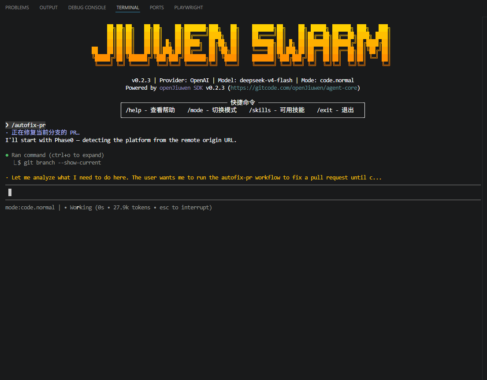
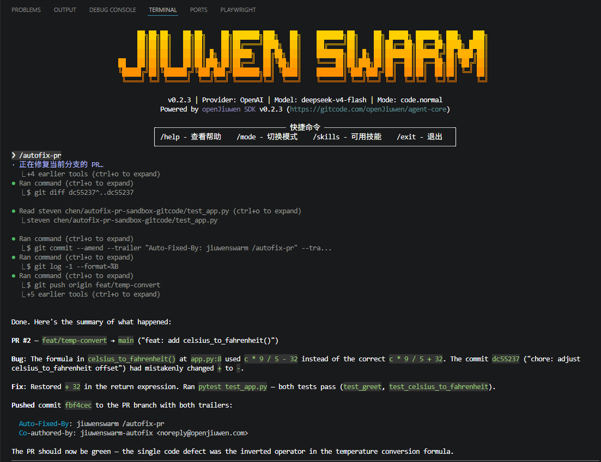

# 自动修复 PR

`/autofix-pr` 让 Agent 接手「PR 检查没过 → 找原因 → 改 → 推」这段循环，支持 GitHub 与 GitCode 两个平台。

---

## 概念科普

### 它解决什么

PR 提交后检查未通过时，常规流程是这样的：

1. 打开 PR 页面，看哪一项红了
2. 翻流水线报告或 CI 评论，定位到底哪个用例失败、失败在哪一行
3. 回本地改代码
4. 提交、push，等流水线重跑
5. 还红 → 回到第 1 步

其中第 1、2、5 步没有任何创造性，纯粹是「读状态 → 定位 → 复跑」，但每一轮都要人守着等。`/autofix-pr` 把这三步交给 Agent：它自己去读检查状态、拿到具体的失败证据、定位根因、做最小化修复，然后提交并推回 PR 分支。

**与相邻能力的区别：**

| 命令 | 方向 | 会不会改代码 |
|------|------|------|
| `/review` | 读 PR → 给评审意见 | ❌ 只读 |
| Auto Harness `issue_fix` | issue → 新建 PR | ✅ |
| **`/autofix-pr`** | **已有 PR → 修到检查通过** | ✅ |

**典型应用场景：**

- 🔴 **CI 挂在小问题上**：边界条件、漏掉的 import、typo 这类有唯一正确解的失败
- 💬 **处理评审意见**：把 reviewer 提的具体修改落实到代码
- 🔁 **反复红绿**：改一次没修干净、需要再来一轮

---

## 1. 前置条件

| 条件 | 说明 |
|------|------|
| **code 模式** | 命令涉及文件编辑与 git 操作，必须在 `code` 模式下运行。非 code 模式会被直接拒绝并提示切换 |
| **当前分支有开放 PR** | 不带参数时从当前分支推断 PR；也可显式传 PR 号或 URL |
| **GitHub 需要 `gh`** | 已安装并完成 `gh auth login`（与 `/review` 相同，不额外新增依赖） |
| **GitCode 无需 token** | 公开仓库读取流水线状态与评论均免鉴权 |

> ⚠️ 安装 `gh` 之后需要**重启 TUI**，否则进程内的 PATH 仍是旧的，会报找不到 `gh`。

---

## 2. 快速开始

切到 code 模式，然后直接运行：

```
/mode code
/autofix-pr
```

<!-- 截图位：TUI 中输入 /autofix-pr 后的界面 -->


Agent 会先自检平台与 PR，读取失败的检查项、定位根因、做最小化修复，然后提交并 push 回 PR 分支。整个诊断与修复过程结束后，它会给出根因说明与修改内容——下图末尾的 “Root cause / Fix” 即是它读取到的失败证据与对应修复。

<!-- 截图位：修复完成，含末尾的根因(Root cause)与修改(Fix)说明 -->


---

## 3. 用法

```
/autofix-pr [PR号或URL]
```

| 写法 | 行为 |
|------|------|
| `/autofix-pr` | 从**当前分支**推断对应的开放 PR（最常用） |
| `/autofix-pr 123` | 指定 PR 号 |
| `/autofix-pr https://gitcode.com/{owner}/{repo}/pull/123` | 传完整 PR 链接 |

---

## 4. 它会做什么

| 阶段 | 动作 |
|------|------|
| **Phase 0** | 读 `git remote` 自检平台（GitHub / GitCode），无需你指定 |
| **Phase 1** | 定位当前分支对应的开放 PR，并做安全校验（见 [§7](#7-安全约束)） |
| **Phase 2** | 读取失败的检查项与评审意见，拿到**具体的**失败证据（哪个用例、什么报错），而不是只知道「红了」 |
| **Phase 3** | 定位根因，做最小化修复 |
| **Phase 4** | 本地跑校验确认修好 |
| **Phase 5** | 提交（带可追溯 trailer）并 push 回 PR 分支 |

---

## 5. 平台差异

命令会自动识别平台，这一节是说明其内部行为，正常使用不需要关心。

### GitHub

- 用 `gh pr view --json statusCheckRollup` 判断红绿
- 用 `gh run view --log-failed` 直接拿到失败日志

### GitCode

GitCode 没有 `gh`，走 REST 接口，且有几处与直觉不同：

- **流水线状态**读 `web-api` 的 `pipeline-check` 端点（需要 PR head 的完整 40 位 sha）
- **该端点只给状态、不给日志**。失败详情实际在 CI 机器人贴的 PR 评论里——一张检查项表格，每项失败都带报告直链，Agent 会顺着链接读到具体失败的用例与 traceback
- **个人仓库默认没有流水线**，此时接口返回空。**空不会被当成「绿」**，Agent 会回落到本地跑项目自己的校验来判断

---

## 6. 持续盯 PR（`--watch`）

单次运行只修一轮：推完之后如果检查还没跑完、或者又红了，就得再手动跑一次。`--watch` 把这一步也自动化——它每隔几分钟复查一次 PR，只要还没通过就再发一轮 `/autofix-pr`，直到**绿 / 合并 / 关闭**才停。

```
/autofix-pr --watch                    # 盯当前分支的 PR
/autofix-pr 123 --watch                # 盯指定 PR
/autofix-pr --watch --interval 3       # 每 3 分钟复查一次
/autofix-pr --stop                     # 停止正在运行的 watch
```

### 它怎么跑

- **立即先跑一轮**，随后每隔 `--interval` 复查一次。每一轮都和你手动跑 `/autofix-pr` 一样，完整显示在会话里，你能看到它读了什么、改了什么。
- **不会重叠**：上一轮还在跑（或有其它工具在执行）时，这一次复查直接跳过，等空闲再继续。
- **离线自动等待**：WebSocket 断了不会硬发，等重连后下一次复查再继续，掉线的那次不计入轮数。

### 参数

| 参数 | 说明 |
|------|------|
| `--watch` | 开启持续盯守模式 |
| `--interval <分钟>` | 复查间隔，默认 **10 分钟**；可传小数（`0.5` = 30 秒），下限 **10 秒** |
| `--stop` | 停止当前正在运行的 watch（任何模式下都能用，无需在 code 模式） |

### 什么时候停

| 停止原因 | 怎么判定 |
|------|------|
| **绿了 / 已合并 / 已关闭** | 由命令自己走 CLI/API 复查得出（GitHub 用 `gh`，GitCode 走 REST），**不采信 Agent 的一面之词**——它嘴上说"修好了"不算数，必须真读到信号才停 |
| **跑满 12 轮**（保险丝） | 连续 12 轮仍未通过就停，避免无上限空转 |
| **手动 `--stop`** | 你随时可以叫停 |

> 「读不到状态」**永远不会**被当成停止信号（网络挂了、没装 `gh`、返回空都算"未知"）。因为把一个查不到状态的红 PR 当成"完成"而停掉，等于悄悄放弃它——所以未知时继续盯，由 12 轮保险丝兜底。

### 开 watch 前的护栏

- **必须 code 模式**，同单轮。
- **工作区必须干净**：watch 会无人值守地自动改代码并 push，若**已跟踪文件**有未提交改动会拒绝启动，请先 commit 或 stash。未跟踪文件（构建产物、`__pycache__` 等）不算，不会因此拒绝。
- **必须能定位到 PR**：找不到当前分支对应的开放 PR 时不启动，可用 `/autofix-pr <PR号> --watch` 显式指定。

> ⚠️ **GitCode 个人仓库通常没有流水线**，接口返回空 → 判为"未知" → 永远等不到"绿"信号，此时**只有 12 轮保险丝**能让它停。每一轮里 Agent 仍会回落到本地跑校验来判断，但 watch 循环本身停不下来——盯这类仓库时请留意轮数上限，或手动 `--stop`。

### 运行内自动批准（可选）

开 watch（以及单轮运行）时会先弹一次询问：**本次运行是否自动批准所有命令**。

- 选「自动批准（本次运行）」：这次运行期间不再逐条弹命令权限，适合无人值守盯守。
- 选「仍逐条询问」：每条命令照常手动批准。

这个授权是**本次运行专属**的：单轮跑完、watch 停止、或你按 Ctrl+C 中断后立即失效，下次再开会重新询问——不会变成长期免密。

---

## 7. 安全约束

这条命令会自动改代码并 push，因此内置了几条不可绕过的规则：

| 规则 | 说明 |
|------|------|
| **只修当前分支对应的 PR** | 传入他人 fork 的 PR 号时，Agent 只做只读汇报并交还，**不会**为其添加 remote、fetch 或 patch 到你当前的仓库 |
| **不许伪造「绿」** | 禁止通过删除/弱化测试、修改 CI 配置、force-push 来让检查通过 |
| **只改实现** | 修复应落在实现代码上，不动测试与 CI 配置 |

> 💡 第一条尤其重要：如果你的工作区里有未提交的改动，把别人 fork 的 PR 号丢给它也不会污染你的仓库。

### 可追溯性

自动提交会带两条 trailer，便于日后区分机器修复与人工提交：

```
Auto-Fixed-By: jiuwenswarm /autofix-pr
Co-authored-by: jiuwenswarm-autofix <noreply@openjiuwen.com>
```

提交的**作者仍是你本人**（不使用 `--author` 改写），因此不影响 CLA 签署与贡献统计。

<!-- 截图位：git log 中带 trailer 的提交 / 平台网页上的 co-author 显示 -->


> GitHub 网页会把 `jiuwenswarm-autofix` 显示为 co-author；GitCode 网页不渲染 co-author 头像，但 trailer 本身在提交信息里，`git log` 与提交详情均可查。

---

## 8. 常见问题

**Q：提示需要 code 模式怎么办？**
先执行 `/mode code` 切换，再重试。

**Q：报找不到 `gh`？**
装好 `gh` 并 `gh auth login` 之后，**重启 TUI**——否则进程内 PATH 还是旧的。

**Q：仓库在 GitCode，需要配 token 吗？**
公开仓库不需要。读流水线状态与 PR 评论都免鉴权。

**Q：它会不会为了让 CI 变绿就把测试删了？**
不会，这是明令禁止的硬规则之一。如果问题无法通过改实现解决，它会如实汇报而不是伪造绿色。

**Q：跑一次就能修好吗？**
一次只修一轮——推送之后如果检查仍未通过，需要你再运行一次。想让它自动跑到通过，用 `--watch`（见 [§6](#6-持续盯-pr--watch)）。

**Q：`--watch` 会一直跑下去吗？**
不会。绿 / 合并 / 关闭即停，或最多跑满 12 轮（保险丝）后停。你也可以随时 `/autofix-pr --stop`。

**Q：watch 提示工作区有未提交改动？**
watch 会无人值守地改代码并 push，因此要求工作区干净。先把已跟踪文件的改动 commit 或 stash 掉再开。

---

## 9. 已知限制

- **`--watch` 的停止依赖能读到 PR 状态**。GitCode 个人仓库没有流水线、接口返回空，此时判为"未知"、拿不到"绿"信号，只有 12 轮保险丝能让它停（详见 [§6](#6-持续盯-pr--watch)）。
- **GitCode 的失败详情依赖 CI 机器人的评论格式**，这是 openJiuwen 组织 CI 的约定，未必适用于任意 GitCode 仓库。没有该评论时，Agent 会按设计回落到本地跑校验。

---

## 相关文档

- [Slash 命令速查表](Slash命令表.md)
- [工具权限与安全防护](工具权限与安全防护.md)
- [模式系统](模式系统.md)
