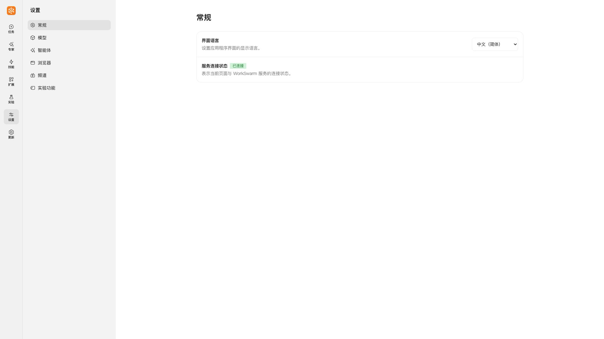
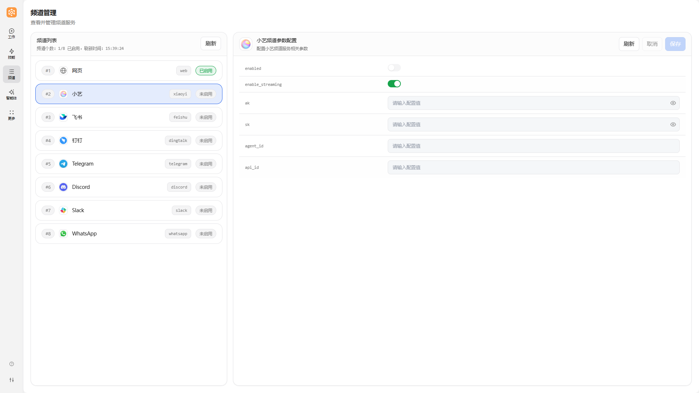
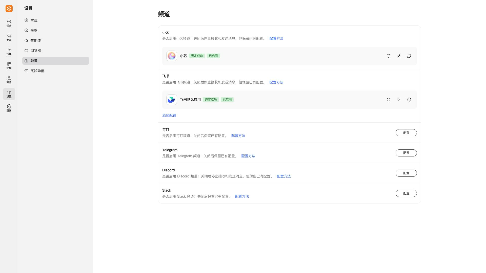
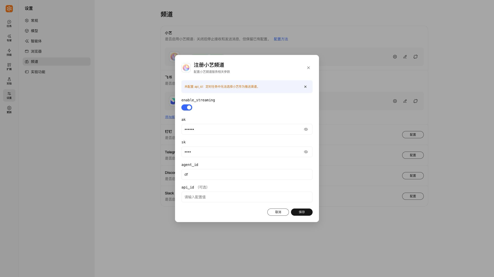
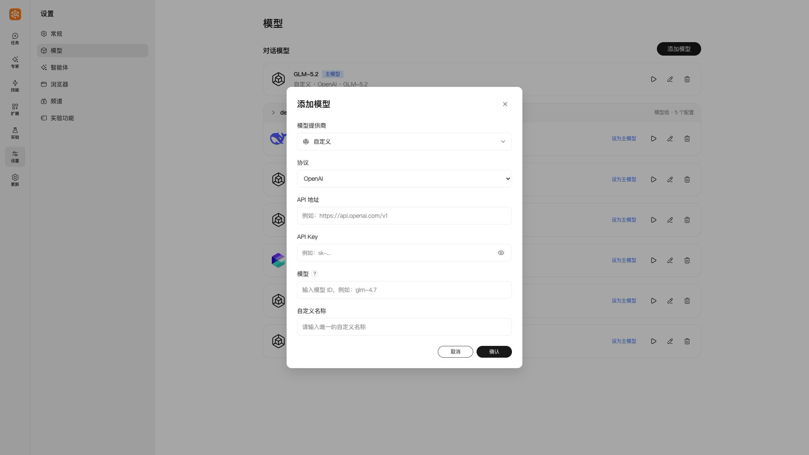
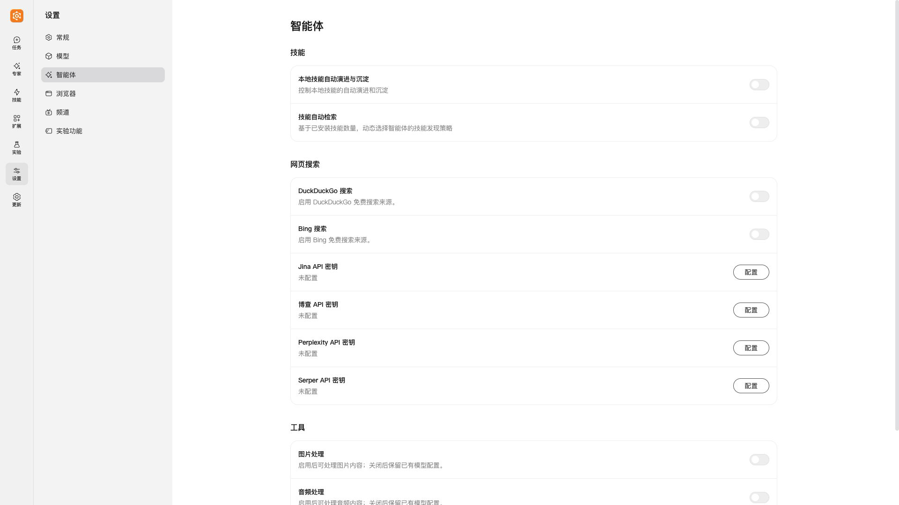
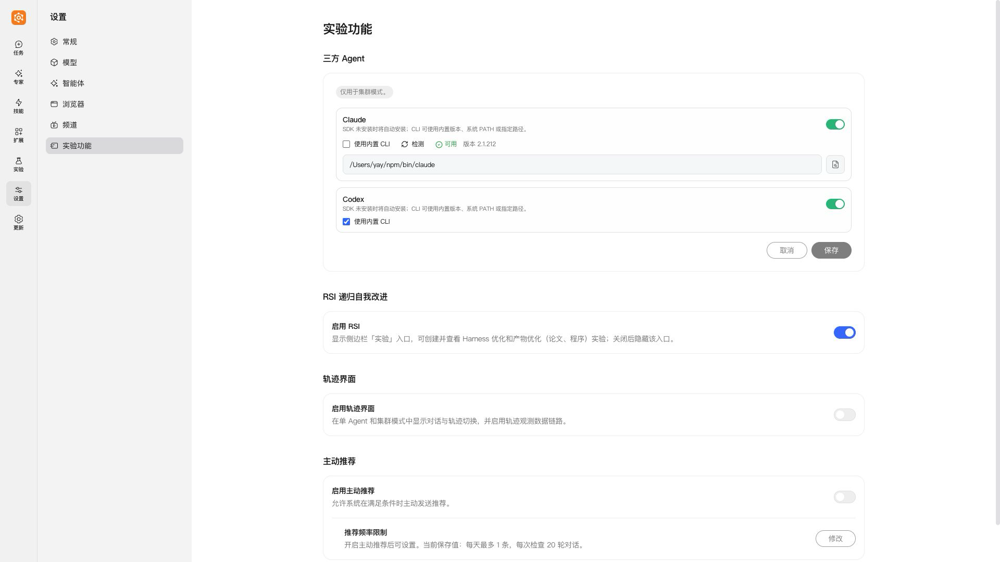
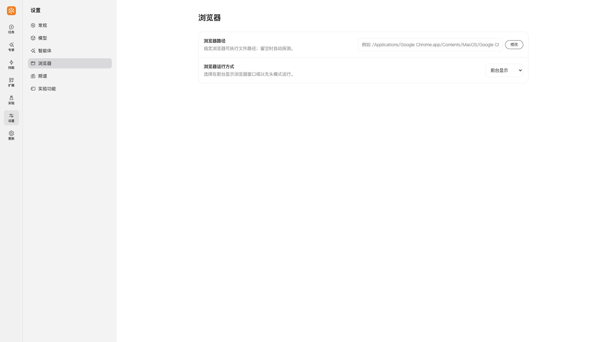
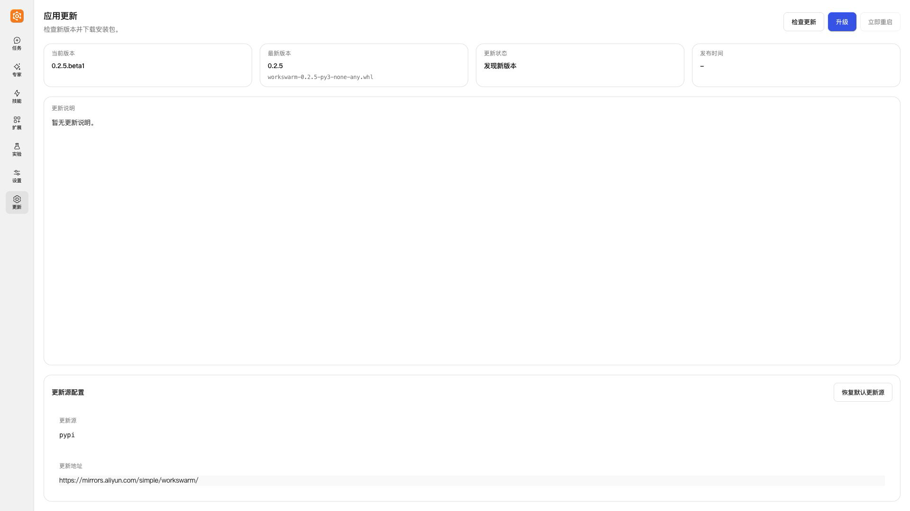

# 设置与频道全新升级：旧版配置迁移指南

[English](../en/SettingsChannelsMigration.md)

本文中的“旧版”指 **WorkSwarm 0.2.5**。新版按 **0.2.6版本开发页面**核对。本文说明旧版入口与当前入口、显示文字的对应关系；“无对应设置项”表示当前页面不提供该配置入口。

## 入口变化

- 旧版“频道” → 新版“设置 → 频道”
- 旧版“更多 → 配置信息” → 新版“设置 → 模型 / 智能体 / 实验功能”
- 旧版“更多 → 浏览器” → 新版“设置 → 浏览器”
- 旧版“更多 → 更新” → 新版左侧独立“更新”入口

### 旧版 WorkSwarm 0.2.5：“更多”

### 新版：“设置”

## 频道 → 设置 / 频道

新版“设置 → 频道”提供小艺、飞书、钉钉、Telegram、Discord、Slack 六种频道配置。

### 旧版 WorkSwarm 0.2.5：“频道”

### 新版：“设置 → 频道”

### 通用启停文字

| 旧版显示文字 | 新版显示文字 |
| --- | --- |
| `enabled` | `已启用` / `未启用` |
| 启停开关 | `启用` / `禁用`（配置卡片上的图标操作） |

### 小艺

| 旧版显示文字 | 新版显示文字 |
| --- | --- |
| `enable_streaming` | `enable_streaming` |
| `ak` | `ak` |
| `sk` | `sk` |
| `agent_id` | `agent_id` |
| `api_id` | `api_id` |

`api_id` 为可选项；未配置时，定时任务中无法选择小艺作为推送渠道。

### 飞书

| 旧版显示文字 | 新版显示文字 |
| --- | --- |
| `name` | `应用名称` |
| `enable_streaming` | `enable_streaming` |
| `app_id` | `app_id` |
| `app_secret` | `app_secret` |
| `encrypt_key` | `encrypt_key` |
| `verification_token` | `verification_token` |
| `group_digital_avatar` | `group_digital_avatar` |
| 新增应用 | `添加配置` |
| 编辑应用 | `修改` |
| 删除应用 | `解绑` |
| 设为默认应用 | 无独立设置项 |

### 钉钉

| 旧版显示文字 | 新版显示文字 |
| --- | --- |
| `client_id` | `client_id` |
| `client_secret` | `client_secret` |
| `allow_from` | `allow_from` |

### Telegram

| 旧版显示文字 | 新版显示文字 |
| --- | --- |
| `bot_token` | `bot_token` |
| `allow_from` | `allow_from` |
| `parse_mode` | `parse_mode` |
| `group_chat_mode` | `group_chat_mode` |
| `mention` | `仅响应 @提及（mention）` |
| `reply` | `仅响应回复（reply）` |
| `all` | `响应所有消息（all）` |
| `off` | `禁用群聊（off）` |

### Discord

| 旧版显示文字 | 新版显示文字 |
| --- | --- |
| `block_dm` | `block_dm` |
| `bot_token` | `bot_token` |
| `application_id` | `application_id` |
| `guild_id` | `guild_id` |
| `channel_id` | `channel_id` |
| `allow_from` | `allow_from` |

### Slack

| 旧版显示文字 | 新版显示文字 |
| --- | --- |
| `reply_in_thread` | `reply_in_thread` |
| `bot_token` | `bot_token` |
| `app_token` | `app_token` |
| `default_channel_id` | `default_channel_id` |
| `allow_from` | `allow_from` |
| `allowed_channel_ids` | `allowed_channel_ids` |

## 更多 / 配置信息 → 设置

旧版“更多 → 配置信息”中仍有设置入口的配置，主要分布在新版“模型”“智能体”和“实验功能”；SwarmFlow 的当前入口见下文“任务输入框”。

### 模型配置

#### 默认模型与模型列表 → 设置 / 模型

| 旧版显示文字 | 新版显示文字 |
| --- | --- |
| 免费模型 | 无对应设置项 |
| `model_name` | `模型` |
| `alias` | `自定义名称` |
| `api_base` | `API 地址` |
| `api_key` | `API Key` |
| `model_provider` | `模型提供商` |
| `reasoning_level` | `推理`（按提供商、协议和模型显示可用选项） |
| 主对话默认 | `主模型` / `设为主模型` |
| 同名模型默认 | `组内默认` / `设为组内默认` |
| 无 | `协议` |

添加模型时先选择“模型提供商”；内置提供商按 Token Plan、Coding Plan、API 等分类，也可选择“自定义”或“OpenAI 账号”。`API 地址` 输入框仅在“自定义”提供商下显示，其他配置字段随提供商变化。下图为“自定义”表单。

#### 视觉、音频与视频模型 → 设置 / 智能体

| 旧版显示文字 | 新版显示文字 |
| --- | --- |
| 视觉模型 | `图片处理` |
| 音频模型 | `音频处理` |
| 视频模型 | `视频理解` |
| `api_base` | `API 地址` |
| `api_key` | `API 密钥` |
| `model` | `模型名称` |
| `provider` | `模型提供商` |

### 其他配置

#### 技能与网页搜索 → 设置 / 智能体

| 旧版显示文字 | 新版显示文字 |
| --- | --- |
| 技能演进 | `本地技能自动演进与沉淀` |
| 技能检索 | `技能自动检索` |
| DuckDuckGo 搜索 | `DuckDuckGo 搜索` |
| Bing 搜索 | `Bing 搜索` |
| `jina_api_key` | `Jina API 密钥` |
| `bocha_api_key` | `博查 API 密钥` |
| `perplexity_api_key` | `Perplexity API 密钥` |
| `serper_api_key` | `Serper API 密钥` |

#### SwarmFlow → 任务输入框

旧版 SwarmFlow 对应当前集群模式下的“动态工作流”：在任务输入框左下角“＋”菜单中开启，开启后可进入“动态工作流配置”。该入口按会话使用，不在“设置 → 智能体”中。

#### 外部 CLI 智能体与主动推荐 → 设置 / 实验功能

| 旧版显示文字 | 新版显示文字 |
| --- | --- |
| 外部 CLI 智能体 | `三方 Agent` |
| Claude / Codex 的 `enabled` | `启用 Claude` / `启用 Codex` |
| `use_builtin` | `使用内置 CLI` |
| `cli_path` | 取消勾选“使用内置 CLI”后显示路径输入框，可“检测”或“选择文件” |
| A2UI / `a2ui_enabled` | 无对应设置项 |
| 主动推荐 | `主动推荐` |
| `proactive_recommendation_enabled` | `启用主动推荐` |
| `proactive_recommendation_max_recommend_per_day` | `每日推荐上限` |
| `proactive_recommendation_max_rounds_per_tick` | `每次检查对话轮数` |

三方 Agent 仅用于集群模式。主动推荐的两个数值位于“推荐频率限制 → 修改”弹窗中，开启主动推荐后可修改，均支持 1–50 的整数。

当前实验功能还提供“RSI 递归自我改进”和“轨迹界面”，不属于本文列出的旧版配置迁移项。

## 更多 / 浏览器 → 设置 / 浏览器

| 旧版显示文字 | 新版显示文字 |
| --- | --- |
| 浏览器类型及其选项 | 无对应设置项 |
| 可执行文件路径（可选） | `浏览器路径` |
| 显示浏览器：开启 | `前台显示` |
| 显示浏览器：关闭 | `无头模式` |

当前页面仅提供“浏览器路径”和“浏览器运行方式”。路径留空时自动探测，不再提供浏览器类型或优先顺序选择。

## 更多 / 更新 → 独立更新入口

旧版 WorkSwarm 0.2.5 中，“更新”位于“更多”内；新版将“更新”移到左侧，作为独立入口。

