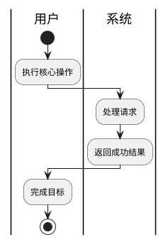

## 场景分析

**主成功场景**

<!-- guideline: When designing error and exception paths, examine these commonly overlooked scenarios: external dependency failures (network timeout, service unavailable), invalid inputs (out-of-range, malformed), concurrency conflicts (simultaneous data modification), resource exhaustion (file size exceeded, connection pool depletion), dynamic resource changes (hot-plug, online/offline), task/data migration to new locations, mid-operation failures (network/server errors), extreme-scale inputs beyond NFR-defined norms, and privilege-exempt entities that bypass regular constraints (e.g., RT tasks, kernel threads). -->

|编号|路径|类别|触发|步骤|
|-|-|-|-|-|
|S-001|[主成功/扩展<!-- condition: Low=AsNeeded, Medium=AsNeeded, High=Generate -->/备选<!-- condition: Low=AsNeeded, Medium=AsNeeded, High=Generate -->/异常<!-- condition: Low=AsNeeded, Medium=AsNeeded, High=Generate -->]|[业务/操作/维护...]|[Trigger conditions]|[]|