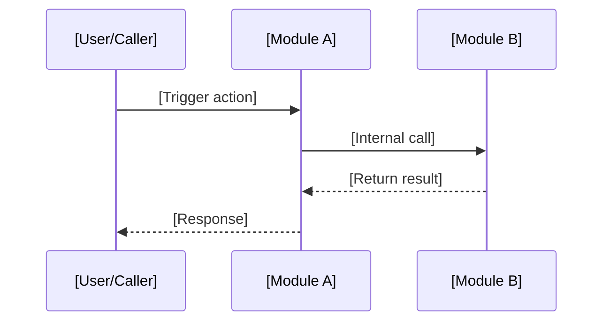

## 核心流程

### [主流程]

[Core business process overview, including but not limited to steps and key decision points]

<!-- guideline: sequenceDiagram for cross-module interaction flows, stateDiagram-v2 for state transitions, flowchart for decision branches. -->

### [] <!-- condition: generate only if omission would cause ambiguity -->

