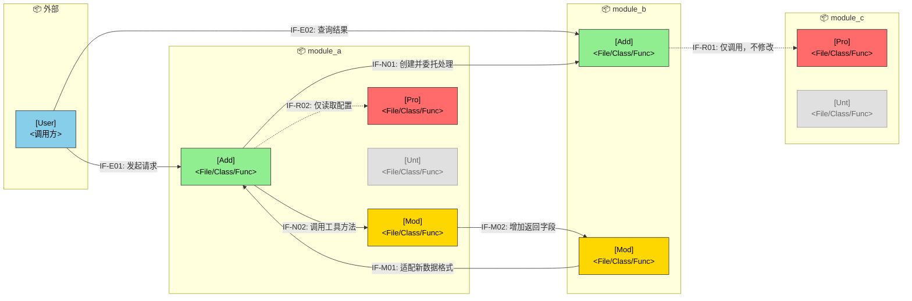

## 架构变更

### 变更总览

<!-- policy: Ensure consistency across design document sections—design decisions, feature changes, module design, and interface design must have corresponding entries. -->
<!-- guideline: Legend—🔵External User 🟢New 🟡Modified 🔴Protected (has calls but code modifications are disallowed this iteration) ⚪Not Involved (unrelated to this change; must explicitly prevent accidental modification). -->
<!-- constraint: Interface naming: IF-{Type}{Number}, where Type = E=External, N=New Internal, M=Modified Internal, R=Reuse Internal. -->
<!-- constraint: Diagram boxes must have connections to other boxes; any orphan node requires an annotated reason in comments (nodes not involved are exempt). -->
<!-- constraint: A single file must not appear in both "Modified" and "Protected" modules. If only a portion of a file is modified (e.g., specific functions in xxx.c), explicitly clarify this in the "Constraints" column. -->

### 模块变更

<!-- constraint: Only list modules truly relevant to this design, control granularity to "sufficient to explain impact scope". -->

|模块|变更|职责|接口|依赖|约束|
|-|-|-|-|-|-|
|[]|[新增/修改/保护/不涉及]|[]|[external interface]|[]|[e.g. only allow modifying certain flow, prohibit changing interface signature, etc.]|
